# CodeWiki Architecture Specification

**Version:** 1.0
**Date:** December 17, 2025
**Status:** Living Document

---

## Executive Summary

CodeWiki is a sophisticated multi-agent documentation system that automatically generates and maintains living documentation (wikis) from Git repositories. Built on TypeScript/Node.js, the system employs over 20 specialized AI agents to analyze code changes, explore codebases, and synthesize high-level documentation.

### Key Characteristics

- **Intelligent & Adaptive**: Six-phase orchestration system that adapts processing strategies based on wiki maturity
- **Multi-Agent Architecture**: Specialized agents for analysis, meta-processing, synthesis, and self-healing
- **Self-Improving**: Consolidation agents detect and fix documentation issues automatically
- **Scalable**: Parallel worker pools process multiple work items concurrently
- **Flexible Storage**: Supports both MongoDB (production) and file-based (development) persistence
- **Rich Integration**: REST API, MCP server, and CLI interfaces for diverse workflows
- **Quality-First**: Four-level test pyramid including LLM-as-judge validation

### Core Value Proposition

CodeWiki transforms Git repositories into comprehensive, navigable documentation that captures:
- **What changed**: Code modifications and their scope
- **Why it changed**: Decision rationale, ADRs, and planning artifacts
- **How it works**: Module relationships, design patterns, and architectural conventions
- **Current state**: Live documentation that evolves with the codebase

The system processes commit history, explores directory structures, and synthesizes high-level guides—all with minimal human intervention.

---

## Table of Contents

1. [System Overview](#system-overview)
2. [Core Subsystems](#core-subsystems)
3. [Multi-Agent System](#multi-agent-system)
4. [Data Flow & Processing Pipelines](#data-flow--processing-pipelines)
5. [Key Abstractions & Patterns](#key-abstractions--patterns)
6. [Storage & Persistence](#storage--persistence)
7. [External Interfaces](#external-interfaces)
8. [Quality Assurance](#quality-assurance)
9. [Configuration & Deployment](#configuration--deployment)

---

## 1. System Overview

### 1.1 High-Level Architecture

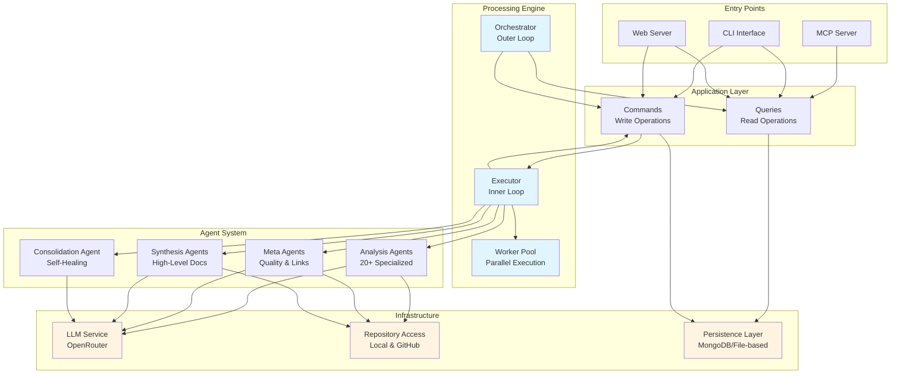

### 1.2 Project Structure

The codebase is organized into clear functional layers:

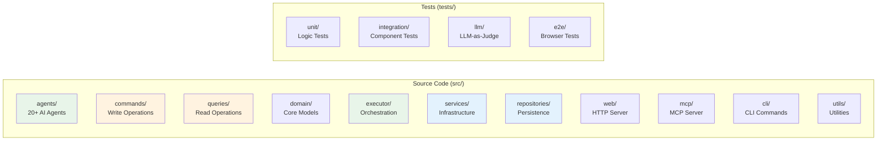

**Key Directories:**
- **agents/**: All AI agent implementations (analysis, meta, synthesis, consolidation)
- **commands/**: CQRS write operations (create, update, delete)
- **queries/**: CQRS read operations (get, list, search)
- **domain/**: Core business models and types
- **executor/**: Orchestration engine and worker pools
- **services/**: Infrastructure services (LLM, Git, GitHub, repository access)
- **repositories/**: Data persistence layer with multiple implementations
- **web/**: Express server, REST API, and web UI
- **mcp/**: Model Context Protocol server for AI tool integration
- **cli/**: Command-line interface implementations

### 1.3 Technology Stack

**Core Technologies:**
- TypeScript (strict mode)
- Node.js (with native test runner)
- Express.js (web framework)
- MongoDB / File-based storage (dual persistence)

**Key Dependencies:**
- **AI/LLM**: OpenRouter API (Claude, GPT, Gemini, etc.)
- **Git**: isomorphic-git (pure JavaScript implementation)
- **GitHub**: Octokit REST API
- **Type Safety**: Zod runtime validation
- **Testing**: Playwright (E2E), native Node test runner

---

## 2. Core Subsystems

### 2.1 Orchestrator System

The orchestrator implements a six-phase adaptive processing strategy that evolves with wiki maturity.

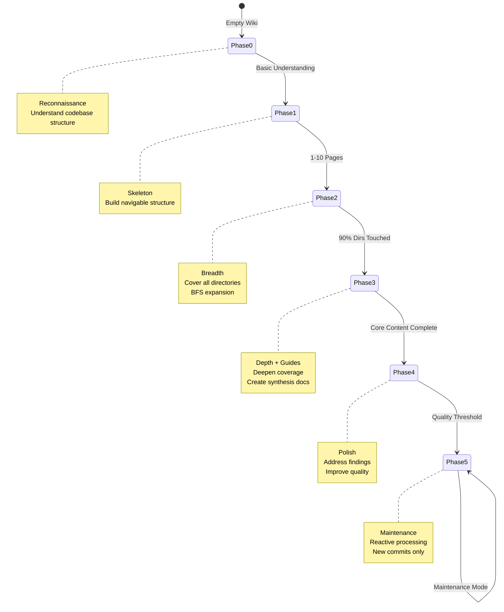

**Phase-Specific Strategies:**

| Phase | Focus | Work Allocation | Exit Criteria |
|-------|-------|----------------|---------------|
| **0: Reconnaissance** | Understand codebase | Bootstrap agent, initial exploration | 1+ pages created |
| **1: Skeleton** | Basic structure | Recent commits, key paths | 10+ pages |
| **2: Breadth** | Cover all areas | BFS directory selection | 90% directories touched |
| **3: Depth + Guides** | Deep coverage | Shallow pages, synthesis agents | Core content complete |
| **4: Polish** | Quality improvement | Findings, meta agents | Quality threshold met |
| **5: Maintenance** | Keep current | New commits only | Ongoing |

**Key Components:**
- **phased-orchestrator.ts**: Main orchestration logic and phase detection
- **context-gatherer.ts**: Collects wiki state, coverage metrics, commit status
- **file-coverage-tree.ts**: Tracks documentation coverage by directory tree
- **strategies.ts**: Phase-specific work generation strategies
- **prompts.ts**: LLM prompts for intelligent work prioritization

### 2.2 Executor System

The executor implements a two-loop architecture: orchestrator (outer) generates work, executor (inner) processes it.

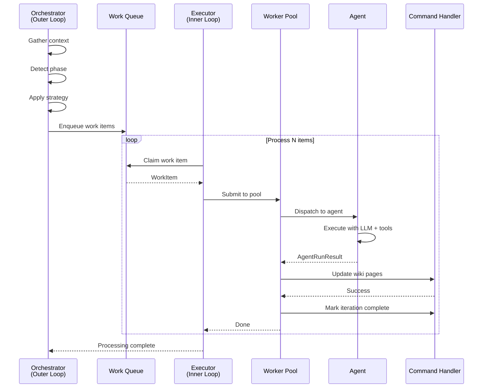

**Key Features:**
- **Parallel Processing**: Worker pool executes multiple agents concurrently
- **Deterministic IDs**: Prevents duplicate work items in queue
- **Graceful Shutdown**: Waits for in-flight work to complete
- **Tool Enforcement**: Validates agents actually read code
- **Error Handling**: Retries transient failures, records permanent ones

**Worker Pool Architecture:**

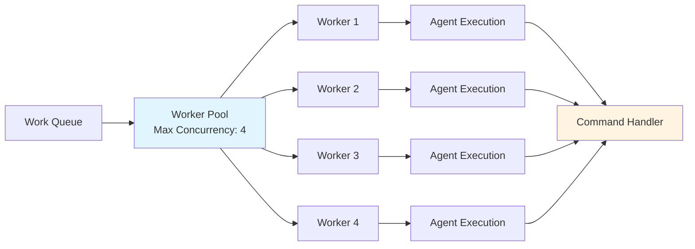

### 2.3 CQRS Pattern Implementation

Strict separation between reads (queries) and writes (commands) ensures consistency and auditability.

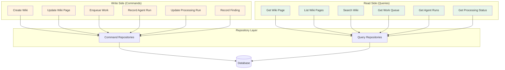

**Benefits:**
- **Separation of Concerns**: Read and write logic isolated
- **Audit Trail**: All changes tracked through commands
- **Scalability**: Queries and commands can be optimized independently
- **Testability**: Commands and queries tested in isolation
- **Type Safety**: Strong TypeScript types for all operations

---

## 3. Multi-Agent System

### 3.1 Agent Taxonomy

CodeWiki employs 20+ specialized agents organized into four functional categories:

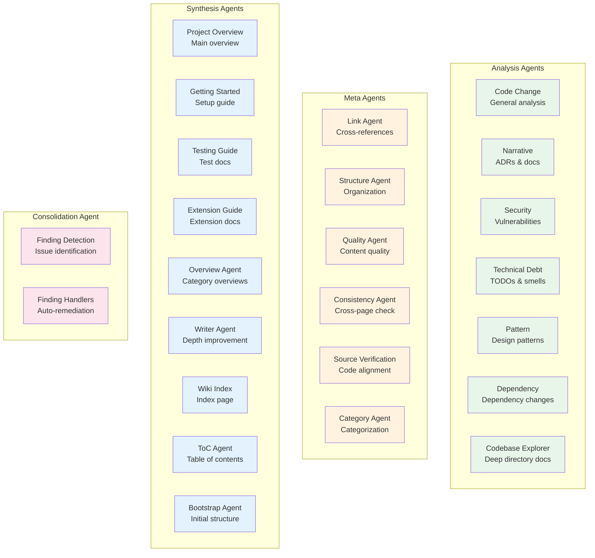

### 3.2 Agent Execution Flow

All agents follow a unified execution model with tool-based interaction:

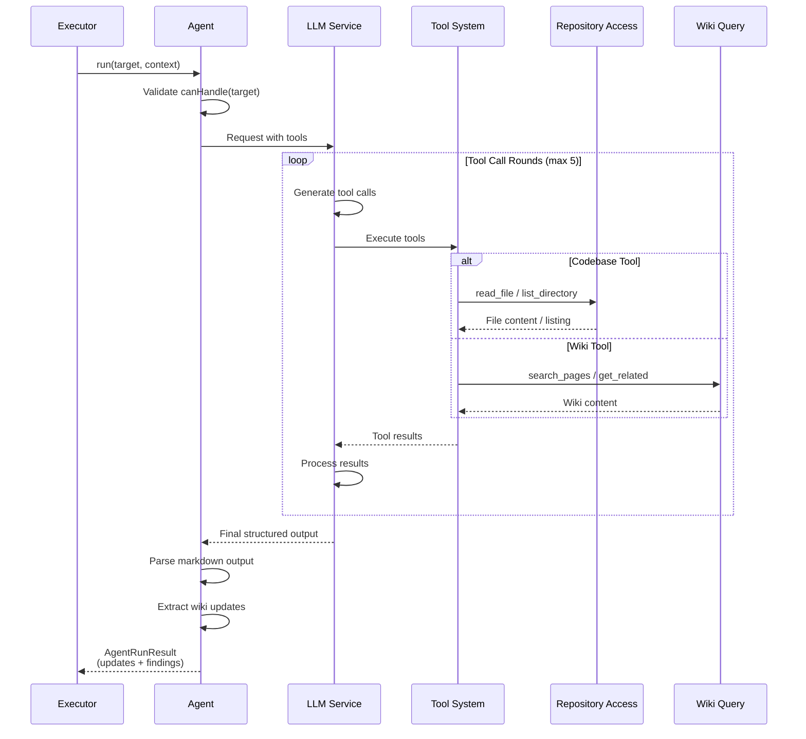

**Tool Categories:**

1. **Codebase Tools** (read code):
   - `read_file`: Read source file contents
   - `list_directory`: List directory structure
   - `search_code`: Search codebase for patterns

2. **Wiki Tools** (read existing docs):
   - `search_pages`: Full-text wiki search
   - `get_related_pages`: Fetch related documentation
   - `list_pages`: List all wiki pages

### 3.3 Agent Registry & Dispatch

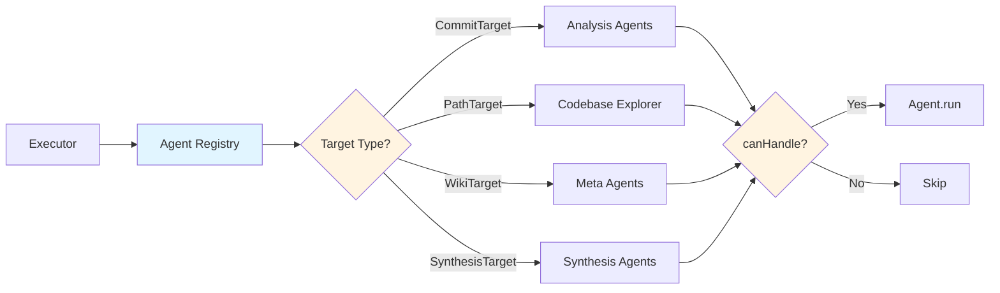

**Key Features:**
- **Centralized Registry**: Single source of truth for all agents
- **Type-Safe Dispatch**: Strong typing prevents mismatched targets
- **Lazy Initialization**: Agents created on first use
- **Introspection Support**: Access to agent prompts for self-improvement

### 3.4 Analysis Agent Processing Order

When processing commits, analysis agents execute in a specific order to build comprehensive documentation:

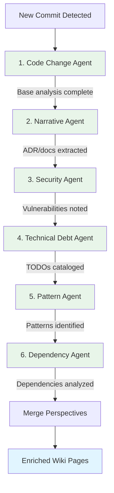

**Rationale:**
1. **Code Change** runs first to establish base content
2. **Narrative** extracts architectural decisions and planning artifacts
3. **Security** identifies vulnerabilities early
4. **Technical Debt** catalogs improvement opportunities
5. **Pattern** recognizes design patterns and conventions
6. **Dependency** tracks dependency changes and impacts

Each agent enriches the wiki pages created by previous agents, providing multiple perspectives on the same changes.

---

## 4. Data Flow & Processing Pipelines

### 4.1 End-to-End Processing Flow

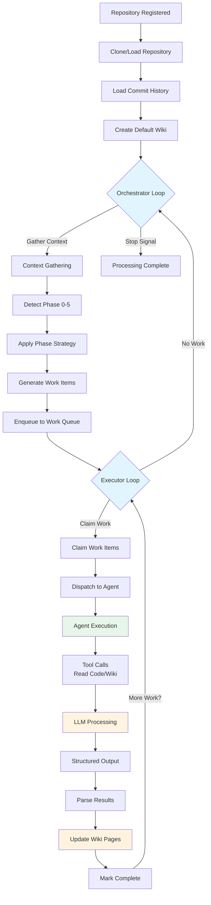

### 4.2 Commit Processing Pipeline

When new commits are detected, they flow through a multi-stage analysis pipeline:

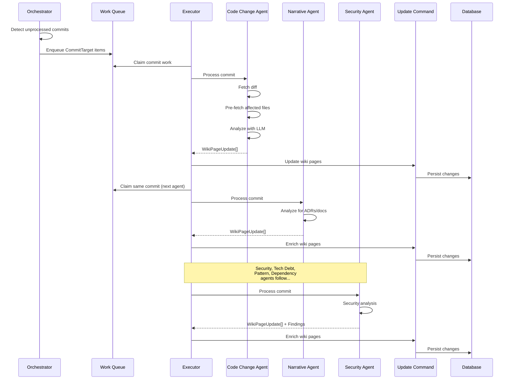

**Pipeline Characteristics:**
- **Sequential Agent Execution**: Each agent builds on previous results
- **Pre-fetching Optimization**: Affected files loaded once, reused across agents
- **Enrichment Model**: Later agents enrich pages created by earlier agents
- **Finding Generation**: Agents can flag issues for consolidation agent

### 4.3 Directory Exploration Pipeline

For undocumented directories, the system generates comprehensive documentation:

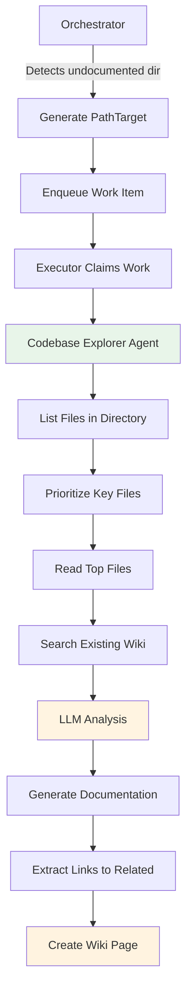

**Explorer Agent Strategy:**
- **File Prioritization**: Focus on README, main entry points, key modules
- **Context Gathering**: Search existing wiki for related content
- **Comprehensive Output**: Single page documenting entire directory/module
- **Cross-linking**: Automatically links to related documentation

### 4.4 Synthesis Pipeline

High-level documentation is generated by synthesis agents in later phases:

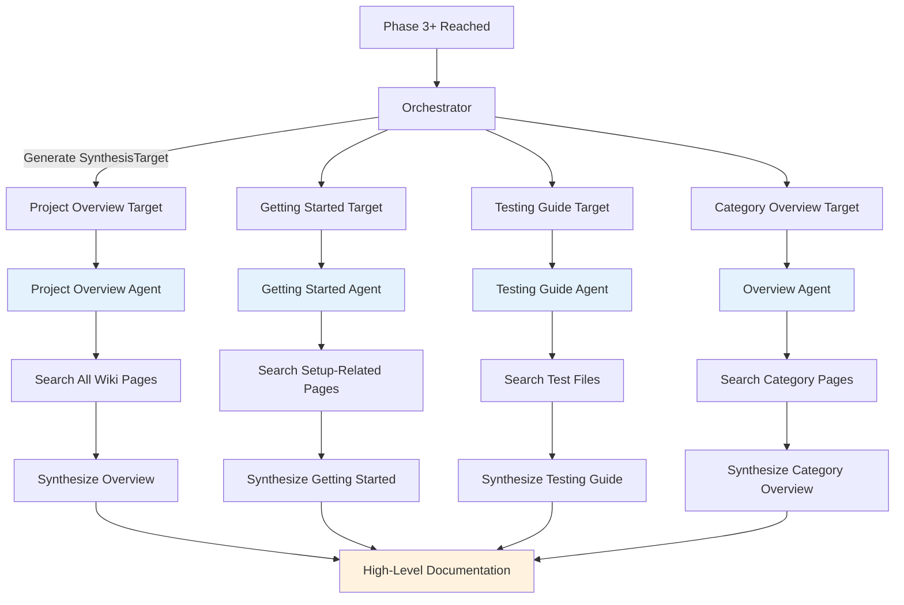

**Synthesis Characteristics:**
- **Wiki-Based Input**: Uses existing wiki pages, not raw code
- **Cross-Cutting Views**: Aggregates information across multiple pages
- **User-Focused**: Targets human readers (setup, testing, extension)
- **Late-Phase Generation**: Only after sufficient base content exists

### 4.5 Self-Healing Pipeline

The consolidation agent detects and fixes documentation issues:

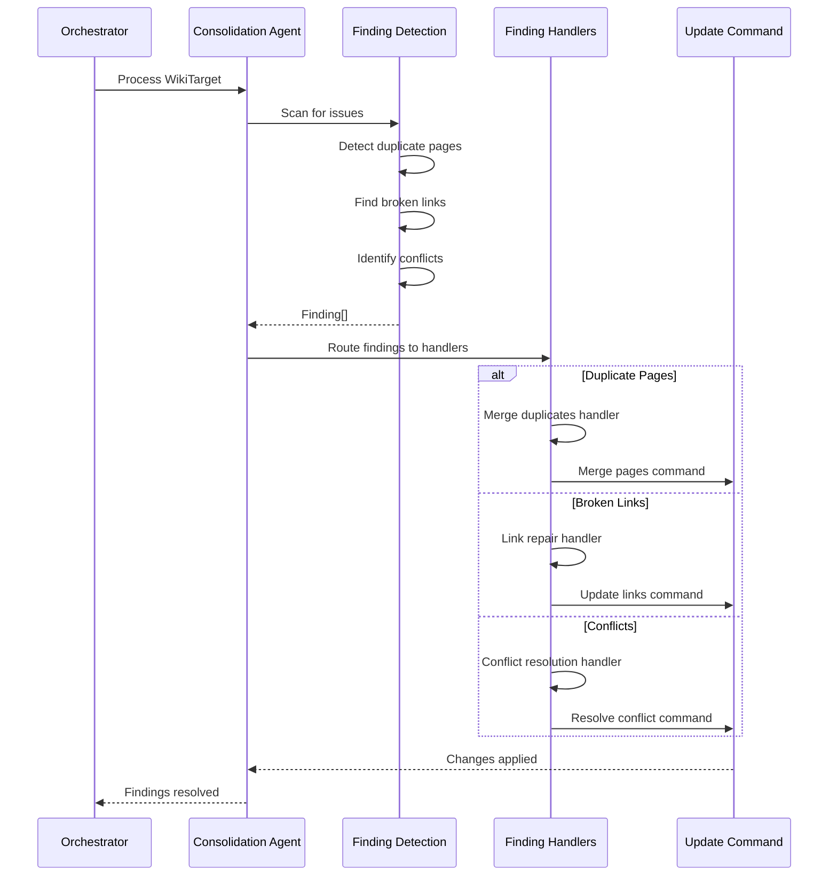

**Self-Healing Capabilities:**
- **Duplicate Detection**: Identifies pages covering same topic
- **Link Validation**: Finds and repairs broken cross-references
- **Conflict Resolution**: Resolves contradictory information
- **Automatic Remediation**: Applies fixes without human intervention

---

## 5. Key Abstractions & Patterns

### 5.1 Domain Model Hierarchy

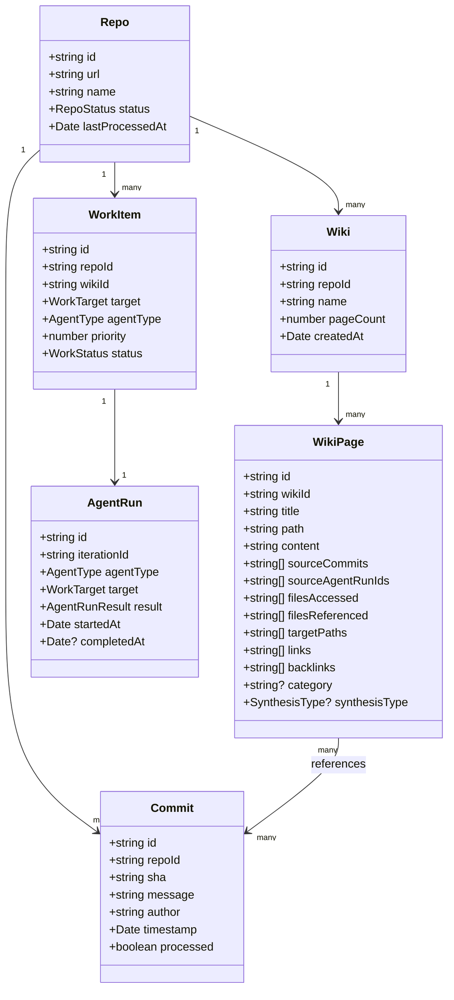

### 5.2 Work Target Polymorphism

Work items can target different units of processing:

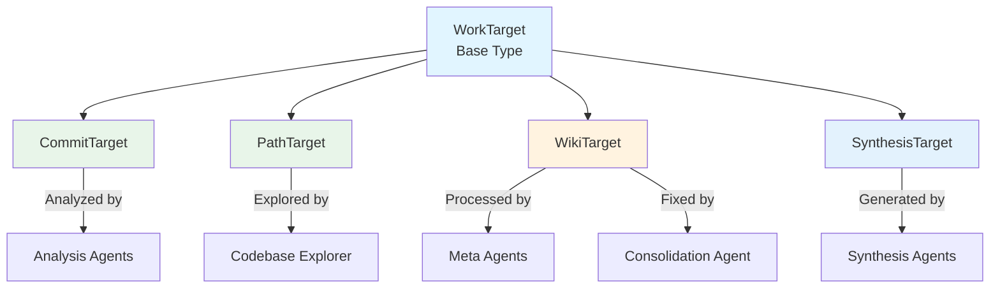

**Target Types:**
- **CommitTarget**: Specific Git commit (SHA + repo context)
- **PathTarget**: Filesystem path (directory or file)
- **WikiTarget**: Entire wiki (for meta-processing)
- **SynthesisTarget**: Synthesis request (overview, guide, etc.)

Each target type routes to appropriate agents via the registry's dispatch logic.

### 5.3 Command Pattern

All state mutations flow through command objects:

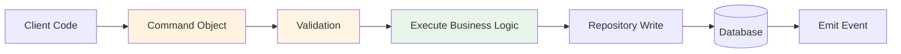

**Command Examples:**
- **CreateWiki**: Creates new wiki instance
- **UpdateWikiPage**: Creates/updates/merges wiki page
- **EnqueueWork**: Adds work item to queue
- **RecordAgentRun**: Logs agent execution
- **RecordFinding**: Records detected issue

### 5.4 Repository Pattern

Data access abstracted behind interfaces with swappable implementations:

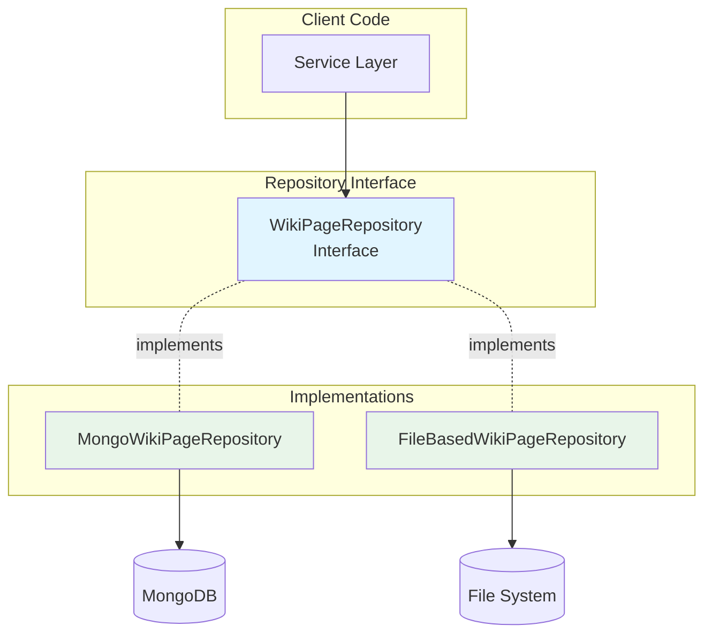

**Benefits:**
- **Flexibility**: Switch storage backends without code changes
- **Testability**: Mock repositories for unit tests
- **Environment Adaptation**: MongoDB for production, file-based for development
- **Consistency**: Same interface contract for all implementations

### 5.5 Strategy Pattern

Phase-specific processing strategies encapsulate orchestration logic:

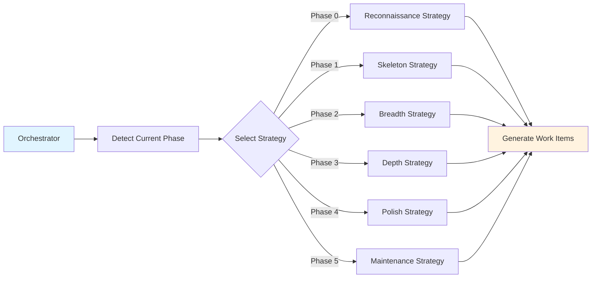

### 5.6 Observer Pattern (Event System)

Wiki events broadcast state changes to interested parties:

```mermaid
sequenceDiagram
    participant CMD as Command Handler
    participant EVT as Event Bus
    participant SUB1 as Web UI Subscriber
    participant SUB2 as Metrics Subscriber
    participant SUB3 as Cache Subscriber

    CMD->>EVT: Emit WikiPageUpdated
    EVT->>SUB1: Notify
    EVT->>SUB2: Notify
    EVT->>SUB3: Notify

    SUB1->>SUB1: Refresh page display
    SUB2->>SUB2: Update metrics
    SUB3->>SUB3: Invalidate cache
```

**Event Types:**
- WikiPageCreated
- WikiPageUpdated
- WikiPageMerged
- WikiPageDeleted
- ProcessingRunStarted
- ProcessingRunCompleted

---

## 6. Storage & Persistence

### 6.1 Dual-Backend Architecture

```mermaid
graph TB
    subgraph "Application Layer"
        CMD[Commands]
        QRY[Queries]
    end

    subgraph "Repository Layer"
        FACTORY[Repository Factory]
        INTERFACE[Repository Interfaces]
    end

    subgraph "Implementation Layer"
        MONGO_IMPL[MongoDB Repositories]
        FILE_IMPL[File-based Repositories]
    end

    subgraph "Storage Layer"
        MONGODB[(MongoDB<br/>Production)]
        FILESYSTEM[(File System<br/>Development)]
    end

    CMD --> INTERFACE
    QRY --> INTERFACE
    INTERFACE --> FACTORY
    FACTORY -.creates.- MONGO_IMPL
    FACTORY -.creates.- FILE_IMPL

    MONGO_IMPL --> MONGODB
    FILE_IMPL --> FILESYSTEM

    style MONGODB fill:#4caf50
    style FILESYSTEM fill:#2196f3
```

### 6.2 Repository Interfaces

All persistence operations defined by interfaces:

- **WikiPageRepository**: CRUD for wiki pages
- **WikiRepository**: Wiki instance management
- **RepoRepository**: Repository registration
- **CommitRepository**: Commit tracking
- **WorkQueueRepository**: Work item persistence
- **AgentRunRepository**: Agent execution history
- **FindingRepository**: Issue tracking
- **ProcessingRunRepository**: Batch execution tracking
- **IterationRepository**: Individual work item iterations
- **OrchestratorRunRepository**: Orchestrator decision logging

### 6.3 MongoDB Implementation

**Production/staging environment:**
- Optimized indexes for query performance
- Aggregation pipelines for complex queries
- Transactional support where needed
- Connection pooling for concurrency

**Collections:**
- `repos`: Repository metadata
- `wikis`: Wiki instances
- `wiki_pages`: Documentation pages
- `commits`: Git commit tracking
- `work_queue`: Queued work items
- `agent_runs`: Agent execution logs
- `findings`: Detected issues
- `processing_runs`: Batch execution records
- `iterations`: Work item iterations

### 6.4 File-Based Implementation

**Development/restricted environments:**
- JSON files for structured data
- Markdown files for wiki content
- Directory structure mirrors logical organization
- No external dependencies

**Directory Structure:**
```
.codewiki-data/
├── repos/
│   └── {repoId}.json
├── wikis/
│   └── {wikiId}.json
├── pages/
│   └── {wikiId}/
│       └── {pageId}.md
├── commits/
│   └── {repoId}/
│       └── {sha}.json
├── work-queue/
│   └── {workItemId}.json
└── agent-runs/
    └── {agentRunId}.json
```

---

## 7. External Interfaces

### 7.1 Interface Overview

```mermaid
graph TB
    subgraph "External Clients"
        USER[Human Users]
        AI[AI Assistants]
        SCRIPT[Scripts/Automation]
    end

    subgraph "Interface Layer"
        CLI[CLI Interface]
        WEB[Web UI + REST API]
        MCP[MCP Server]
    end

    subgraph "Application Core"
        CMDS[Commands]
        QRYS[Queries]
    end

    USER --> CLI
    USER --> WEB
    AI --> MCP
    SCRIPT --> CLI
    SCRIPT --> WEB

    CLI --> CMDS
    CLI --> QRYS
    WEB --> CMDS
    WEB --> QRYS
    MCP --> QRYS

    style CLI fill:#4caf50
    style WEB fill:#2196f3
    style MCP fill:#ff9800
```

### 7.2 CLI Interface

Command-line interface for local and CI/CD usage:

**Key Commands:**
- `codewiki generate <repo-path>`: Generate wiki for repository
- `codewiki start`: Start web server
- `codewiki status <repo-id>`: Check processing status
- `codewiki export <wiki-id>`: Export wiki to static files
- `codewiki benchmark <wiki-id>`: Run quality benchmarks

### 7.3 Web Server & REST API

Express-based server providing HTTP access:

```mermaid
graph LR
    subgraph "HTTP Layer"
        BROWSER[Web Browser]
        HTTP_CLIENT[HTTP Clients]
    end

    subgraph "Web Server"
        ROUTES[Express Routes]
        AUTH[Authentication]
        SWAGGER[Swagger Docs]
    end

    subgraph "API Endpoints"
        REPO_API[/api/repos]
        WIKI_API[/api/wikis]
        PAGE_API[/api/wiki-pages]
        PROC_API[/api/processing]
        AGENT_API[/api/agents]
    end

    BROWSER --> ROUTES
    HTTP_CLIENT --> ROUTES
    ROUTES --> AUTH
    AUTH --> REPO_API
    AUTH --> WIKI_API
    AUTH --> PAGE_API
    AUTH --> PROC_API
    AUTH --> AGENT_API

    ROUTES --> SWAGGER

    style ROUTES fill:#2196f3
    style SWAGGER fill:#4caf50
```

**API Categories:**
- **Repository Management**: Register, list, update repositories
- **Wiki Operations**: Create, list, delete wikis
- **Content Access**: CRUD wiki pages, search content
- **Processing Control**: Start, stop, monitor processing
- **Observability**: Agent runs, metrics, coverage stats
- **Authentication**: GitHub OAuth, session management

**OpenAPI/Swagger Documentation:**
- Auto-generated from route definitions
- Interactive API testing interface
- Type-safe request/response schemas

### 7.4 MCP Server

Model Context Protocol server exposes CodeWiki to AI coding assistants:

```mermaid
sequenceDiagram
    participant AI as AI Assistant<br/>(Claude, etc.)
    participant MCP as MCP Server
    participant QUERY as Query Handlers
    participant DB as Database

    AI->>MCP: query_wiki("How does auth work?")
    MCP->>QUERY: SearchWiki query
    QUERY->>DB: Full-text search
    DB-->>QUERY: Matching pages
    QUERY-->>MCP: Formatted results
    MCP-->>AI: Documentation content

    AI->>AI: Use context to answer
    AI->>AI: Make informed code changes
```

**MCP Tools:**
- `query_wiki`: Ask questions about codebase
- `list_wiki_pages`: Browse available documentation
- `get_wiki_page`: Retrieve specific page
- `get_repo_status`: Check processing state
- `generate_spec`: Create task specifications

**Use Cases:**
- AI reads wiki before making changes
- AI answers developer questions about codebase
- AI generates specifications based on existing patterns
- AI validates changes against documented architecture

---

## 8. Quality Assurance

### 8.1 Four-Level Test Pyramid

```mermaid
graph TB
    E2E[E2E Tests<br/>Full system + browser<br/>Playwright]
    LLM[LLM Tests<br/>Real LLM calls<br/>LLM-as-Judge]
    INT[Integration Tests<br/>Component interactions<br/>Mocked LLM]
    UNIT[Unit Tests<br/>Pure logic<br/>Fully isolated]

    E2E --> LLM
    LLM --> INT
    INT --> UNIT

    style E2E fill:#f44336
    style LLM fill:#ff9800
    style INT fill:#4caf50
    style UNIT fill:#2196f3
```

### 8.2 Test Distribution

| Test Level | Count | Purpose | Speed | Cost |
|------------|-------|---------|-------|------|
| **Unit** | ~120 files | Pure logic, edge cases | Fast | Free |
| **Integration** | ~50 files | Component interactions | Medium | Free |
| **LLM** | ~15 files | Semantic correctness | Slow | Paid |
| **E2E** | ~10 files | User workflows | Slow | Free |

### 8.3 LLM-as-Judge Testing

Unique testing approach for validating AI agent quality:

```mermaid
sequenceDiagram
    participant TEST as Test Runner
    participant AGENT as Agent Under Test
    participant LLM as Production LLM
    participant JUDGE as Judge LLM

    TEST->>AGENT: Execute with real context
    AGENT->>LLM: Process with tools
    LLM-->>AGENT: Generate output
    AGENT-->>TEST: Agent output

    TEST->>JUDGE: Evaluate output
    Note over TEST,JUDGE: Prompt: "Rate accuracy 0-10"
    JUDGE->>JUDGE: Analyze output
    JUDGE-->>TEST: Score + reasoning

    TEST->>TEST: Assert score >= threshold
```

**LLM Test Characteristics:**
- **Real LLM Calls**: Uses actual LLM service, not mocks
- **Semantic Evaluation**: Judges meaning, not exact strings
- **Scoring Scale**: 0-10 with configurable thresholds
- **Detailed Feedback**: Reasoning and improvement suggestions
- **Result Logging**: JSON artifacts for analysis

**Benefits:**
- Catches prompt regressions
- Validates semantic accuracy
- Tests tool usage patterns
- Measures cross-agent consistency

### 8.4 Tool Enforcement

Validation layer ensures agents follow tool usage requirements:

```mermaid
graph LR
    AGENT[Agent Execution] --> RESULT[Agent Result]
    RESULT --> ENFORCE[Tool Enforcement]
    ENFORCE --> CHECK{Required Tools Used?}

    CHECK -->|Yes| PASS[Accept Result]
    CHECK -->|No - Warn Mode| WARN[Log Warning<br/>Accept Result]
    CHECK -->|No - Strict Mode| REJECT[Reject Result<br/>Throw Error]

    style ENFORCE fill:#ff9800
    style REJECT fill:#f44336
    style WARN fill:#ffeb3b
    style PASS fill:#4caf50
```

**Tool Requirements:**
- Analysis agents must read affected files
- Explorer agents must list directories
- Meta agents must read wiki pages
- Synthesis agents must search wiki

**Enforcement Modes:**
- **Warn**: Log violations but accept results (default)
- **Strict**: Reject results that don't meet requirements (testing)

### 8.5 Content Validation Pipeline

Multi-stage validation prevents low-quality content:

```mermaid
flowchart TD
    INPUT[Agent Output] --> V1{Template Check}
    V1 -->|Contains placeholders| REJECT1[Reject: Placeholder Found]
    V1 -->|Clean| V2{Length Check}
    V2 -->|Too short| REJECT2[Reject: Insufficient Content]
    V2 -->|Adequate| V3{Reference Check}
    V3 -->|Broken refs| REJECT3[Reject: Invalid References]
    V3 -->|Valid| V4{Duplicate Check}
    V4 -->|Duplicate| MERGE[Merge with Existing]
    V4 -->|Unique| ACCEPT[Accept & Persist]

    style REJECT1 fill:#f44336
    style REJECT2 fill:#f44336
    style REJECT3 fill:#f44336
    style ACCEPT fill:#4caf50
```

**Validation Stages:**
1. **Template Detection**: Rejects content with `{placeholder}` patterns
2. **Length Requirements**: Enforces minimum content length
3. **Reference Validation**: Checks file/page references exist
4. **Duplicate Detection**: Prevents redundant pages
5. **Link Validation**: Verifies cross-references

---

## 9. Configuration & Deployment

### 9.1 Environment Configuration

**Core Settings:**

| Variable | Purpose | Default |
|----------|---------|---------|
| `OPENROUTER_API_KEY` | LLM API access | Required |
| `OPENROUTER_MODEL` | Default model | claude-haiku-4.5 |
| `MONGODB_URI` | Database connection | File-based fallback |
| `PORT` | Web server port | 3000 |
| `MAX_CONCURRENCY` | Parallel workers | 4 |
| `NODE_ENV` | Environment mode | development |

**GitHub Integration:**

| Variable | Purpose |
|----------|---------|
| `GITHUB_APP_CLIENT_ID` | OAuth client ID |
| `GITHUB_APP_CLIENT_SECRET` | OAuth secret |
| `GITHUB_WEBHOOK_SECRET` | Webhook validation |

**Processing Control:**

| Variable | Purpose | Default |
|----------|---------|---------|
| `ORCHESTRATOR_DEBUG` | Detailed logging | false |
| `AGENT_CONCURRENCY` | Agent parallelism | 4 |
| `TOOL_ENFORCEMENT_MODE` | Validation strictness | warn |
| `MAX_TOOL_ROUNDS` | LLM tool call limit | 5 |

### 9.2 Deployment Architectures

**Local Development:**
```mermaid
graph TB
    DEV[Developer Machine]
    DEV --> CLI[CLI Commands]
    DEV --> FS[File-based Storage]
    CLI --> PROC[Processing Engine]
    PROC --> FS

    style DEV fill:#4caf50
    style FS fill:#2196f3
```

**Production Deployment:**
```mermaid
graph TB
    LB[Load Balancer] --> WEB1[Web Server 1]
    LB --> WEB2[Web Server 2]

    WEB1 --> MONGO[(MongoDB Cluster)]
    WEB2 --> MONGO

    WEB1 --> OPENROUTER[OpenRouter API]
    WEB2 --> OPENROUTER

    WEB1 --> GITHUB[GitHub API]
    WEB2 --> GITHUB

    WORKER1[Worker Node 1] --> MONGO
    WORKER2[Worker Node 2] --> MONGO

    WORKER1 --> OPENROUTER
    WORKER2 --> OPENROUTER

    style LB fill:#ff9800
    style MONGO fill:#4caf50
    style OPENROUTER fill:#2196f3
    style GITHUB fill:#9c27b0
```

### 9.3 Scaling Considerations

**Horizontal Scaling:**
- Web servers: Stateless, can scale to N instances
- Worker nodes: Independent processing pools
- Database: MongoDB clustering and sharding

**Vertical Scaling:**
- Worker concurrency: Increase `MAX_CONCURRENCY`
- Memory: LLM context caching requires RAM
- CPU: Parallel agent execution benefits from cores

**Rate Limiting:**
- LLM API rate limits: Built-in retry with exponential backoff
- GitHub API limits: Request caching and batching
- Database connections: Connection pooling

### 9.4 Monitoring & Observability

**Metrics Exposed:**
- Processing run statistics (duration, items processed, errors)
- Agent execution counts by type
- LLM token usage and costs
- Wiki page counts and coverage percentages
- Work queue depth and throughput
- API request rates and latencies

**Logging Levels:**
- `error`: System failures requiring intervention
- `warn`: Recoverable issues (rate limits, validation warnings)
- `info`: High-level progress (phase transitions, processing starts/stops)
- `debug`: Detailed orchestration decisions
- `trace`: Full tool call and LLM interaction logs

---

## Appendix A: Key Files Reference

**Orchestration:**
- `src/agents/orchestrator/phased-orchestrator.ts`: Main orchestration logic
- `src/agents/orchestrator/context-gatherer.ts`: Wiki state collection
- `src/agents/orchestrator/file-coverage-tree.ts`: Coverage tracking
- `src/agents/orchestrator/strategies.ts`: Phase-specific strategies

**Agent System:**
- `src/agents/registry.ts`: Agent registration and dispatch
- `src/agents/base-agent.ts`: Agent interface definition
- `src/agents/agent-helpers.ts`: Shared agent utilities
- `src/agents/parsing/`: Output parsing logic

**Executor:**
- `src/executor/executor.ts`: Main execution engine
- `src/executor/continuous-worker-pool.ts`: Parallel worker pool
- `src/executor/tool-enforcement.ts`: Tool usage validation

**CQRS:**
- `src/commands/`: All write operations
- `src/queries/`: All read operations

**Services:**
- `src/services/llm/llm-service.ts`: LLM abstraction
- `src/services/repository/unified-repo-access.ts`: Repository access
- `src/services/git/git-service.ts`: Git operations
- `src/services/github/`: GitHub integration

**Repositories:**
- `src/repositories/interfaces/`: Repository contracts
- `src/repositories/mongo-based/`: MongoDB implementations
- `src/repositories/file-based/`: File-based implementations

---

## Appendix B: Architectural Decisions

### ADR-001: CQRS Pattern Adoption
**Status:** Accepted
**Decision:** Separate read and write operations into commands and queries
**Rationale:** Enables independent optimization, clear audit trails, and testability

### ADR-002: Multi-Agent Architecture
**Status:** Accepted
**Decision:** Decompose documentation into specialized agents
**Rationale:** Modularity, focused expertise, parallel processing, extensibility

### ADR-003: Phased Orchestration
**Status:** Accepted
**Decision:** Adapt processing strategy to wiki maturity (6 phases)
**Rationale:** Efficient resource usage, quality progression, intelligent work prioritization

### ADR-004: Tool-Based Agent Interaction
**Status:** Accepted
**Decision:** Agents read code/wiki through tool calls, not direct prompts
**Rationale:** Prevents hallucination, enables provenance tracking, validates research

### ADR-005: Dual Storage Backend
**Status:** Accepted
**Decision:** Support both MongoDB and file-based storage
**Rationale:** Production scalability (MongoDB) + development simplicity (files)

### ADR-006: Repository Pattern for Persistence
**Status:** Accepted
**Decision:** Abstract all data access behind interfaces
**Rationale:** Storage flexibility, testability, environment adaptation

### ADR-007: LLM-as-Judge Testing
**Status:** Accepted
**Decision:** Use LLM to evaluate semantic correctness of agent outputs
**Rationale:** Catches prompt regressions, validates semantic accuracy, measures quality

---

## Document Maintenance

This architecture specification is a living document that should be updated when:
- Major architectural changes are introduced
- New subsystems are added
- Processing phases are modified
- Agent system evolves significantly
- Storage backends change
- External interfaces are added/modified

**Review Schedule:** Quarterly or after major releases
**Owner:** Engineering team
**Last Updated:** December 17, 2025
