# Data Model & Domain

## Executive Summary

CodeWiki's data model represents the complete lifecycle of living documentation, from repository analysis through wiki generation to quality measurement. The domain is organized around three primary concepts: **repositories as knowledge sources**, **wiki pages as knowledge artifacts**, and **quality metrics as knowledge validation**.

**Core Domain Entities:**
- **Repository & Files**: Source code structure and metadata
- **Wiki Pages**: Generated documentation with semantic structure
- **Work Items**: Orchestration and task management
- **Quality & Benchmarks**: Validation and scoring
- **Agents & Tools**: Knowledge generation infrastructure

The model supports dual storage backends (MongoDB and file-based), enabling both collaborative cloud deployment and lightweight local usage. All entities follow CQRS principles with clear separation between command operations (write) and query operations (read).

---

## Table of Contents

1. [Domain Overview](#domain-overview)
2. [Core Entities](#core-entities)
3. [Repository Domain](#repository-domain)
4. [Wiki Page Domain](#wiki-page-domain)
5. [Work Management Domain](#work-management-domain)
6. [Quality & Benchmarking Domain](#quality--benchmarking-domain)
7. [Agent & Tool Domain](#agent--tool-domain)
8. [Storage Layer](#storage-layer)
9. [Entity Relationships](#entity-relationships)
10. [Domain Events](#domain-events)

---

## Domain Overview

### Conceptual Model

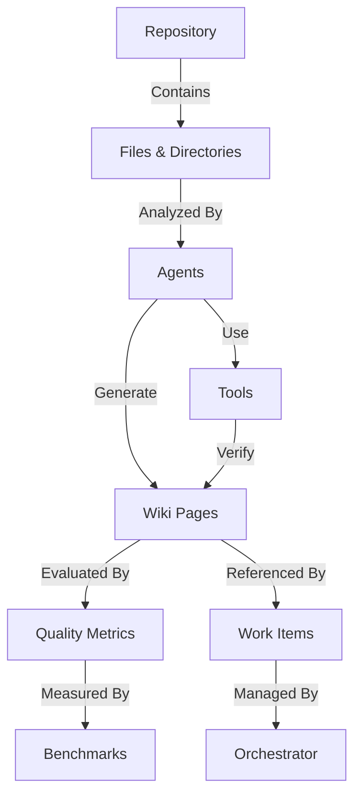

---

### Domain Boundaries

**Repository Domain:**
- Manages code repository metadata
- Tracks file structure and changes
- Maintains coverage metrics
- Handles Git integration

**Wiki Domain:**
- Stores generated documentation
- Manages page relationships
- Tracks content versions
- Provides search and retrieval

**Work Domain:**
- Orchestrates wiki generation
- Manages agent task queues
- Tracks phase progression
- Coordinates scheduling

**Quality Domain:**
- Measures documentation quality
- Runs accuracy benchmarks
- Tracks quality trends
- Enforces standards

**Agent Domain:**
- Defines agent capabilities
- Manages tool assignments
- Tracks agent execution
- Provides agent scheduling

---

## Core Entities

### Entity Summary

| Entity | Purpose | Key Attributes | Lifecycle |
|--------|---------|----------------|-----------|
| Repository | Represents source codebase | path, remote URL, metadata | Long-lived, updated on push |
| File | Individual source file | path, type, size, coverage | Immutable snapshot per commit |
| WikiPage | Generated documentation | content, topics, quality score | Versioned, regenerated |
| WorkItem | Task for wiki generation | type, status, priority, agent | Created → In Progress → Completed |
| QualityMetrics | Page quality assessment | 8 dimension scores, overall | Recalculated on benchmark |
| Benchmark | Quality measurement run | type, results, timestamp | Immutable after completion |
| Agent | Documentation generator | name, prompt, tools | Configuration, long-lived |
| Tool | Agent capability | name, function, schema | Configuration, long-lived |

---

## Repository Domain

### Repository Entity

**Purpose**: Represents a Git repository being documented

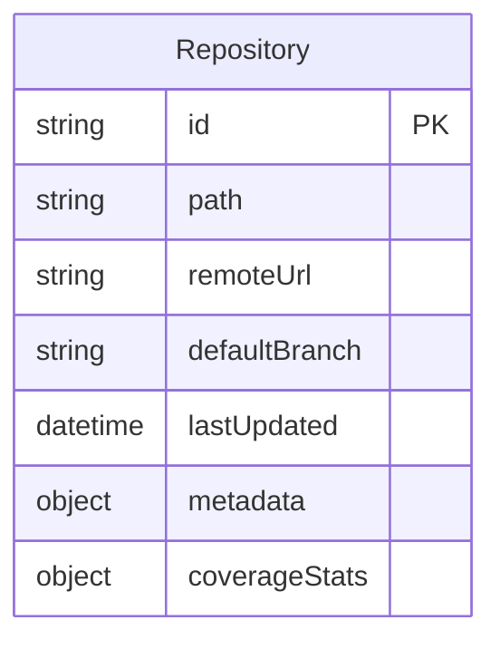

**Attributes:**

| Field | Type | Description | Constraints |
|-------|------|-------------|-------------|
| id | string | Unique repository identifier | Primary key, UUID or hash |
| path | string | Local filesystem path | Absolute path, validated |
| remoteUrl | string | Git remote URL (optional) | Valid URL or null |
| defaultBranch | string | Main branch name | Defaults to 'main' or 'master' |
| lastUpdated | datetime | Last wiki generation time | ISO 8601 timestamp |
| metadata | object | Repository metadata | Languages, size, commit count |
| coverageStats | object | Documentation coverage | Percentage, files covered, depth |

**Metadata Structure:**
- **languages**: Map of language to line count
- **totalFiles**: Total number of files
- **totalLines**: Total lines of code
- **commitCount**: Number of commits
- **contributors**: List of contributor names
- **createdAt**: Repository creation date
- **lastCommit**: Latest commit hash and date

**Coverage Stats Structure:**
- **overallPercentage**: 0-100% coverage
- **filesCovered**: Count of documented files
- **totalFiles**: Total files in repository
- **averageDepth**: Average documentation depth
- **directoryCoverage**: Map of directory to coverage %

---

### File Entity

**Purpose**: Represents an individual file in the repository

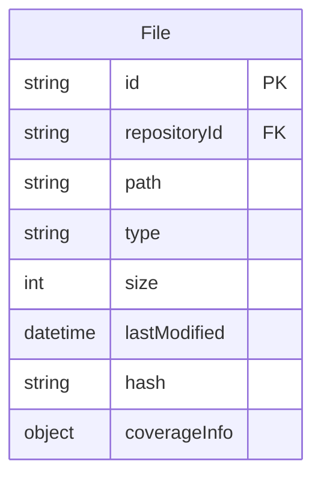

**Attributes:**

| Field | Type | Description | Constraints |
|-------|------|-------------|-------------|
| id | string | Unique file identifier | Primary key, path-based hash |
| repositoryId | string | Parent repository | Foreign key to Repository |
| path | string | File path relative to repo root | Unique within repository |
| type | string | File type/extension | .ts, .js, .py, etc. |
| size | int | File size in bytes | Non-negative |
| lastModified | datetime | Last modification time | From Git history |
| hash | string | Content hash (SHA-256) | For change detection |
| coverageInfo | object | Documentation coverage | Score, pages, depth |

**Coverage Info Structure:**
- **coverageScore**: 0-100% documentation coverage
- **documentedBy**: Array of wiki page IDs
- **depthLevel**: 0-3 (none, shallow, medium, deep)
- **lastDocumented**: Timestamp of last documentation
- **gaps**: Array of undocumented aspects

---

### Directory Entity

**Purpose**: Represents a directory in the repository hierarchy

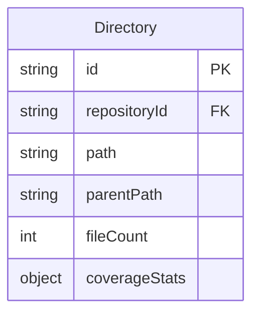

**Attributes:**

| Field | Type | Description | Constraints |
|-------|------|-------------|-------------|
| id | string | Unique directory identifier | Primary key |
| repositoryId | string | Parent repository | Foreign key to Repository |
| path | string | Directory path | Relative to repo root |
| parentPath | string | Parent directory path | Null for root |
| fileCount | int | Number of files | Direct children only |
| coverageStats | object | Aggregate coverage | Percentage, depth |

**Coverage Stats Structure:**
- **overallCoverage**: Aggregate coverage percentage
- **filesInDirectory**: Total files count
- **filesCovered**: Documented files count
- **subdirectoryCoverage**: Map of subdir to coverage
- **priorityScore**: Selection priority for breadth phase

---

## Wiki Page Domain

### WikiPage Entity

**Purpose**: Represents a generated documentation page

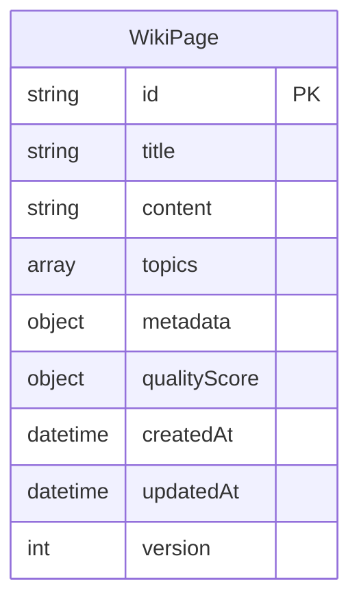

**Attributes:**

| Field | Type | Description | Constraints |
|-------|------|-------------|-------------|
| id | string | Unique page identifier | Primary key, UUID |
| title | string | Page title | Required, 1-200 chars |
| content | string | Markdown content | Required, markdown format |
| topics | array | Topic tags | Array of strings |
| metadata | object | Page metadata | See structure below |
| qualityScore | object | Quality metrics | 8 dimensions + overall |
| createdAt | datetime | Creation timestamp | ISO 8601 |
| updatedAt | datetime | Last update timestamp | ISO 8601 |
| version | int | Version number | Increments on update |

**Metadata Structure:**
- **agent**: Agent that generated this page
- **phase**: Orchestrator phase during generation
- **sourceFiles**: Array of file paths referenced
- **relatedPages**: Array of related page IDs
- **wordCount**: Total word count
- **estimatedReadingTime**: Minutes to read
- **difficulty**: Beginner/Intermediate/Advanced
- **audience**: Target audience tags

**Quality Score Structure:**
- **overall**: Weighted average 0-10
- **accuracy**: Factual correctness 0-10
- **completeness**: Coverage depth 0-10
- **clarity**: Readability 0-10
- **relevance**: Topic appropriateness 0-10
- **consistency**: Internal coherence 0-10
- **timeliness**: Freshness 0-10
- **verifiability**: Tool-verified facts 0-10
- **accessibility**: Ease of understanding 0-10

---

### WikiPageVersion Entity

**Purpose**: Stores historical versions of wiki pages

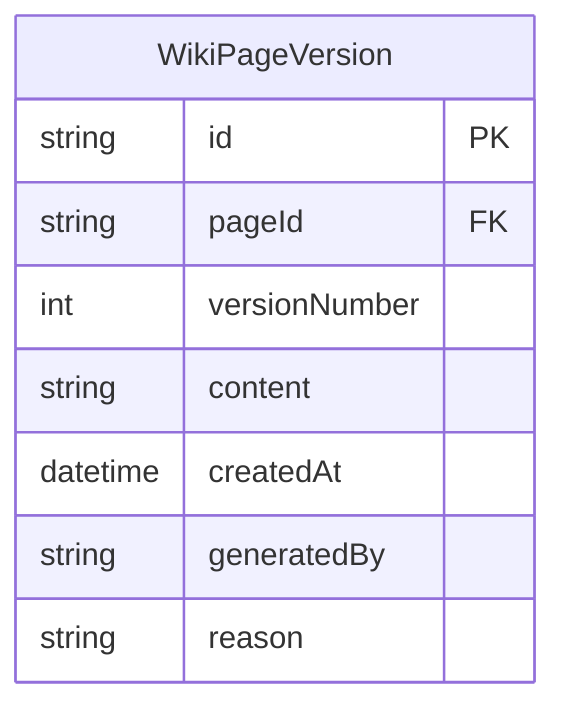

**Attributes:**

| Field | Type | Description | Constraints |
|-------|------|-------------|-------------|
| id | string | Unique version identifier | Primary key |
| pageId | string | Parent page | Foreign key to WikiPage |
| versionNumber | int | Version sequence number | Positive, sequential |
| content | string | Page content at this version | Markdown |
| createdAt | datetime | Version creation time | ISO 8601 |
| generatedBy | string | Agent or user | Agent name or 'manual' |
| reason | string | Reason for regeneration | Update, fix, improve, etc. |

---

### Topic Entity

**Purpose**: Represents a documentation topic or tag

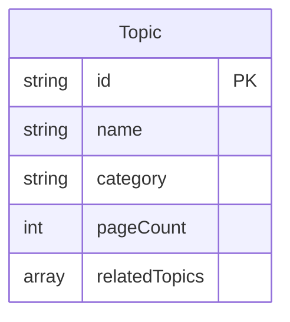

**Attributes:**

| Field | Type | Description | Constraints |
|-------|------|-------------|-------------|
| id | string | Unique topic identifier | Primary key, slug |
| name | string | Topic display name | Required, unique |
| category | string | Topic category | Architecture, API, Guide, etc. |
| pageCount | int | Number of pages with this topic | Non-negative |
| relatedTopics | array | Related topic IDs | For topic navigation |

---

## Work Management Domain

### WorkItem Entity

**Purpose**: Represents a task in the wiki generation process

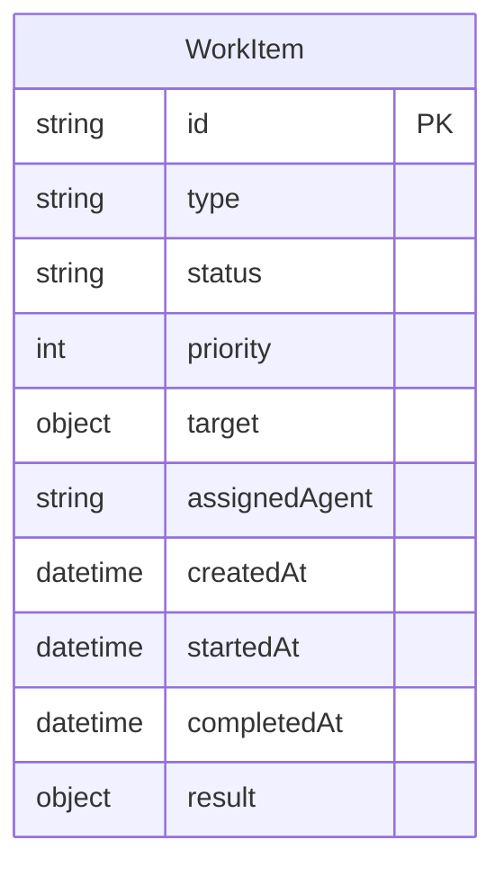

**Attributes:**

| Field | Type | Description | Constraints |
|-------|------|-------------|-------------|
| id | string | Unique work item identifier | Primary key, UUID |
| type | string | Type of work | page_generation, update, benchmark, etc. |
| status | string | Current status | pending, in_progress, completed, failed |
| priority | int | Priority score | 0-100, higher = more important |
| target | object | Work target specification | Varies by type |
| assignedAgent | string | Agent handling this work | Agent name |
| createdAt | datetime | Creation timestamp | ISO 8601 |
| startedAt | datetime | Start timestamp | Null if not started |
| completedAt | datetime | Completion timestamp | Null if not complete |
| result | object | Work output | Varies by type |

**Target Structure (Page Generation)**:
- **pageId**: ID of page to generate (null for new)
- **topic**: Topic to document
- **sourceFiles**: Files to reference
- **depth**: Desired documentation depth
- **context**: Additional context for agent

**Result Structure**:
- **success**: Boolean indicating success
- **pageId**: ID of created/updated page
- **qualityScore**: Initial quality assessment
- **tokensUsed**: LLM tokens consumed
- **duration**: Execution time in ms
- **errors**: Array of error messages if failed

---

### Phase Entity

**Purpose**: Represents an orchestrator phase execution

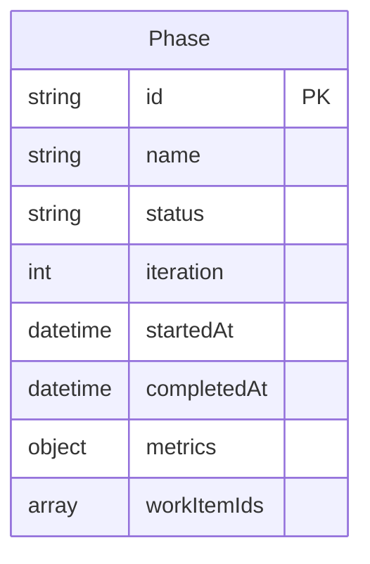

**Attributes:**

| Field | Type | Description | Constraints |
|-------|------|-------------|-------------|
| id | string | Unique phase identifier | Primary key |
| name | string | Phase name | reconnaissance, skeleton, breadth, depth, polish, maintenance |
| status | string | Phase status | pending, active, completed |
| iteration | int | Iteration number | For phases that repeat |
| startedAt | datetime | Phase start time | ISO 8601 |
| completedAt | datetime | Phase completion time | Null if active |
| metrics | object | Phase-specific metrics | See structure below |
| workItemIds | array | Work items in this phase | Array of work item IDs |

**Metrics Structure**:
- **workItemsCreated**: Total work items created
- **workItemsCompleted**: Completed work items
- **pagesGenerated**: New pages created
- **pagesUpdated**: Existing pages updated
- **coverageImprovement**: Coverage % gained
- **qualityAverage**: Average quality of pages
- **totalCost**: API cost for this phase
- **totalDuration**: Total execution time

---

## Quality & Benchmarking Domain

### QualityMetrics Entity

**Purpose**: Stores quality assessment for a wiki page

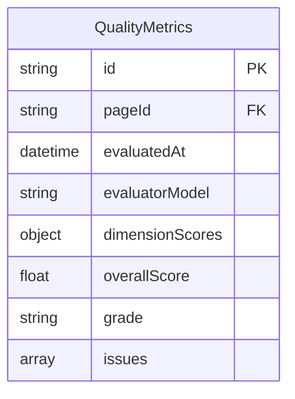

**Attributes:**

| Field | Type | Description | Constraints |
|-------|------|-------------|-------------|
| id | string | Unique metrics identifier | Primary key |
| pageId | string | Page being evaluated | Foreign key to WikiPage |
| evaluatedAt | datetime | Evaluation timestamp | ISO 8601 |
| evaluatorModel | string | LLM model used for eval | e.g., 'gpt-4-turbo' |
| dimensionScores | object | 8 dimension scores | Each 0-10 |
| overallScore | float | Weighted average | 0-10 |
| grade | string | Letter grade | A/B/C/D/F |
| issues | array | Identified quality issues | Array of issue objects |

**Dimension Scores Structure:**
- **accuracy**: 0-10 (weight: 0.25)
- **completeness**: 0-10 (weight: 0.20)
- **clarity**: 0-10 (weight: 0.15)
- **relevance**: 0-10 (weight: 0.10)
- **consistency**: 0-10 (weight: 0.10)
- **timeliness**: 0-10 (weight: 0.10)
- **verifiability**: 0-10 (weight: 0.05)
- **accessibility**: 0-10 (weight: 0.05)

**Issue Object Structure:**
- **dimension**: Which dimension has issue
- **severity**: low/medium/high
- **description**: What the problem is
- **suggestion**: How to fix it

---

### Benchmark Entity

**Purpose**: Represents a quality or accuracy benchmark run

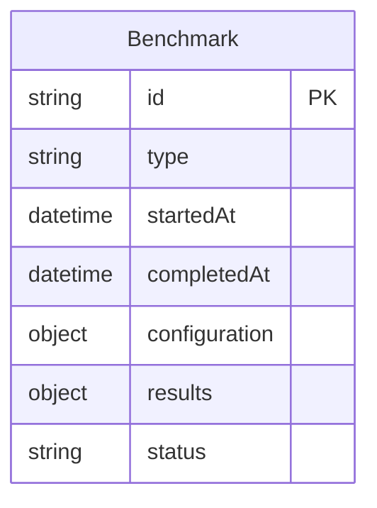

**Attributes:**

| Field | Type | Description | Constraints |
|-------|------|-------------|-------------|
| id | string | Unique benchmark identifier | Primary key, UUID |
| type | string | Benchmark type | quality, accuracy, auto-benchmark |
| startedAt | datetime | Start timestamp | ISO 8601 |
| completedAt | datetime | Completion timestamp | Null if running |
| configuration | object | Benchmark config | See structure below |
| results | object | Benchmark results | See structure below |
| status | string | Execution status | pending, running, completed, failed |

**Configuration Structure (Quality Benchmark)**:
- **pages**: Array of page IDs to evaluate (or 'all')
- **dimensions**: Array of dimensions to score
- **evaluatorModel**: LLM model for evaluation
- **thresholds**: Pass/fail thresholds per dimension

**Configuration Structure (Accuracy Benchmark)**:
- **pages**: Array of page IDs to test
- **questionSet**: Array of question objects
- **evaluatorModel**: LLM model for grading
- **passingScore**: Minimum score to pass

**Results Structure:**
- **overallScore**: Aggregate score
- **passedPages**: Count of passing pages
- **failedPages**: Count of failing pages
- **pageResults**: Map of page ID to scores
- **totalCost**: API cost for benchmark
- **totalDuration**: Execution time in ms

---

### BenchmarkQuestion Entity

**Purpose**: Represents a question in an accuracy benchmark

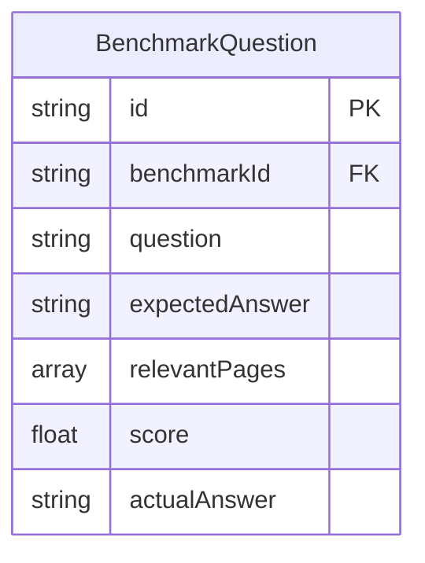

**Attributes:**

| Field | Type | Description | Constraints |
|-------|------|-------------|-------------|
| id | string | Unique question identifier | Primary key |
| benchmarkId | string | Parent benchmark | Foreign key to Benchmark |
| question | string | Question text | Required |
| expectedAnswer | string | Expected answer or criteria | Required |
| relevantPages | array | Page IDs that should answer | Optional hint |
| score | float | Actual score received | 0-10, null if not graded |
| actualAnswer | string | Answer extracted from wiki | Null if not run |

---

## Agent & Tool Domain

### Agent Entity

**Purpose**: Defines an agent that generates documentation

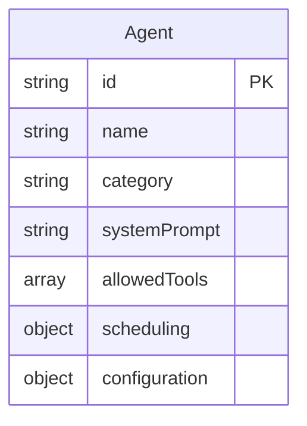

**Attributes:**

| Field | Type | Description | Constraints |
|-------|------|-------------|-------------|
| id | string | Unique agent identifier | Primary key, slug |
| name | string | Agent display name | Required, unique |
| category | string | Agent category | analysis, meta, synthesis, consolidation |
| systemPrompt | string | LLM system prompt | Required, detailed |
| allowedTools | array | Tool IDs agent can use | Array of tool IDs |
| scheduling | object | Scheduling configuration | Phases, priorities |
| configuration | object | Agent-specific config | Model, temperature, etc. |

**Scheduling Structure:**
- **phases**: Array of phase names where agent runs
- **priority**: Base priority for work items
- **maxConcurrent**: Max parallel executions
- **dependencies**: Array of prerequisite agents

**Configuration Structure:**
- **model**: LLM model to use (override default)
- **temperature**: Temperature setting 0-2
- **maxTokens**: Max tokens per response
- **retryAttempts**: Number of retries on failure

---

### Tool Entity

**Purpose**: Defines a tool agents can use for verification

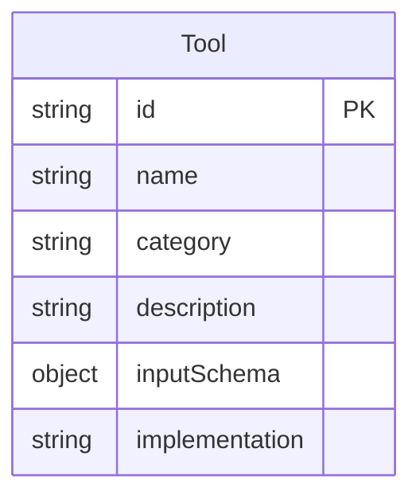

**Attributes:**

| Field | Type | Description | Constraints |
|-------|------|-------------|-------------|
| id | string | Unique tool identifier | Primary key, slug |
| name | string | Tool name | Required, unique |
| category | string | Tool category | codebase, wiki, analysis |
| description | string | What the tool does | User-facing description |
| inputSchema | object | JSON schema for inputs | Defines parameters |
| implementation | string | Implementation reference | Function name or module |

**Input Schema Structure** (JSON Schema):
- **type**: 'object'
- **properties**: Map of parameter name to schema
- **required**: Array of required parameter names

---

### ToolExecution Entity

**Purpose**: Records a tool execution by an agent

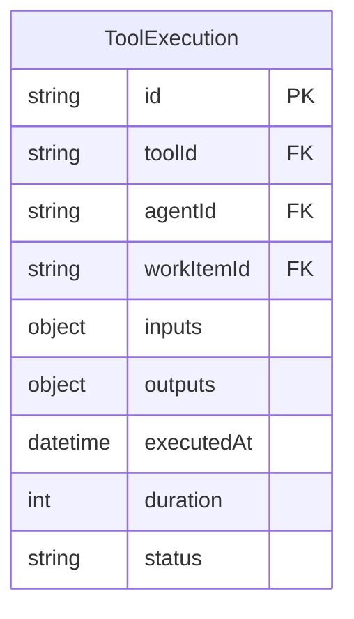

**Attributes:**

| Field | Type | Description | Constraints |
|-------|------|-------------|-------------|
| id | string | Unique execution identifier | Primary key |
| toolId | string | Tool that was executed | Foreign key to Tool |
| agentId | string | Agent that invoked tool | Foreign key to Agent |
| workItemId | string | Work item context | Foreign key to WorkItem |
| inputs | object | Tool input parameters | Varies by tool |
| outputs | object | Tool execution results | Varies by tool |
| executedAt | datetime | Execution timestamp | ISO 8601 |
| duration | int | Execution time in ms | Non-negative |
| status | string | Execution status | success, error, timeout |

---

## Storage Layer

### Storage Abstraction

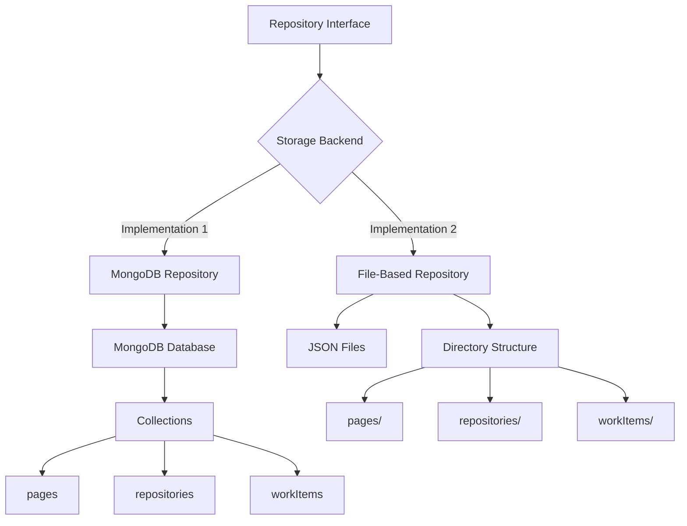

---

### Repository Pattern

**Interface Contract:**

Each entity has a repository with standard CQRS operations:

**Commands (Write Operations)**:
- `create(entity)`: Create new entity
- `update(id, changes)`: Update existing entity
- `delete(id)`: Delete entity
- `bulkCreate(entities)`: Create multiple entities
- `bulkUpdate(updates)`: Update multiple entities

**Queries (Read Operations)**:
- `findById(id)`: Get entity by ID
- `findAll(filter, options)`: Get all matching entities
- `findOne(filter)`: Get first matching entity
- `count(filter)`: Count matching entities
- `exists(filter)`: Check if entity exists

---

### MongoDB Implementation

**Collections:**

| Collection | Purpose | Indexes |
|------------|---------|---------|
| repositories | Repository entities | id (PK), path (unique) |
| files | File entities | id (PK), repositoryId + path (unique) |
| pages | WikiPage entities | id (PK), topics (multi), updatedAt |
| pageVersions | WikiPageVersion entities | id (PK), pageId + versionNumber |
| topics | Topic entities | id (PK), name (unique) |
| workItems | WorkItem entities | id (PK), status + priority (compound) |
| phases | Phase entities | id (PK), name + iteration |
| qualityMetrics | QualityMetrics entities | id (PK), pageId + evaluatedAt |
| benchmarks | Benchmark entities | id (PK), type + startedAt |
| agents | Agent entities | id (PK), name (unique) |
| tools | Tool entities | id (PK), name (unique) |
| toolExecutions | ToolExecution entities | id (PK), workItemId |

**Index Strategy:**
- Primary key index on id for all collections
- Unique indexes on natural keys (name, path)
- Compound indexes for common query patterns
- Text indexes for full-text search on content fields
- TTL indexes for temporary data

---

### File-Based Implementation

**Directory Structure:**

```
.codewiki-data/
├── repositories/
│   └── {repo-id}.json
├── files/
│   └── {repo-id}/
│       └── {file-hash}.json
├── pages/
│   ├── {page-id}.json
│   └── versions/
│       └── {page-id}-{version}.json
├── topics/
│   └── {topic-slug}.json
├── workItems/
│   └── {work-item-id}.json
├── phases/
│   └── {phase-name}-{iteration}.json
├── qualityMetrics/
│   └── {page-id}-{timestamp}.json
├── benchmarks/
│   └── {benchmark-id}.json
├── agents/
│   └── {agent-slug}.json
├── tools/
│   └── {tool-slug}.json
└── toolExecutions/
    └── {execution-id}.json
```

**File Format**: JSON with pretty printing for readability

**Query Implementation**:
- Load all entities into memory for filtering
- Build in-memory indexes for performance
- Use caching to avoid repeated file reads
- Watch files for changes (optional)

---

## Entity Relationships

### Primary Relationships

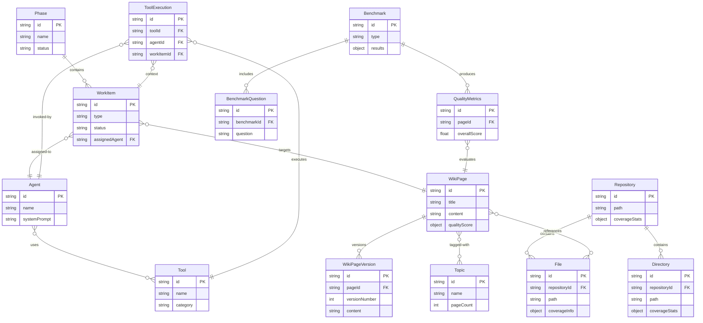

---

### Relationship Cardinalities

| Relationship | From | To | Type | Description |
|--------------|------|-----|------|-------------|
| Repository contains Files | Repository | File | 1:N | One repo has many files |
| Repository contains Directories | Repository | Directory | 1:N | One repo has many directories |
| WikiPage has Versions | WikiPage | WikiPageVersion | 1:N | One page has many versions |
| WikiPage tagged with Topics | WikiPage | Topic | M:N | Pages can have multiple topics |
| WikiPage references Files | WikiPage | File | M:N | Pages reference multiple files |
| WorkItem assigned to Agent | WorkItem | Agent | N:1 | Work item handled by one agent |
| WorkItem targets WikiPage | WorkItem | WikiPage | N:1 | Work item may target a page |
| Phase contains WorkItems | Phase | WorkItem | 1:N | Phase has many work items |
| QualityMetrics evaluates WikiPage | QualityMetrics | WikiPage | N:1 | Metrics for one page |
| Benchmark includes Questions | Benchmark | BenchmarkQuestion | 1:N | Benchmark has many questions |
| Benchmark produces QualityMetrics | Benchmark | QualityMetrics | 1:N | Benchmark generates metrics |
| Agent uses Tools | Agent | Tool | M:N | Agents use multiple tools |
| ToolExecution executes Tool | ToolExecution | Tool | N:1 | Execution of one tool |
| ToolExecution invoked by Agent | ToolExecution | Agent | N:1 | Execution by one agent |
| ToolExecution in WorkItem context | ToolExecution | WorkItem | N:1 | Execution during work item |

---

## Domain Events

### Event Types

**Repository Events:**
- `RepositoryAdded`: New repository registered
- `RepositoryUpdated`: Repository metadata changed
- `FilesAnalyzed`: File structure analyzed

**Wiki Events:**
- `PageCreated`: New wiki page generated
- `PageUpdated`: Existing page regenerated
- `PageDeleted`: Page removed
- `PageVersionCreated`: New version snapshot

**Work Events:**
- `WorkItemCreated`: New work item added
- `WorkItemStarted`: Work item execution began
- `WorkItemCompleted`: Work item finished
- `WorkItemFailed`: Work item failed
- `PhaseStarted`: Orchestrator phase began
- `PhaseCompleted`: Orchestrator phase finished

**Quality Events:**
- `QualityEvaluated`: Quality metrics calculated
- `BenchmarkStarted`: Benchmark execution began
- `BenchmarkCompleted`: Benchmark finished
- `QualityThresholdFailed`: Page below quality threshold

**Agent Events:**
- `AgentExecutionStarted`: Agent began processing
- `AgentExecutionCompleted`: Agent finished processing
- `AgentExecutionFailed`: Agent execution failed
- `ToolExecuted`: Agent invoked a tool

---

### Event Structure

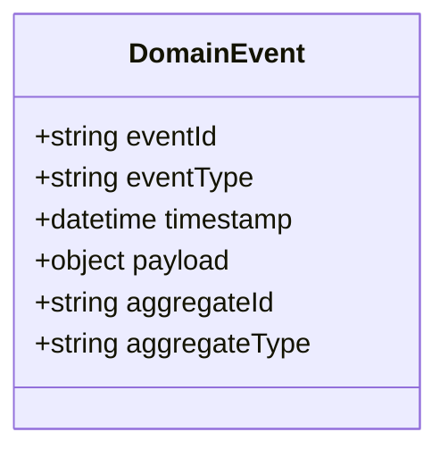

**Common Attributes:**

| Field | Type | Description |
|-------|------|-------------|
| eventId | string | Unique event identifier (UUID) |
| eventType | string | Event type name |
| timestamp | datetime | When event occurred (ISO 8601) |
| payload | object | Event-specific data |
| aggregateId | string | ID of affected entity |
| aggregateType | string | Type of affected entity |

**Example Event** (PageCreated):
- eventType: 'PageCreated'
- aggregateType: 'WikiPage'
- aggregateId: page-123
- payload:
  - pageId: page-123
  - title: "Architecture Overview"
  - generatedBy: "overview-agent"
  - phase: "skeleton"
  - topics: ["architecture", "overview"]

---

## Appendix A: Storage Size Estimates

### Typical Storage Requirements

**Small Repository** (< 100 files):
- Repository metadata: < 1 KB
- Files: ~10 KB (100 files × 100 bytes)
- Wiki pages: ~500 KB (20 pages × 25 KB)
- Work items: ~50 KB (ephemeral, cleared)
- Quality metrics: ~20 KB (20 pages × 1 KB)
- **Total**: ~600 KB

**Medium Repository** (100-1,000 files):
- Repository metadata: ~5 KB
- Files: ~100 KB (1,000 files × 100 bytes)
- Wiki pages: ~2.5 MB (100 pages × 25 KB)
- Work items: ~200 KB (ephemeral, cleared)
- Quality metrics: ~100 KB (100 pages × 1 KB)
- **Total**: ~3 MB

**Large Repository** (1,000-10,000 files):
- Repository metadata: ~10 KB
- Files: ~1 MB (10,000 files × 100 bytes)
- Wiki pages: ~12.5 MB (500 pages × 25 KB)
- Work items: ~1 MB (ephemeral, cleared)
- Quality metrics: ~500 KB (500 pages × 1 KB)
- **Total**: ~15 MB

**Page Versions**: Add 20% to wiki pages size for historical versions

---

## Appendix B: Query Patterns

### Common Queries

**Find all wiki pages for a file:**
```
WikiPage.findAll({
  'metadata.sourceFiles': { $contains: '/path/to/file.ts' }
})
```

**Find low-quality pages:**
```
WikiPage.findAll({
  'qualityScore.overall': { $lt: 7.0 }
}).sort({ 'qualityScore.overall': 'asc' })
```

**Find pending work items by priority:**
```
WorkItem.findAll({
  status: 'pending'
}).sort({ priority: 'desc' })
```

**Get coverage for directory:**
```
Directory.findOne({
  repositoryId: repo-id,
  path: 'src/agents'
})
// Returns coverageStats
```

**Find pages by topic:**
```
WikiPage.findAll({
  topics: { $contains: 'architecture' }
})
```

**Get recent benchmark results:**
```
Benchmark.findAll({
  type: 'quality',
  status: 'completed'
}).sort({ completedAt: 'desc' }).limit(10)
```

---

## Appendix C: Data Migration Considerations

### MongoDB to File-Based

**Process:**
1. Export all MongoDB collections to JSON
2. Transform to file-based structure
3. Write JSON files to appropriate directories
4. Update configuration to use file storage
5. Validate data integrity

**Challenges:**
- Relationship resolution (references by ID)
- Index recreation not applicable
- Transaction semantics lost

---

### File-Based to MongoDB

**Process:**
1. Read all JSON files from directories
2. Parse and validate against schemas
3. Insert into MongoDB collections
4. Create indexes
5. Validate relationships
6. Update configuration to use MongoDB

**Challenges:**
- Bulk insert performance
- Maintaining referential integrity
- Handling duplicate IDs

---

**Document Version**: 1.0
**Last Updated**: 2025-12-18
**Related Documents**:
- ARCHITECTURE.md - System architecture overview
- WEB_UI_FEATURES.md - Web interface using this model
- WIKI_BUILDING_PROCESS.md - How entities flow through system
- STORAGE.md - Detailed storage implementation (if exists)
