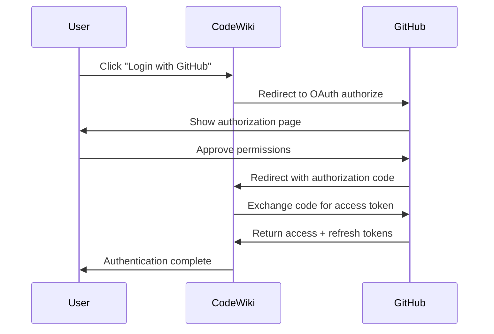
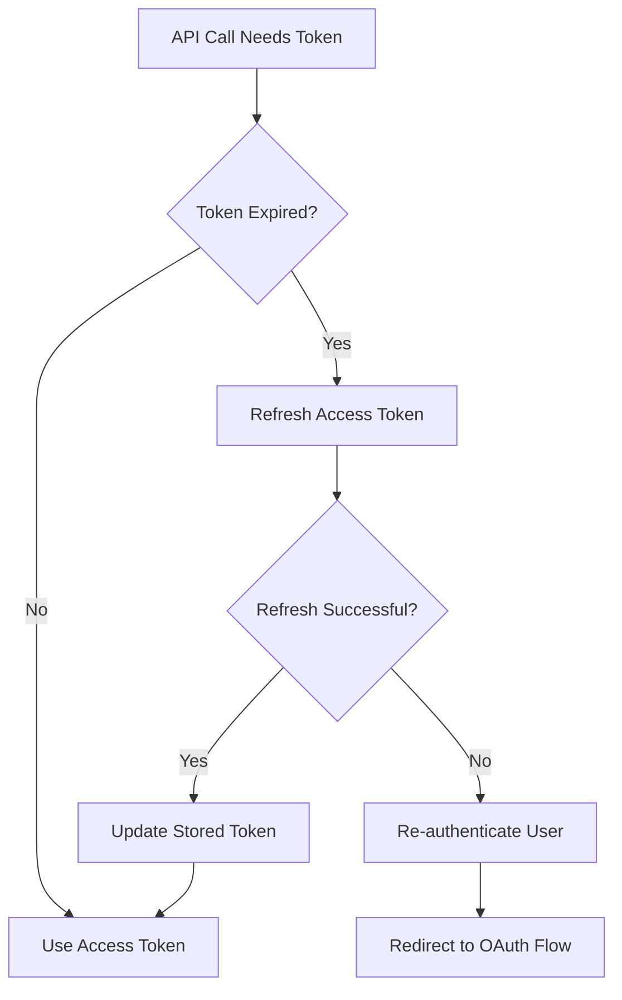
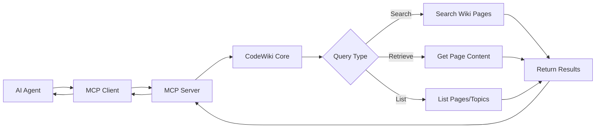
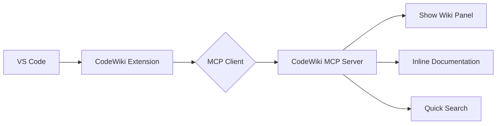
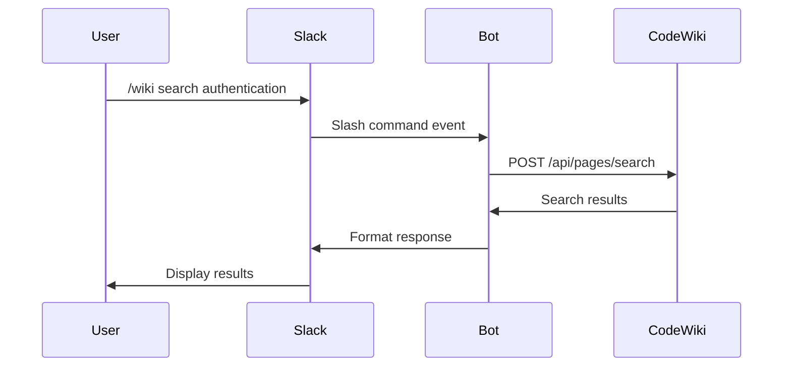

# Integration Patterns

## Executive Summary

CodeWiki provides multiple integration points to fit into diverse development workflows and toolchains. Rather than existing as an isolated documentation system, it integrates deeply with version control (GitHub), AI agent frameworks (MCP), continuous integration pipelines, and external tools via REST API.

**Core Integration Patterns:**

1. **GitHub OAuth Integration**: Secure authentication and repository access
2. **MCP Server Integration**: AI agent protocol for knowledge queries
3. **REST API Integration**: Programmatic access for custom tools
4. **CI/CD Integration**: Automated documentation in build pipelines
5. **Webhook Integration**: Event-driven wiki updates

These patterns enable CodeWiki to serve as **infrastructure** rather than just an application—a foundational layer that other systems build upon.

---

## Table of Contents

1. [Integration Philosophy](#integration-philosophy)
2. [GitHub OAuth Integration](#github-oauth-integration)
3. [MCP Server Integration](#mcp-server-integration)
4. [REST API Integration](#rest-api-integration)
5. [CI/CD Integration](#cicd-integration)
6. [Webhook Integration](#webhook-integration)
7. [Custom Integrations](#custom-integrations)
8. [Security Considerations](#security-considerations)

---

## Integration Philosophy

### Design Principles

**1. Open by Default**

CodeWiki exposes its capabilities through well-defined interfaces. Any system that can speak HTTP, OAuth, or MCP can integrate.

**2. Minimal Coupling**

Integrations don't require deep knowledge of CodeWiki internals. Clean abstractions allow surface-level integration.

**3. Standards-Based**

Where standards exist (OAuth 2.0, REST, MCP), CodeWiki conforms. This reduces integration friction and leverages existing tooling.

**4. Secure by Design**

All integrations require proper authentication and authorization. Sensitive operations are protected, and access is auditable.

---

## GitHub OAuth Integration

### Overview

GitHub OAuth integration provides secure authentication and repository access, enabling CodeWiki to clone repositories, access file contents, and receive webhook events.



---

### OAuth Flow Implementation

**Authorization Request:**

```
GET https://github.com/login/oauth/authorize
  ?client_id={CLIENT_ID}
  &redirect_uri={REDIRECT_URI}
  &scope=repo,read:org,user:email
  &state={RANDOM_STATE}
```

**Parameters:**
- `client_id`: GitHub OAuth app client ID
- `redirect_uri`: Where GitHub redirects after authorization
- `scope`: Permissions requested (repo access, org info, email)
- `state`: CSRF protection token

**Token Exchange:**

```
POST https://github.com/login/oauth/access_token
  code={AUTH_CODE}
  &client_id={CLIENT_ID}
  &client_secret={CLIENT_SECRET}
  &redirect_uri={REDIRECT_URI}
```

**Response:**

```json
{
  "access_token": "gho_xxxxxxxxxxxx",
  "token_type": "bearer",
  "scope": "repo,read:org,user:email",
  "refresh_token": "ghr_xxxxxxxxxxxx",
  "refresh_token_expires_in": 15780000
}
```

---

### Token Management

**Token Storage:**

```typescript
{
  userId: string;
  accessToken: string;      // Encrypted at rest
  refreshToken: string;     // Encrypted at rest
  expiresAt: Date;
  scopes: string[];
  githubUserId: number;
  githubUsername: string;
}
```

**Token Refresh:**



**Automatic Refresh Logic:**

```typescript
async function getValidToken(userId: string): Promise<string> {
  const tokens = await loadTokens(userId);

  if (tokens.expiresAt > new Date()) {
    return tokens.accessToken;
  }

  // Token expired, refresh it
  const refreshed = await refreshToken(tokens.refreshToken);

  await storeTokens(userId, {
    ...tokens,
    accessToken: refreshed.access_token,
    expiresAt: new Date(Date.now() + refreshed.expires_in * 1000)
  });

  return refreshed.access_token;
}
```

---

### GitHub API Integration

**Repository Cloning:**

```typescript
async function cloneRepository(repoUrl: string, accessToken: string) {
  // Clone with authenticated URL
  const authedUrl = repoUrl.replace(
    'https://github.com/',
    `https://${accessToken}@github.com/`
  );

  await exec(`git clone ${authedUrl} ./repos/${repoId}`);
}
```

**API Requests:**

```typescript
async function fetchRepositoryInfo(owner: string, repo: string, token: string) {
  const response = await fetch(
    `https://api.github.com/repos/${owner}/${repo}`,
    {
      headers: {
        'Authorization': `Bearer ${token}`,
        'Accept': 'application/vnd.github.v3+json'
      }
    }
  );

  return response.json();
}
```

**Common API Endpoints Used:**

| Endpoint | Purpose | Method |
|----------|---------|--------|
| /user/repos | List accessible repositories | GET |
| /repos/:owner/:repo | Get repository info | GET |
| /repos/:owner/:repo/contents/:path | Get file contents | GET |
| /repos/:owner/:repo/commits | Get commit history | GET |
| /repos/:owner/:repo/hooks | Manage webhooks | GET, POST |

---

### Permission Scopes

**Required Scopes:**

- **repo**: Full repository access (read, clone)
- **read:org**: Read organization membership
- **user:email**: Access user email address

**Optional Scopes:**

- **admin:repo_hook**: Create and manage webhooks
- **workflow**: Trigger GitHub Actions workflows

---

## MCP Server Integration

### Overview

The Model Context Protocol (MCP) server enables AI agents to query CodeWiki's knowledge base programmatically. This is the primary integration point for AI-first applications.



---

### MCP Protocol

**Connection Establishment:**

```json
{
  "jsonrpc": "2.0",
  "method": "initialize",
  "params": {
    "protocolVersion": "1.0",
    "capabilities": {
      "tools": true,
      "resources": true,
      "prompts": false
    },
    "clientInfo": {
      "name": "my-ai-agent",
      "version": "1.0.0"
    }
  },
  "id": 1
}
```

**Server Response:**

```json
{
  "jsonrpc": "2.0",
  "result": {
    "protocolVersion": "1.0",
    "capabilities": {
      "tools": {
        "listChanged": true
      },
      "resources": {
        "subscribe": true,
        "listChanged": true
      }
    },
    "serverInfo": {
      "name": "codewiki-mcp-server",
      "version": "1.0.0"
    }
  },
  "id": 1
}
```

---

### Available Tools

**1. Search Wiki**

```json
{
  "name": "search_wiki",
  "description": "Search wiki pages by keyword or concept",
  "inputSchema": {
    "type": "object",
    "properties": {
      "query": {
        "type": "string",
        "description": "Search query"
      },
      "maxResults": {
        "type": "number",
        "description": "Maximum results to return",
        "default": 20
      }
    },
    "required": ["query"]
  }
}
```

**Usage:**

```json
{
  "jsonrpc": "2.0",
  "method": "tools/call",
  "params": {
    "name": "search_wiki",
    "arguments": {
      "query": "authentication flow",
      "maxResults": 10
    }
  },
  "id": 2
}
```

**Response:**

```json
{
  "jsonrpc": "2.0",
  "result": {
    "content": [
      {
        "type": "text",
        "text": "[{\"pageId\":\"auth-overview\",\"title\":\"Authentication Overview\",\"excerpt\":\"...authentication flow using OAuth...\",\"relevance\":0.95}]"
      }
    ]
  },
  "id": 2
}
```

---

**2. Get Page**

```json
{
  "name": "get_wiki_page",
  "description": "Retrieve full content of a wiki page",
  "inputSchema": {
    "type": "object",
    "properties": {
      "pageId": {
        "type": "string",
        "description": "Page identifier"
      }
    },
    "required": ["pageId"]
  }
}
```

---

**3. List Topics**

```json
{
  "name": "list_topics",
  "description": "List all topics in wiki",
  "inputSchema": {
    "type": "object",
    "properties": {
      "sortBy": {
        "type": "string",
        "enum": ["name", "count"],
        "default": "count"
      }
    }
  }
}
```

---

### MCP Resources

**Resource URIs:**

- `wiki://pages` - All wiki pages
- `wiki://pages/:pageId` - Specific page
- `wiki://topics` - All topics
- `wiki://topics/:topicId` - Pages for topic

**Resource Access:**

```json
{
  "jsonrpc": "2.0",
  "method": "resources/read",
  "params": {
    "uri": "wiki://pages/auth-overview"
  },
  "id": 3
}
```

**Response:**

```json
{
  "jsonrpc": "2.0",
  "result": {
    "contents": [
      {
        "uri": "wiki://pages/auth-overview",
        "mimeType": "text/markdown",
        "text": "# Authentication Overview\n\n..."
      }
    ]
  },
  "id": 3
}
```

---

### MCP Server Configuration

**Server Startup:**

```bash
# Start MCP server on specific port
codewiki mcp-server --port 3100

# With authentication
codewiki mcp-server --port 3100 --auth-token SECRET_TOKEN

# With custom storage
codewiki mcp-server --storage-backend mongodb://localhost/codewiki
```

**Client Configuration (Example for Claude Desktop):**

```json
{
  "mcpServers": {
    "codewiki": {
      "command": "npx",
      "args": ["codewiki-mcp-server"],
      "env": {
        "CODEWIKI_STORAGE_PATH": "/path/to/.codewiki-data"
      }
    }
  }
}
```

---

## REST API Integration

### API Overview

CodeWiki exposes a REST API for programmatic access to all functionality.

**Base URL:** `http://localhost:3000/api`

**Authentication:** Bearer token or session cookie

---

### API Endpoints

**Pages**

```
GET    /api/pages              # List all pages
GET    /api/pages/:id          # Get specific page
POST   /api/pages/search       # Search pages
POST   /api/pages              # Create page (admin)
PUT    /api/pages/:id          # Update page (admin)
DELETE /api/pages/:id          # Delete page (admin)
```

**Repositories**

```
GET    /api/repositories       # List repositories
GET    /api/repositories/:id   # Get repository info
POST   /api/repositories       # Add repository
DELETE /api/repositories/:id   # Remove repository
```

**Quality & Benchmarks**

```
GET    /api/quality/metrics    # Get quality metrics
POST   /api/benchmarks/run     # Run benchmark
GET    /api/benchmarks/:id     # Get benchmark results
```

**System**

```
GET    /api/system/status      # System status
POST   /api/system/process     # Trigger wiki generation
GET    /api/system/progress    # Get progress
```

---

### API Examples

**List Pages:**

```bash
curl -X GET http://localhost:3000/api/pages \
  -H "Authorization: Bearer YOUR_TOKEN" \
  -H "Content-Type: application/json"
```

**Response:**

```json
{
  "pages": [
    {
      "id": "page-123",
      "title": "Architecture Overview",
      "topics": ["architecture", "overview"],
      "qualityScore": 9.2,
      "updatedAt": "2025-12-18T10:00:00Z"
    }
  ],
  "total": 1,
  "page": 1,
  "pageSize": 20
}
```

---

**Search Pages:**

```bash
curl -X POST http://localhost:3000/api/pages/search \
  -H "Authorization: Bearer YOUR_TOKEN" \
  -H "Content-Type: application/json" \
  -d '{
    "query": "authentication",
    "filters": {
      "topics": ["security"],
      "minQuality": 7.0
    },
    "maxResults": 10
  }'
```

**Response:**

```json
{
  "results": [
    {
      "pageId": "auth-overview",
      "title": "Authentication Overview",
      "excerpt": "...OAuth 2.0 authentication flow...",
      "relevanceScore": 0.95,
      "qualityScore": 8.5
    }
  ],
  "total": 1
}
```

---

**Trigger Wiki Generation:**

```bash
curl -X POST http://localhost:3000/api/system/process \
  -H "Authorization: Bearer YOUR_TOKEN" \
  -H "Content-Type: application/json" \
  -d '{
    "repositoryId": "repo-123",
    "mode": "incremental",
    "phases": ["depth", "polish"]
  }'
```

**Response:**

```json
{
  "processId": "proc-456",
  "status": "started",
  "estimatedDuration": 1800,
  "message": "Wiki generation started"
}
```

---

### API Authentication

**Token-Based Auth:**

```bash
# Obtain token
curl -X POST http://localhost:3000/api/auth/login \
  -H "Content-Type: application/json" \
  -d '{"username":"user","password":"pass"}'

# Response
{"token":"eyJhbGc...","expiresIn":86400}

# Use token
curl -X GET http://localhost:3000/api/pages \
  -H "Authorization: Bearer eyJhbGc..."
```

**Session-Based Auth:**

```bash
# Login (sets cookie)
curl -X POST http://localhost:3000/api/auth/login \
  -H "Content-Type: application/json" \
  -d '{"username":"user","password":"pass"}' \
  -c cookies.txt

# Use session cookie
curl -X GET http://localhost:3000/api/pages \
  -b cookies.txt
```

---

## CI/CD Integration

### GitHub Actions Integration

**Workflow Example:**

```yaml
name: Update Wiki

on:
  push:
    branches: [main]

jobs:
  update-wiki:
    runs-on: ubuntu-latest
    steps:
      - uses: actions/checkout@v3

      - name: Setup Node.js
        uses: actions/setup-node@v3
        with:
          node-version: '18'

      - name: Install CodeWiki
        run: npm install -g codewiki

      - name: Generate Wiki
        env:
          OPENROUTER_API_KEY: ${{ secrets.OPENROUTER_API_KEY }}
        run: |
          codewiki process --repository .

      - name: Upload Wiki Artifact
        uses: actions/upload-artifact@v3
        with:
          name: wiki
          path: .codewiki-data/

      - name: Deploy to Wiki Server
        run: |
          rsync -avz .codewiki-data/ user@wiki-server:/var/www/wiki/
```

---

### GitLab CI Integration

```yaml
stages:
  - documentation

update-wiki:
  stage: documentation
  image: node:18
  script:
    - npm install -g codewiki
    - codewiki process --repository .
  artifacts:
    paths:
      - .codewiki-data/
    expire_in: 30 days
  only:
    - main
```

---

### Jenkins Integration

```groovy
pipeline {
    agent any

    environment {
        OPENROUTER_API_KEY = credentials('openrouter-api-key')
    }

    stages {
        stage('Update Wiki') {
            steps {
                sh 'npm install -g codewiki'
                sh 'codewiki process --repository .'
                archiveArtifacts artifacts: '.codewiki-data/**/*'
            }
        }
    }
}
```

---

## Webhook Integration

### GitHub Webhooks

**Setup:**

```typescript
async function setupWebhook(repoFullName: string, accessToken: string) {
  const [owner, repo] = repoFullName.split('/');

  await fetch(
    `https://api.github.com/repos/${owner}/${repo}/hooks`,
    {
      method: 'POST',
      headers: {
        'Authorization': `Bearer ${accessToken}`,
        'Content-Type': 'application/json'
      },
      body: JSON.stringify({
        name: 'web',
        active: true,
        events: ['push', 'pull_request'],
        config: {
          url: 'https://codewiki.example.com/webhooks/github',
          content_type: 'json',
          secret: process.env.WEBHOOK_SECRET
        }
      })
    }
  );
}
```

---

**Webhook Handler:**

```typescript
app.post('/webhooks/github', async (req, res) => {
  // Verify signature
  const signature = req.headers['x-hub-signature-256'];
  if (!verifySignature(req.body, signature, WEBHOOK_SECRET)) {
    return res.status(401).send('Invalid signature');
  }

  const event = req.headers['x-github-event'];
  const payload = req.body;

  if (event === 'push' && payload.ref === 'refs/heads/main') {
    // Trigger incremental wiki update
    await queueWikiUpdate({
      repositoryId: payload.repository.id,
      commit: payload.after,
      changedFiles: payload.commits.flatMap(c => c.modified)
    });
  }

  res.status(200).send('OK');
});
```

---

## Custom Integrations

### VS Code Extension

**Concept:**



**Features:**
- Sidebar panel showing relevant wiki pages
- Inline documentation on hover
- Command palette search
- Auto-refresh on file changes

---

### Slack Bot

**Integration Flow:**



---

### IDE Plugins (IntelliJ, Neovim)

**Common Pattern:**

1. Plugin detects codebase
2. Connects to CodeWiki MCP server
3. Provides context-aware documentation
4. Updates on file navigation

---

## Security Considerations

### OAuth Security

**Best Practices:**

- Store tokens encrypted at rest
- Use HTTPS for all OAuth flows
- Validate redirect URIs strictly
- Implement CSRF protection with state parameter
- Rotate client secrets regularly
- Use short-lived access tokens with refresh

---

### API Security

**Authentication:**
- Require authentication for all sensitive endpoints
- Use JWT tokens with expiration
- Implement rate limiting per token

**Authorization:**
- Verify user permissions for operations
- Scope tokens to minimum necessary permissions
- Audit all administrative actions

**Input Validation:**
- Sanitize all inputs
- Validate against schemas
- Prevent injection attacks

---

### Webhook Security

**Signature Verification:**

```typescript
function verifySignature(
  payload: string,
  signature: string,
  secret: string
): boolean {
  const hmac = crypto.createHmac('sha256', secret);
  const digest = 'sha256=' + hmac.update(payload).digest('hex');
  return crypto.timingSafeEqual(
    Buffer.from(signature),
    Buffer.from(digest)
  );
}
```

**Additional Protections:**
- Use HTTPS endpoints only
- Implement replay attack prevention
- Rate limit webhook deliveries
- Log all webhook events

---

## Appendix: Integration Checklist

### New Integration Checklist

- [ ] Define integration goals and use cases
- [ ] Choose appropriate integration pattern (OAuth, MCP, API)
- [ ] Design authentication mechanism
- [ ] Implement error handling
- [ ] Add rate limiting
- [ ] Write integration tests
- [ ] Document integration process
- [ ] Set up monitoring and logging
- [ ] Perform security review
- [ ] Create usage examples
- [ ] Plan for versioning and deprecation

---

**Document Version**: 1.0
**Last Updated**: 2025-12-18
**Related Documents**:
- USER_WORKFLOWS.md - User interaction patterns
- CONFIGURATION.md - Integration configuration
- ARCHITECTURE.md - System architecture
