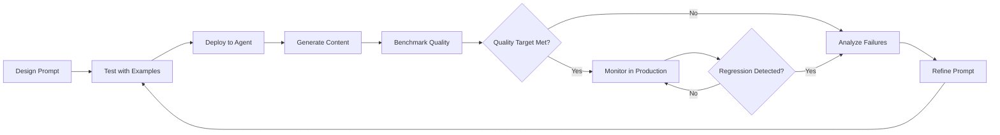
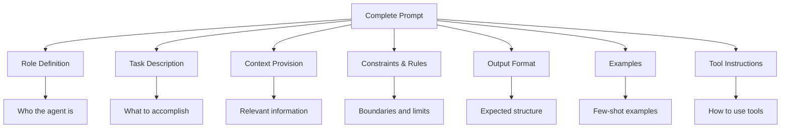
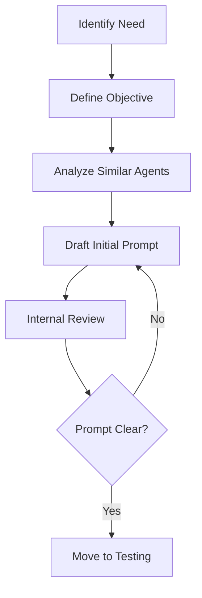
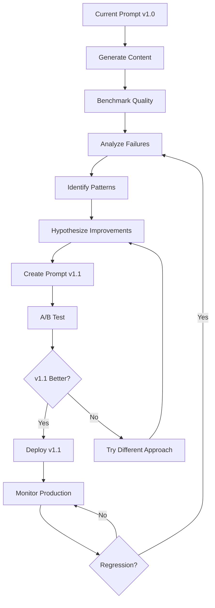
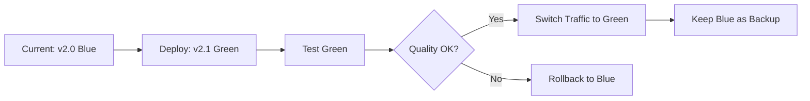
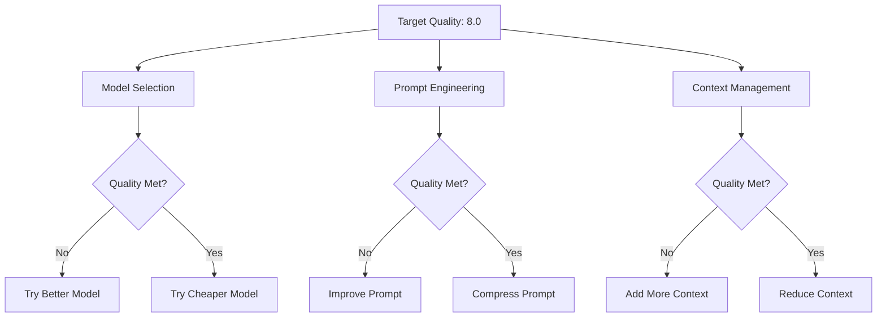

# Prompt Engineering & Tuning Methodology

## Executive Summary

Prompt engineering is the cornerstone of CodeWiki's documentation quality. While the system architecture enables wiki generation, the **prompts determine what gets generated and how well**. This document details CodeWiki's systematic approach to designing, testing, tuning, and optimizing prompts for 26+ specialized agents.

**Core Philosophy:**

The quality of generated documentation is directly proportional to prompt quality. A 10% improvement in prompt design can yield 50%+ improvement in output quality while potentially reducing costs through more efficient token usage.

**Key Principles:**

1. **Prompts are Code**: Version controlled, tested, reviewed, and deployed with rigor
2. **Measure Everything**: Every prompt change backed by quantitative evaluation
3. **Iterate Based on Data**: Use LLM-as-judge scores and benchmarks to guide improvements
4. **Context is King**: More relevant context beats longer instructions
5. **Constraints Drive Quality**: Clear constraints prevent hallucination and drift

**Tuning Cycle:**



This document provides the systematic methodology CodeWiki uses to achieve consistently high-quality documentation through deliberate prompt engineering.

---

## Table of Contents

1. [Prompt Design Philosophy](#prompt-design-philosophy)
2. [Prompt Anatomy](#prompt-anatomy)
3. [Design Patterns](#design-patterns)
4. [Development Lifecycle](#development-lifecycle)
5. [Testing Strategy](#testing-strategy)
6. [Tuning Methodology](#tuning-methodology)
7. [Optimization Techniques](#optimization-techniques)
8. [Common Anti-Patterns](#common-anti-patterns)
9. [Version Control & Deployment](#version-control--deployment)
10. [Cost vs Quality Tradeoffs](#cost-vs-quality-tradeoffs)

---

## Prompt Design Philosophy

### First Principles

**Principle 1: Clarity Over Cleverness**

Simple, explicit instructions outperform clever tricks. LLMs follow clear directions reliably; subtle hints produce inconsistent results.

```
❌ Bad: "You might want to consider looking at the code structure..."
✅ Good: "Analyze the code structure in src/ and identify the main modules."
```

**Principle 2: Show, Don't Tell**

Examples are worth a thousand words. One good example teaches better than paragraphs of explanation.

```
❌ Bad: "Write good documentation with proper structure."
✅ Good: "Write documentation following this structure:
# Title
## Overview
[2-3 sentence summary]
## Key Concepts
[Bullet list of main ideas]
..."
```

**Principle 3: Constraints Prevent Hallucination**

Explicit boundaries keep LLMs grounded. Without constraints, models fill gaps with plausible-sounding fiction.

```
❌ Bad: "Describe the authentication system."
✅ Good: "Describe the authentication system using ONLY information from the provided code files. If a feature is not evident in the code, state 'Not found in provided code' rather than inferring."
```

**Principle 4: Context Beats Instructions**

Relevant context enables good output more than lengthy instructions. Context shows the LLM reality; instructions guide interpretation.

```
❌ Bad: Long prompt with detailed instructions but no code context
✅ Good: Relevant code snippets + concise instructions
```

**Principle 5: One Task, One Prompt**

Each prompt should have a single, clear objective. Multiple objectives lead to compromised results on all fronts.

```
❌ Bad: "Analyze the code, write documentation, and create a diagram."
✅ Good: Three separate prompts for analysis, documentation, and diagram generation.
```

---

## Prompt Anatomy

### Standard Prompt Structure

Every CodeWiki agent prompt follows a consistent structure:



---

### 1. Role Definition

**Purpose**: Establishes the agent's persona and expertise

**Pattern**:
```
You are a [specific role] specializing in [domain].
Your expertise includes [key skills].
```

**Example**:
```
You are a senior software architect specializing in system design documentation.
Your expertise includes analyzing codebases, identifying architectural patterns,
and explaining complex systems clearly to technical audiences.
```

**Best Practices**:
- Be specific about expertise (not just "expert")
- Include relevant domain knowledge
- Set appropriate authority level
- Mention target audience when relevant

---

### 2. Task Description

**Purpose**: Clearly states what the agent must accomplish

**Pattern**:
```
Your task is to [primary objective].
Specifically, you should:
1. [Subtask 1]
2. [Subtask 2]
3. [Subtask 3]
```

**Example**:
```
Your task is to generate comprehensive documentation for the provided source code.
Specifically, you should:
1. Identify the primary purpose and responsibilities of the code
2. Explain key concepts and design patterns used
3. Document important functions and their relationships
4. Highlight any notable implementation details or trade-offs
```

**Best Practices**:
- State primary objective first
- Break down into specific subtasks
- Use action verbs (identify, explain, document, analyze)
- Number subtasks for clarity

---

### 3. Context Provision

**Purpose**: Provides relevant information the agent needs

**Pattern**:
```
Context:
- Repository: [repo info]
- Files: [relevant files]
- Existing Documentation: [related docs]
- Code Snippet: [actual code]
```

**Example**:
```
Context:
- Repository: CodeWiki - Living documentation generator
- Files being documented: src/agents/OverviewAgent.ts
- Related files: src/agents/BaseAgent.ts, src/types/Agent.ts
- Existing documentation: ARCHITECTURE.md (overview of agent system)

Code to document:
[Full file contents here]
```

**Best Practices**:
- Provide only relevant context (not everything)
- Include related documentation for consistency
- Show actual code, not summaries
- Mention dependencies and relationships

---

### 4. Constraints & Rules

**Purpose**: Sets boundaries to prevent hallucination and maintain quality

**Pattern**:
```
Constraints:
- ONLY use information from provided context
- DO NOT infer or assume features not visible in code
- DO NOT include code examples unless requested
- MUST verify all factual claims using tools
- Page length: [min-max] words
```

**Example**:
```
Constraints:
- ONLY use information from the provided code files
- If you cannot determine something from the code, state "Not evident in provided code"
- DO NOT describe features that might exist - only document what demonstrably exists
- MUST use grep_code or ast_query tools to verify any specific claims about implementation
- Target length: 500-800 words (concise but comprehensive)
- Avoid marketing language - use technical, factual tone
```

**Best Practices**:
- Use emphatic language (MUST, NEVER, ONLY)
- Specify what NOT to do (prevents common errors)
- Include length constraints
- Require tool usage for verification
- Set tone and style expectations

---

### 5. Output Format

**Purpose**: Specifies the structure and format of the output

**Pattern**:
```
Output Format:
# [Title]
## [Section 1]
[Content guidelines]

## [Section 2]
[Content guidelines]

[Additional structure]
```

**Example**:
```
Output Format:
# {Module Name}

## Overview
2-3 sentence summary of the module's purpose.

## Key Responsibilities
Bulleted list of main functions/responsibilities.

## Architecture
Description of how the module is structured and key design patterns.

## Dependencies
- Internal: [list]
- External: [list]

## Usage Examples
[Only if appropriate for the module]

## Related Modules
[Cross-references to related documentation]
```

**Best Practices**:
- Provide concrete structure, not vague guidance
- Use placeholders in {braces} for dynamic content
- Specify content for each section
- Include length guidance per section if needed
- Show heading hierarchy clearly

---

### 6. Examples (Few-Shot Learning)

**Purpose**: Shows the agent exactly what good output looks like

**Pattern**:
```
Example:

Input: [sample input]

Good Output:
[exemplary output following all guidelines]

---

Input: [another sample]

Good Output:
[another exemplary output]
```

**Example**:
```
Example 1:

Input: UserService.ts - handles user management

Good Output:
# User Service

## Overview
The User Service provides core user management functionality including
registration, authentication, and profile management. It serves as the
central authority for all user-related operations in the system.

## Key Responsibilities
- User registration and validation
- Authentication and session management
- Profile CRUD operations
- Password reset workflows
...
```

**Best Practices**:
- Provide 1-3 examples (more rarely helps)
- Show diverse cases if task has variations
- Include complete examples, not fragments
- Annotate what makes the example good if subtle
- Match examples to common use cases

---

### 7. Tool Instructions

**Purpose**: Explains how to use available tools for verification

**Pattern**:
```
Available Tools:
1. tool_name(params): Description
   - Use when: [scenario]
   - Example: tool_name(param="value")

2. tool_name(params): Description
   - Use when: [scenario]
   - Example: tool_name(param="value")

Tool Usage Requirements:
- MUST verify [specific claims] using [specific tool]
- Use tools BEFORE making claims
- If tool shows different result, trust the tool
```

**Example**:
```
Available Tools:
1. grep_code(pattern, fileGlob): Search codebase for pattern matches
   - Use when: Verifying existence of functions, classes, or patterns
   - Example: grep_code(pattern="class.*Agent", fileGlob="*.ts")

2. ast_query(file, query): Parse and query AST
   - Use when: Need to understand code structure or extract definitions
   - Example: ast_query(file="src/Agent.ts", query="class_declaration")

3. search_wiki(query): Search existing wiki pages
   - Use when: Checking if topic already documented
   - Example: search_wiki(query="authentication")

Tool Usage Requirements:
- MUST use grep_code to verify any claim about function or class existence
- MUST use search_wiki BEFORE generating to avoid duplication
- If tools show code does not exist, DO NOT document it
- Include file references from tool results in your output
```

**Best Practices**:
- List all available tools with signatures
- Explain WHEN to use each tool
- Provide concrete examples
- Set mandatory tool usage for verification
- Explain how to handle tool results

---

## Design Patterns

### Pattern 1: Chain of Thought

**When to Use**: Complex analysis or reasoning tasks

**Structure**:
```
Task: [complex task]

Process:
1. First, [step 1]
2. Then, [step 2]
3. Next, [step 3]
4. Finally, [step 4]

Think through each step explicitly before producing final output.
```

**Example**:
```
Task: Identify the architectural patterns used in this codebase.

Process:
1. First, examine the directory structure and file organization
2. Then, analyze class relationships and dependencies
3. Next, identify common structural patterns (MVC, Repository, etc.)
4. Finally, look for behavioral patterns (Observer, Strategy, etc.)

Think through each step explicitly, using tools to verify your observations.
Output your findings only after completing all analysis steps.
```

**Benefits**:
- Improves reasoning quality
- Makes process auditable
- Reduces premature conclusions

---

### Pattern 2: Structured Output

**When to Use**: Need consistent, parseable output format

**Structure**:
```
Output must be valid [JSON/YAML/Markdown with strict schema].

Schema:
[Define exact schema]

Example:
[Show valid example]
```

**Example**:
```
Output must be valid JSON following this schema:

{
  "title": "string (required)",
  "summary": "string (required, 2-3 sentences)",
  "topics": ["string array (required)"],
  "sections": [
    {
      "heading": "string",
      "content": "string"
    }
  ],
  "references": [
    {
      "file": "string",
      "line": "number (optional)"
    }
  ]
}

Ensure all JSON is valid and follows this schema exactly.
```

**Benefits**:
- Enables programmatic parsing
- Reduces format errors
- Facilitates automation

---

### Pattern 3: Self-Critique

**When to Use**: High-quality output required

**Structure**:
```
After generating your output:
1. Review it against these criteria: [criteria]
2. Identify any issues
3. Revise to address issues
4. Output only the final revised version
```

**Example**:
```
After generating your documentation:
1. Review it against these criteria:
   - All claims verifiable from provided code
   - No marketing language or superlatives
   - Appropriate technical depth
   - Clear structure and flow
   - Cross-references to related docs
2. Identify any issues or violations
3. Revise to address all issues
4. Output only the final revised version

Do not show the self-critique process in your output.
```

**Benefits**:
- Improves output quality
- Catches common errors
- Approximates multi-pass review

---

### Pattern 4: Conditional Instructions

**When to Use**: Behavior varies based on context

**Structure**:
```
IF [condition]:
  [specific instructions]
ELSE IF [condition]:
  [different instructions]
ELSE:
  [default instructions]
```

**Example**:
```
IF the code file is a test file (*.test.ts, *.spec.ts):
  - Focus on what is being tested, not test implementation
  - Describe the component/feature under test
  - Summarize test coverage
ELSE IF the code file is a configuration file (*.config.ts, *.json):
  - Explain configuration options
  - Describe default values and valid ranges
  - Show example configurations
ELSE:
  - Follow standard documentation structure
  - Focus on purpose, design, and usage
```

**Benefits**:
- Handles diverse scenarios with one prompt
- Maintains consistency within categories
- Reduces number of specialized prompts needed

---

### Pattern 5: Gradual Expansion

**When to Use**: Building on existing content

**Structure**:
```
Existing content: [previous output]

Task: Expand the existing content by:
1. [expansion task 1]
2. [expansion task 2]

Maintain consistency with existing content in:
- Tone
- Structure
- Terminology
```

**Example**:
```
Existing content:
[Previous documentation snippet]

Task: Expand the existing content by adding:
1. A detailed "Implementation Details" section
2. A "Common Pitfalls" section
3. A "Best Practices" section

Maintain consistency with existing content in:
- Technical tone and depth
- Heading style and hierarchy
- Terminology (use same terms for same concepts)
- Cross-reference format

Do not modify existing sections unless correcting errors.
```

**Benefits**:
- Enables incremental improvement
- Maintains consistency
- Preserves good existing content

---

## Development Lifecycle

### Phase 1: Requirements & Design



**Steps:**

1. **Identify Need**
   - What documentation gap exists?
   - What questions should the agent answer?
   - What existing agent is most similar?

2. **Define Objective**
   - Primary goal (one sentence)
   - Success criteria (measurable)
   - Failure modes to avoid

3. **Analyze Similar Agents**
   - Review prompts of related agents
   - Identify reusable patterns
   - Note what works well

4. **Draft Initial Prompt**
   - Follow standard anatomy
   - Include all required sections
   - Add specific constraints for this agent

5. **Internal Review**
   - Read prompt aloud (catches ambiguity)
   - Check for conflicting instructions
   - Verify all tools mentioned are available
   - Confirm examples match guidelines

---

### Phase 2: Initial Testing

**Unit Testing Prompts:**

```typescript
describe('OverviewAgent prompt', () => {
  it('should generate overview for simple module', async () => {
    const context = {
      code: fs.readFileSync('tests/fixtures/SimpleModule.ts'),
      relatedDocs: []
    };

    const output = await agent.generate(context);

    // Verify structure
    expect(output).toContain('# ');
    expect(output).toContain('## Overview');
    expect(output).toContain('## Key Responsibilities');

    // Verify constraints
    expect(output).not.toMatch(/might|maybe|possibly/); // No speculation
    expect(output.length).toBeGreaterThan(400);
    expect(output.length).toBeLessThan(1000);
  });

  it('should use tools for verification', async () => {
    const context = { /* ... */ };
    const toolSpy = jest.spyOn(tools, 'grep_code');

    await agent.generate(context);

    expect(toolSpy).toHaveBeenCalled(); // Verify tools were used
  });
});
```

**Manual Testing:**

```bash
# Test with real codebase samples
codewiki test-agent overview-agent \
  --sample tests/fixtures/sample-repos/small-project \
  --output test-output/

# Review output manually
cat test-output/overview-agent/*.md
```

**Testing Criteria:**

- ✅ Output follows specified format
- ✅ Constraints are respected
- ✅ Tools are used appropriately
- ✅ Content is factual and verifiable
- ✅ Length is within bounds
- ✅ Tone matches requirements

---

### Phase 3: LLM Testing

Use LLM-as-judge to evaluate semantic quality:

```typescript
describe('OverviewAgent LLM tests', () => {
  it('should generate accurate overview', async () => {
    const output = await agent.generate(context);

    const score = await evaluateLLM({
      output: output,
      criteria: 'accuracy',
      evaluator: 'qwen/qwen-turbo',
      rubric: 'Does the overview accurately describe the module purpose and responsibilities based on the provided code?'
    });

    expect(score).toBeGreaterThan(7.0);
  });

  it('should not hallucinate features', async () => {
    const output = await agent.generate(context);

    const score = await evaluateLLM({
      output: output,
      criteria: 'grounding',
      rubric: 'Are all claims in the documentation verifiable from the provided code? Score low if any features are described that are not present.'
    });

    expect(score).toBeGreaterThan(8.0);
  });
});
```

---

### Phase 4: Integration Testing

Test agent in full system context:

```typescript
describe('OverviewAgent integration', () => {
  it('should integrate with orchestrator', async () => {
    const orchestrator = createTestOrchestrator();
    await orchestrator.runPhase('skeleton');

    const overviewPages = await repository.findPages({
      agent: 'overview-agent'
    });

    expect(overviewPages.length).toBeGreaterThan(0);

    // Check quality of generated pages
    const avgQuality = overviewPages.reduce((sum, p) => sum + p.quality, 0) / overviewPages.length;
    expect(avgQuality).toBeGreaterThan(7.0);
  });
});
```

---

### Phase 5: Benchmark & Deploy

1. **Run Quality Benchmark**
   ```bash
   codewiki benchmark quality --agent overview-agent
   ```

2. **Review Results**
   - Overall quality score
   - Dimension-specific scores
   - Common failure modes

3. **Deploy Decision**
   - If score ≥ 7.5: Deploy to production
   - If score 6.5-7.4: Deploy with monitoring
   - If score < 6.5: Return to tuning

4. **Deploy with Monitoring**
   ```typescript
   // Deploy new prompt version
   await agentRegistry.updatePrompt('overview-agent', newPrompt, {
     version: '2.0.0',
     monitoringPeriod: '7d',
     rollbackThreshold: 7.0
   });
   ```

---

## Tuning Methodology

### Data-Driven Tuning

**Tuning Cycle:**



---

### Step 1: Analyze Failures

**Identify Failure Patterns:**

```bash
# Get low-scoring pages
codewiki list pages --filter "quality < 7.0" --agent overview-agent --format json > failures.json

# Analyze common issues
cat failures.json | jq '.pages[] | {title, quality, issues}'
```

**Common Failure Patterns:**

| Pattern | Symptom | Likely Cause |
|---------|---------|--------------|
| Hallucination | Claims features not in code | Insufficient constraint emphasis |
| Speculation | Uses "might", "probably", "likely" | No explicit prohibition |
| Inconsistent length | Some 200 words, some 2000 | No length constraints |
| Missing tool use | No file references | Tool usage not required |
| Wrong tone | Marketing language | Tone not specified |
| Poor structure | Sections out of order | Format not strict enough |

---

### Step 2: Hypothesize Improvements

For each failure pattern, formulate a hypothesis:

**Example:**

- **Observation**: Agent generates content about features not present in code
- **Hypothesis**: Current constraint "Use only provided information" is too weak
- **Proposed Change**: Add "If you cannot find evidence of a feature in the code, explicitly state 'Not found in provided files' rather than describing it."
- **Expected Impact**: Reduce hallucination errors by 50%+

---

### Step 3: Implement Changes

**Change Categories:**

1. **Constraint Addition**
   ```
   OLD: Write documentation based on the code.
   NEW: Write documentation based ONLY on the code. If information
        is not present, state "Not available in provided code"
        rather than inferring or assuming.
   ```

2. **Format Tightening**
   ```
   OLD: Use headings to organize content.
   NEW: Use exactly these headings in this order:
        ## Overview
        ## Key Responsibilities
        ## Architecture
        ## Dependencies
   ```

3. **Example Improvement**
   ```
   OLD: [No examples]
   NEW: [Add 2 complete examples showing exactly what's expected]
   ```

4. **Tool Requirement**
   ```
   OLD: You have access to grep_code tool.
   NEW: You MUST use grep_code to verify any claim about function
        or class existence before stating it as fact. If grep_code
        returns no results, do not document that element.
   ```

5. **Context Enhancement**
   ```
   OLD: [Provides only the target file]
   NEW: [Provides target file + related files + existing docs]
   ```

---

### Step 4: A/B Testing

**Test Setup:**

```typescript
// Create A/B test
const abTest = await createPromptTest({
  agent: 'overview-agent',
  control: 'v1.0',  // Current prompt
  treatment: 'v1.1', // New prompt
  sampleSize: 50,    // Generate 50 pages with each
  metrics: [
    'quality.overall',
    'quality.accuracy',
    'quality.completeness',
    'cost',
    'duration'
  ]
});

// Run test
await abTest.run();

// Get results
const results = await abTest.getResults();
```

**Analyze Results:**

```typescript
{
  control: {
    quality: {
      overall: 7.2,
      accuracy: 7.5,
      completeness: 7.0
    },
    avgCost: 0.015,
    avgDuration: 8.3
  },
  treatment: {
    quality: {
      overall: 8.1,   // +0.9 improvement ✅
      accuracy: 8.8,  // +1.3 improvement ✅
      completeness: 7.5 // +0.5 improvement ✅
    },
    avgCost: 0.018,   // +20% cost increase ⚠️
    avgDuration: 9.1  // +10% duration increase ⚠️
  },
  statistical_significance: {
    quality: 0.001,   // p < 0.001, highly significant
    cost: 0.05,
    duration: 0.12
  },
  recommendation: 'DEPLOY_TREATMENT'
}
```

**Decision Criteria:**

```
Deploy Treatment IF:
  - Quality improvement ≥ 0.5 AND statistically significant
  - Cost increase < 50% OR quality improvement ≥ 1.0
  - No dimension score decreases > 0.3
```

---

### Step 5: Deploy & Monitor

**Gradual Rollout:**

```typescript
// Deploy to 10% of traffic first
await deployPrompt('overview-agent', 'v1.1', {
  rolloutPercentage: 10,
  monitoringDuration: '2d'
});

// Monitor for regressions
const monitoring = await monitorDeployment('overview-agent', 'v1.1');

if (monitoring.qualityRegression) {
  await rollbackPrompt('overview-agent', 'v1.0');
} else if (monitoring.successCriteriaMet) {
  await deployPrompt('overview-agent', 'v1.1', {
    rolloutPercentage: 100
  });
}
```

---

## Optimization Techniques

### Technique 1: Prompt Compression

**Goal**: Reduce token usage while maintaining quality

**Strategies:**

1. **Remove Redundancy**
   ```
   ❌ Verbose:
   "You should document the code. The documentation should be clear.
    Make sure the documentation includes examples. The documentation
    should be comprehensive and thorough."

   ✅ Compressed:
   "Document the code with clear, comprehensive coverage including examples."
   ```

2. **Use Shorthand**
   ```
   ❌ Long:
   "Available Tools:
    1. grep_code(pattern, fileGlob) - Search for pattern in files
    2. ast_query(file, query) - Query abstract syntax tree
    3. search_wiki(query) - Search wiki pages"

   ✅ Short:
   "Tools: grep_code(pattern, glob), ast_query(file, query), search_wiki(query)"
   ```

3. **Template Placeholders**
   ```
   ❌ Repeated:
   "If you find a class, document it. If you find a function, document it.
    If you find an interface, document it..."

   ✅ Template:
   "For each {class|function|interface}, document its purpose and usage."
   ```

**Compression Benchmark:**

```typescript
const results = await benchmarkPromptVersions({
  original: originalPrompt,  // 1200 tokens
  compressed: compressedPrompt  // 800 tokens
});

// Target: 30% token reduction, <5% quality reduction
```

---

### Technique 2: Context Window Management

**Goal**: Fit more relevant context in limited window

**Strategies:**

1. **Prioritize Context**
   ```typescript
   function selectContext(targetFile, allFiles, maxTokens) {
     const priority = [
       targetFile,              // Highest priority
       getImports(targetFile),  // Direct dependencies
       getRelatedDocs(),        // Existing documentation
       getExports(targetFile),  // What uses this
       getTestFiles()           // Test files (lower priority)
     ];

     return fillContext(priority, maxTokens);
   }
   ```

2. **Summarize Large Files**
   ```typescript
   if (file.tokens > 2000) {
     // Include full file only if target
     // Otherwise, include summary + public interface
     context.files.push({
       path: file.path,
       summary: generateSummary(file),
       publicInterface: extractPublicAPI(file)
     });
   }
   ```

3. **Chunk Large Codebases**
   ```typescript
   // For very large files, process in chunks
   const chunks = chunkFile(largeFile, maxChunkSize=1000);
   const results = await Promise.all(
     chunks.map(chunk => agent.processChunk(chunk))
   );
   const combined = combineResults(results);
   ```

---

### Technique 3: Temperature Tuning

**Goal**: Find optimal temperature for task

**Temperature Guidelines:**

| Temperature | Best For | Characteristics |
|-------------|----------|-----------------|
| 0.0 - 0.3 | Factual docs, API references | Deterministic, focused, safe |
| 0.4 - 0.7 | Explanations, tutorials | Balanced creativity and accuracy |
| 0.8 - 1.0 | Creative docs, analogies | More varied, potentially insightful |
| 1.1 - 2.0 | Experimental only | Unpredictable, high hallucination risk |

**Finding Optimal Temperature:**

```typescript
const temperatureTest = await testTemperatures({
  agent: 'overview-agent',
  range: [0.0, 0.3, 0.5, 0.7, 0.9],
  samples: 20, // per temperature
  metrics: ['quality', 'consistency', 'creativity']
});

/*
Results:
temp=0.0: quality=7.8, consistency=0.95, creativity=3.2
temp=0.3: quality=8.1, consistency=0.89, creativity=4.5 ← Optimal
temp=0.5: quality=8.0, consistency=0.82, creativity=5.8
temp=0.7: quality=7.5, consistency=0.71, creativity=7.2
temp=0.9: quality=6.9, consistency=0.58, creativity=8.5
*/
```

---

### Technique 4: Model Selection

**Goal**: Use most cost-effective model for quality target

**Model Cascade Strategy:**

```typescript
async function generateWithCascade(context) {
  // Try cheap model first
  const cheap = await generate(context, 'qwen/qwen-turbo');
  const quality = await evaluate(cheap);

  if (quality >= 8.0) {
    return cheap; // Good enough!
  }

  // Fall back to better model
  const mid = await generate(context, 'anthropic/claude-3-sonnet');
  const quality2 = await evaluate(mid);

  if (quality2 >= 8.0) {
    return mid;
  }

  // Last resort: best model
  return await generate(context, 'anthropic/claude-3-opus');
}
```

**Model Selection Matrix:**

| Agent Type | Quality Target | Recommended Model | Cost/1K tokens |
|------------|----------------|-------------------|----------------|
| Overview | 7.5 | qwen-turbo or gpt-3.5 | $0.0001 |
| API Docs | 8.0 | claude-3-sonnet | $0.003 |
| Architecture | 8.5 | claude-3-opus or gpt-4 | $0.015 |
| Security | 9.0 | claude-3-opus | $0.015 |

---

## Common Anti-Patterns

### Anti-Pattern 1: Vague Instructions

**Problem:**
```
❌ "Write good documentation for this code."
```

**Issues:**
- "Good" is subjective
- No specific guidance
- No format specified
- No constraints

**Solution:**
```
✅ "Write technical documentation for this code module including:
   - Purpose (2-3 sentences)
   - Key functions (bulleted list)
   - Usage example (if public API)
   Length: 300-500 words. Tone: Technical, factual."
```

---

### Anti-Pattern 2: Conflicting Instructions

**Problem:**
```
❌ "Be comprehensive and detailed. Keep documentation concise and brief."
```

**Issues:**
- Contradictory goals
- LLM will compromise on both
- Results are inconsistent

**Solution:**
```
✅ "Provide comprehensive coverage of all key concepts (completeness)
   while keeping each explanation concise (1-2 sentences per point)."
```

---

### Anti-Pattern 3: Implicit Expectations

**Problem:**
```
❌ "Document this code professionally."
```

**Issues:**
- "Professionally" undefined
- Cultural/contextual assumptions
- Likely mismatched expectations

**Solution:**
```
✅ "Document this code using:
   - Technical tone (no marketing language)
   - Active voice
   - Present tense
   - Industry-standard terminology
   - No colloquialisms or slang"
```

---

### Anti-Pattern 4: Over-Specification

**Problem:**
```
❌ [5000-word prompt with minutiae of every possible scenario]
```

**Issues:**
- LLM attention diluted
- Key instructions buried
- Higher cost
- Actually reduces compliance

**Solution:**
```
✅ [800-word prompt with clear core instructions + examples]
```

**Rule of Thumb**: If you can't explain the task in < 1000 tokens, consider breaking it into subtasks.

---

### Anti-Pattern 5: No Examples

**Problem:**
```
❌ [Long instructions without showing what good output looks like]
```

**Issues:**
- Abstract instructions hard to follow
- Interpretations vary
- Quality inconsistent

**Solution:**
```
✅ [Concise instructions + 1-2 complete good examples]
```

**Rule**: One good example > 500 words of description.

---

### Anti-Pattern 6: Ignoring Tool Usage

**Problem:**
```
❌ "You have tools available. Use them if needed."
```

**Issues:**
- Optional tool usage → inconsistent verification
- LLM may rely on training data (outdated)
- Hallucination risk

**Solution:**
```
✅ "MUST use grep_code to verify function existence before documenting.
   MUST use ast_query to get actual signatures.
   MUST use search_wiki before creating new page.
   Trust tool results over any assumptions."
```

---

## Version Control & Deployment

### Prompt Versioning

**Semantic Versioning for Prompts:**

```
MAJOR.MINOR.PATCH

MAJOR: Breaking changes (output format changes)
MINOR: Improvements (better instructions, examples)
PATCH: Bug fixes (typos, clarifications)
```

**Example:**

```typescript
{
  agent: 'overview-agent',
  version: '2.1.3',
  prompt: '...',
  changelog: [
    {
      version: '2.1.3',
      date: '2025-12-18',
      changes: 'Fixed typo in constraint section',
      author: 'engineer-x'
    },
    {
      version: '2.1.0',
      date: '2025-12-15',
      changes: 'Added tool verification requirement',
      qualityImprovement: +0.8,
      author: 'engineer-y'
    }
  ]
}
```

---

### Deployment Strategy

**Blue-Green Deployment:**



**Canary Deployment:**

```typescript
// Deploy to 5% of traffic
await deployPrompt('overview-agent', 'v2.1', {
  strategy: 'canary',
  canaryPercentage: 5,
  duration: '1d'
});

// Monitor metrics
const metrics = await monitorCanary('overview-agent', 'v2.1');

if (metrics.quality >= metrics.baseline * 0.95) {
  // Gradually increase
  await updateCanary('overview-agent', 'v2.1', {
    percentage: 25
  });
}
```

---

### Rollback Procedures

**Automatic Rollback:**

```typescript
const deployment = await deployPrompt('overview-agent', 'v2.1', {
  autoRollback: {
    enabled: true,
    conditions: {
      qualityDrop: 0.5,      // Rollback if quality drops > 0.5
      errorRate: 0.1,        // Rollback if error rate > 10%
      monitoringWindow: '1h' // Evaluate every hour
    }
  }
});
```

**Manual Rollback:**

```bash
# Immediate rollback
codewiki rollback-agent overview-agent --to-version 2.0

# Check rollback status
codewiki agent-version overview-agent
```

---

## Cost vs Quality Tradeoffs

### Optimization Framework



---

### Cost Optimization Hierarchy

**Priority 1: Prompt Engineering** (0% cost increase)
- Better prompts → better results with same model
- Most impact, no additional cost
- Should always be first optimization

**Priority 2: Model Selection** (10-90% cost reduction)
- Use cheapest model that meets quality target
- Test cascade strategies
- Per-agent model tuning

**Priority 3: Context Optimization** (20-40% cost reduction)
- Reduce unnecessary context
- Prioritize most relevant information
- Summarize large dependencies

**Priority 4: Caching** (30-70% cost reduction)
- Cache identical requests
- Reuse prior generations when possible
- Cache tool results

**Priority 5: Batching** (10-20% cost reduction)
- Batch similar requests
- Reduce API overhead
- Amortize fixed costs

---

### Quality-Cost Matrix

| Quality Target | Model Tier | Expected Cost/Page | Use Case |
|----------------|------------|-------------------|----------|
| 6.0-7.0 | Cheap (Qwen, GPT-3.5) | $0.001-0.005 | Initial drafts, test coverage |
| 7.0-8.0 | Mid (Claude Sonnet) | $0.005-0.015 | Standard documentation |
| 8.0-9.0 | High (Claude Opus, GPT-4) | $0.015-0.030 | Important public docs |
| 9.0+ | Premium (Opus + tuning) | $0.030-0.050 | Critical/security docs |

---

### Decision Tree

```
START: Need to generate documentation

1. What quality is required?
   - Internal docs: Target 7.0 → Use qwen-turbo
   - Public docs: Target 8.0 → Use claude-sonnet
   - Critical docs: Target 9.0 → Use claude-opus

2. Did we meet target?
   - No → Improve prompt, try again
   - Yes → Can we use cheaper model?

3. Test cheaper model
   - Quality maintained? → Deploy cheaper
   - Quality dropped? → Keep current

4. Optimize prompt
   - Compress unnecessary tokens
   - Add caching for repeated content
   - Monitor cost trends
```

---

## Appendix A: Prompt Template

```
# {Agent Name} Prompt v{version}

## Role Definition
You are a {role} specializing in {domain}.
Your expertise includes {skills}.

## Task Description
Your task is to {primary objective}.
Specifically, you should:
1. {Subtask 1}
2. {Subtask 2}
3. {Subtask 3}

## Context
You will be provided:
- {Context item 1}
- {Context item 2}
- {Context item 3}

## Constraints
- ONLY use information from provided context
- DO NOT {common mistake 1}
- DO NOT {common mistake 2}
- MUST {requirement 1}
- MUST {requirement 2}
- Target length: {min}-{max} words
- Tone: {tone description}

## Output Format
# {Dynamic Title}

## {Section 1}
{Section 1 content guidelines}

## {Section 2}
{Section 2 content guidelines}

{Additional sections...}

## Available Tools
1. tool_name(params): {description}
   - Use when: {scenario}
   - Example: {example usage}

Tool Usage Requirements:
- MUST use {tool} to verify {claim type}
- If tool shows different result, trust the tool

## Examples

Example 1:
Input: {sample input}

Expected Output:
{complete example following all guidelines}

---

Example 2:
Input: {different sample}

Expected Output:
{another complete example}
```

---

## Appendix B: Evaluation Rubric Template

```yaml
agent: overview-agent
version: 2.1.0

evaluation_criteria:
  accuracy:
    weight: 0.25
    rubric: |
      Does the documentation accurately represent the code?
      - All claims verifiable from provided code
      - No hallucinated features
      - Correct technical details
    threshold: 8.0

  completeness:
    weight: 0.20
    rubric: |
      Does the documentation cover all important aspects?
      - All key functions documented
      - Dependencies mentioned
      - Edge cases addressed
    threshold: 7.5

  clarity:
    weight: 0.15
    rubric: |
      Is the documentation clear and well-organized?
      - Logical structure
      - Clear explanations
      - Good examples
    threshold: 7.5

  [other dimensions...]

overall_threshold: 7.5
```

---

**Document Version**: 1.0
**Last Updated**: 2025-12-18
**Related Documents**:
- AGENT_CATALOG.md - Current agent prompts
- TESTING_STRATEGY.md - LLM testing approach
- QUALITY_BENCHMARKING.md - Quality evaluation system
- ARCHITECTURE.md - System architecture
