# Quality Benchmarking System

## Executive Summary

CodeWiki's quality benchmarking system provides objective, automated measurement of documentation quality using the **LLM-as-judge pattern**. Rather than relying on traditional metrics like code coverage or static analysis, the system employs specialized evaluator LLMs to assess documentation on semantic dimensions that matter to human readers: accuracy, completeness, clarity, and more.

**Three Benchmarking Subsystems:**

1. **Quality Benchmarking**: Evaluates documentation on 8 semantic dimensions using LLM judges
2. **Accuracy Benchmarking**: Tests factual correctness using question-answer validation
3. **Auto-Benchmark**: Iteratively improves wikis through generation-benchmark cycles

The system enables **continuous quality assurance**, **regression detection**, and **data-driven improvement** of generated documentation. It provides quantifiable metrics for documentation quality that correlate with human judgment while being fully automated and cost-effective.

---

## Table of Contents

1. [System Architecture](#system-architecture)
2. [Quality Benchmarking](#quality-benchmarking)
3. [Accuracy Benchmarking](#accuracy-benchmarking)
4. [Auto-Benchmark System](#auto-benchmark-system)
5. [LLM-as-Judge Pattern](#llm-as-judge-pattern)
6. [Scoring & Grading](#scoring--grading)
7. [Cost Management](#cost-management)
8. [Integration Points](#integration-points)
9. [Best Practices](#best-practices)

---

## System Architecture

### Benchmarking Ecosystem

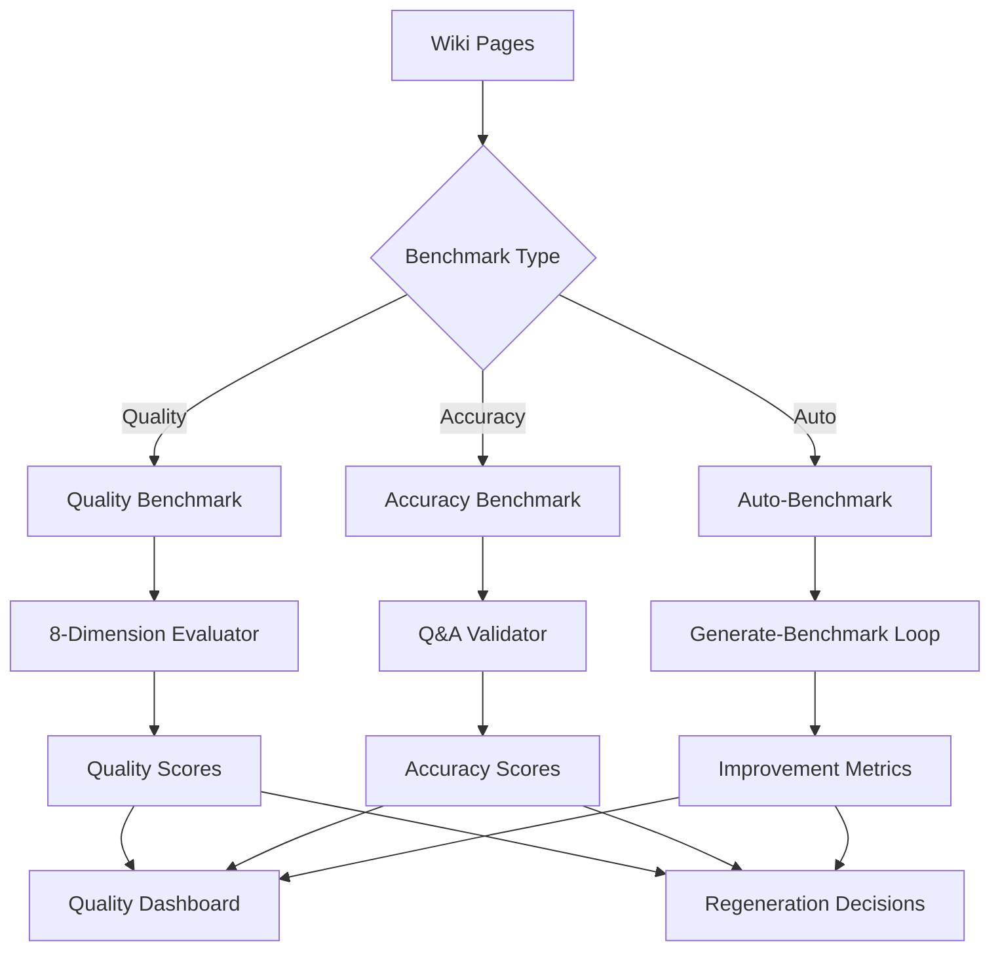

---

### Core Components

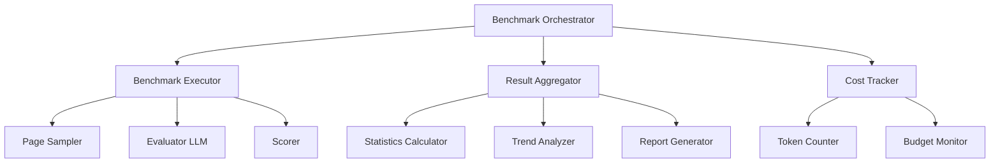

**Component Responsibilities:**

| Component | Responsibility | Key Functions |
|-----------|----------------|---------------|
| Benchmark Orchestrator | Coordinates benchmark execution | Schedule, configure, execute |
| Page Sampler | Selects pages for evaluation | Random, stratified, all |
| Evaluator LLM | Judges page quality | Semantic assessment on 0-10 scale |
| Scorer | Computes final scores | Weighted averages, grading |
| Result Aggregator | Combines individual results | Statistics, trends, summaries |
| Cost Tracker | Monitors API expenses | Token counting, budget limits |
| Report Generator | Produces benchmark reports | Dashboard data, exports |

---

## Quality Benchmarking

### Overview

Quality benchmarking evaluates documentation pages across **8 semantic dimensions** that correlate with human perception of quality. Each dimension is scored independently by an LLM judge on a 0-10 scale, then combined into an overall quality score using weighted averaging.

---

### Eight Quality Dimensions

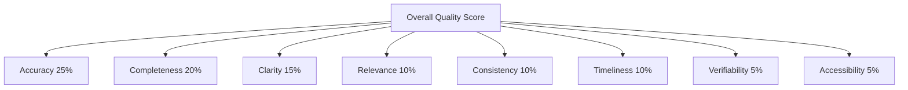

---

#### 1. Accuracy (Weight: 25%)

**Definition**: Factual correctness of documentation against the actual codebase

**Evaluation Criteria:**
- Statements match actual code behavior
- Technical details are correct
- No misleading or false information
- API signatures and types are accurate
- Examples work as described

**Evaluator Prompt:**
```
Evaluate the factual accuracy of this documentation page.
Compare claims to the provided codebase context.
Rate from 0 (completely inaccurate) to 10 (perfectly accurate).

Consider:
- Do code examples match actual implementation?
- Are API signatures correct?
- Do descriptions match actual behavior?
- Are technical details verifiable?

Provide score and brief justification.
```

**Verification Methods:**
- Tool-based fact checking (grep, ast-grep, tree-sitter)
- Code reference validation
- API signature matching
- Example execution testing

**Common Issues:**
- Outdated information after code changes
- Copy-paste errors from similar code
- Assumptions without verification
- Incorrect parameter types or return values

---

#### 2. Completeness (Weight: 20%)

**Definition**: Depth and breadth of coverage for the documented topic

**Evaluation Criteria:**
- All relevant aspects covered
- Appropriate level of detail
- Important edge cases mentioned
- Related concepts explained
- No major gaps in coverage

**Evaluator Prompt:**
```
Evaluate how completely this page covers its intended topic.

Rate from 0 (bare minimum) to 10 (comprehensive).

Consider:
- Are all important aspects covered?
- Is depth appropriate for the topic?
- Are edge cases discussed?
- Are prerequisites explained?
- Does it answer likely user questions?

Provide score and identify any gaps.
```

**Assessment Approach:**
- Compare against canonical documentation standards
- Check for common questions answered
- Verify edge cases addressed
- Assess depth vs breadth balance

**Common Issues:**
- Surface-level coverage without details
- Missing error handling documentation
- Undocumented configuration options
- Lack of examples for complex usage

---

#### 3. Clarity (Weight: 15%)

**Definition**: Readability, structure, and ease of understanding

**Evaluation Criteria:**
- Clear, concise writing
- Logical organization
- Good use of headings and structure
- Appropriate use of examples
- Jargon explained when necessary

**Evaluator Prompt:**
```
Evaluate the clarity and readability of this documentation.

Rate from 0 (confusing/hard to follow) to 10 (crystal clear).

Consider:
- Is writing clear and concise?
- Is organization logical?
- Are examples helpful?
- Is technical jargon explained?
- Can the target audience understand it?

Provide score and note any clarity issues.
```

**Assessment Approach:**
- Readability metrics (Flesch-Kincaid)
- Structural analysis (heading hierarchy)
- Example quality assessment
- Terminology consistency check

**Common Issues:**
- Run-on sentences or complex phrasing
- Poor organization or missing structure
- Unexplained jargon or acronyms
- Lack of concrete examples
- Inconsistent terminology

---

#### 4. Relevance (Weight: 10%)

**Definition**: Appropriateness of content for the topic and audience

**Evaluation Criteria:**
- Content matches page title/topic
- Appropriate for target audience
- Focus on important information
- Minimal tangential content
- Proper scope (not too broad/narrow)

**Evaluator Prompt:**
```
Evaluate how relevant the content is to the stated topic.

Rate from 0 (off-topic) to 10 (perfectly relevant).

Consider:
- Does content match the page title?
- Is detail level appropriate?
- Is there tangential or off-topic content?
- Is scope appropriate?
- Does it serve the target audience?

Provide score and note any relevance issues.
```

**Assessment Approach:**
- Topic alignment analysis
- Audience appropriateness check
- Scope validation
- Focus assessment

**Common Issues:**
- Topic drift or tangents
- Content too basic or advanced for audience
- Overly broad coverage losing focus
- Implementation details in overview docs
- Missing context for target audience

---

#### 5. Consistency (Weight: 10%)

**Definition**: Internal coherence and alignment with rest of documentation

**Evaluation Criteria:**
- Terminology used consistently
- Style matches other pages
- No contradictions within page
- Aligned with project conventions
- Consistent formatting and structure

**Evaluator Prompt:**
```
Evaluate the internal consistency of this documentation.

Rate from 0 (many contradictions) to 10 (perfectly consistent).

Consider:
- Is terminology used consistently?
- Are there internal contradictions?
- Does style match other pages?
- Is formatting consistent?
- Do all statements align?

Provide score and note inconsistencies.
```

**Assessment Approach:**
- Terminology frequency analysis
- Cross-reference validation
- Style pattern matching
- Contradiction detection

**Common Issues:**
- Same concept called different names
- Contradictory statements
- Formatting inconsistency
- Style mismatches with other docs
- Terminology drift

---

#### 6. Timeliness (Weight: 10%)

**Definition**: Freshness and alignment with current codebase state

**Evaluation Criteria:**
- Reflects current code state
- Recent updates incorporated
- No deprecated information
- Version-appropriate content
- Change history considered

**Evaluator Prompt:**
```
Evaluate how current and up-to-date this documentation is.

Rate from 0 (severely outdated) to 10 (perfectly current).

Consider:
- Does it reflect current code?
- Are recent changes incorporated?
- Is deprecated content marked?
- Is version info clear?
- Are timestamps reasonable?

Provide score and note any staleness.
```

**Assessment Approach:**
- Comparison to last code modification
- Deprecation detection
- Version alignment check
- Change recency analysis

**Common Issues:**
- Documentation for removed features
- Missing recent functionality
- Outdated examples or APIs
- Old version assumptions
- Stale timestamps

---

#### 7. Verifiability (Weight: 5%)

**Definition**: Claims can be verified through tools or code inspection

**Evaluation Criteria:**
- Statements backed by code references
- Tool-verifiable facts
- Examples can be tested
- Clear provenance of information
- Traceable to source code

**Evaluator Prompt:**
```
Evaluate how verifiable the documentation claims are.

Rate from 0 (unverifiable) to 10 (fully verifiable).

Consider:
- Are claims backed by code references?
- Can facts be tool-checked?
- Are examples testable?
- Is provenance clear?
- Can reader verify independently?

Provide score and note verification issues.
```

**Assessment Approach:**
- Code reference link validation
- Tool execution for fact-checking
- Example execution testing
- Source traceability check

**Common Issues:**
- Claims without references
- Unverifiable generalizations
- Missing code links
- Untestable examples
- Ambiguous provenance

---

#### 8. Accessibility (Weight: 5%)

**Definition**: Ease of understanding for intended audience

**Evaluation Criteria:**
- Appropriate complexity level
- Prerequisites clearly stated
- Helpful examples and diagrams
- Progressive disclosure of complexity
- Inclusive language

**Evaluator Prompt:**
```
Evaluate how accessible this documentation is to its audience.

Rate from 0 (inaccessible) to 10 (highly accessible).

Consider:
- Is complexity appropriate?
- Are prerequisites clear?
- Are examples helpful?
- Is complexity introduced gradually?
- Is language inclusive?

Provide score and note accessibility issues.
```

**Assessment Approach:**
- Complexity analysis
- Prerequisite identification
- Example quality check
- Language inclusivity scan

**Common Issues:**
- Assuming too much prior knowledge
- Missing prerequisites
- No introductory examples
- Overwhelming complexity upfront
- Exclusive or jargon-heavy language

---

### Scoring Process

**Single Page Evaluation:**

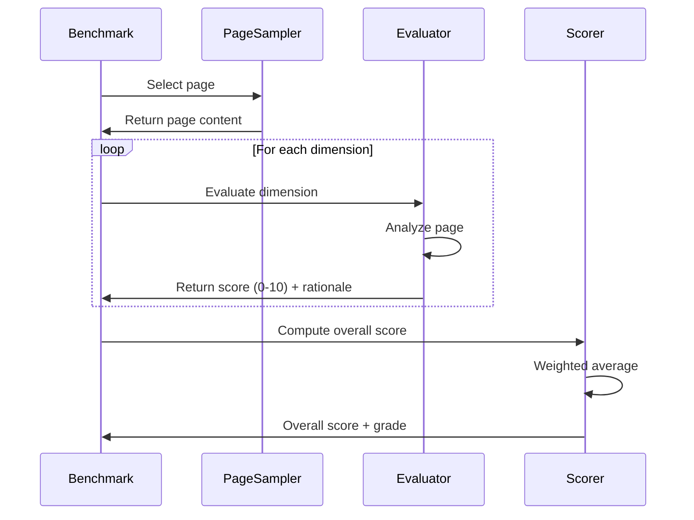

**Overall Score Calculation:**

```
Overall Score =
  (Accuracy × 0.25) +
  (Completeness × 0.20) +
  (Clarity × 0.15) +
  (Relevance × 0.10) +
  (Consistency × 0.10) +
  (Timeliness × 0.10) +
  (Verifiability × 0.05) +
  (Accessibility × 0.05)
```

**Grading Scale:**

| Grade | Score Range | Description |
|-------|-------------|-------------|
| A | 9.0 - 10.0 | Excellent: High-quality documentation |
| B | 8.0 - 8.9 | Good: Minor improvements possible |
| C | 7.0 - 7.9 | Acceptable: Some issues need attention |
| D | 6.0 - 6.9 | Poor: Significant issues present |
| F | 0.0 - 5.9 | Failing: Major problems, regenerate |

---

### Benchmark Execution

**Full Benchmark Flow:**

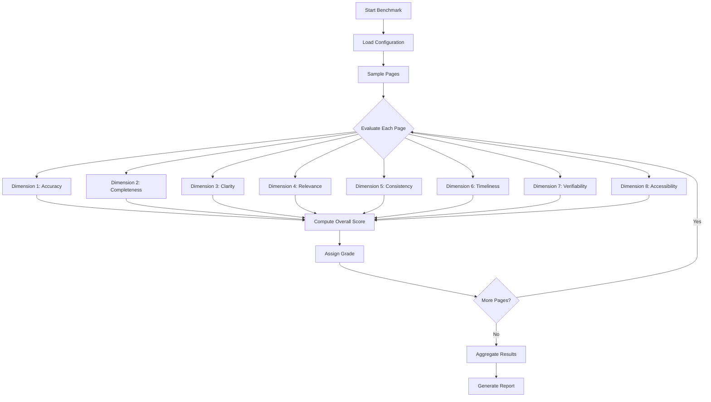

---

## Accuracy Benchmarking

### Overview

Accuracy benchmarking tests **factual correctness** by posing specific questions and validating answers against expected results. This provides a complementary measure to quality dimensions, focusing solely on whether the wiki contains correct, verifiable information.

---

### Question-Answer Validation

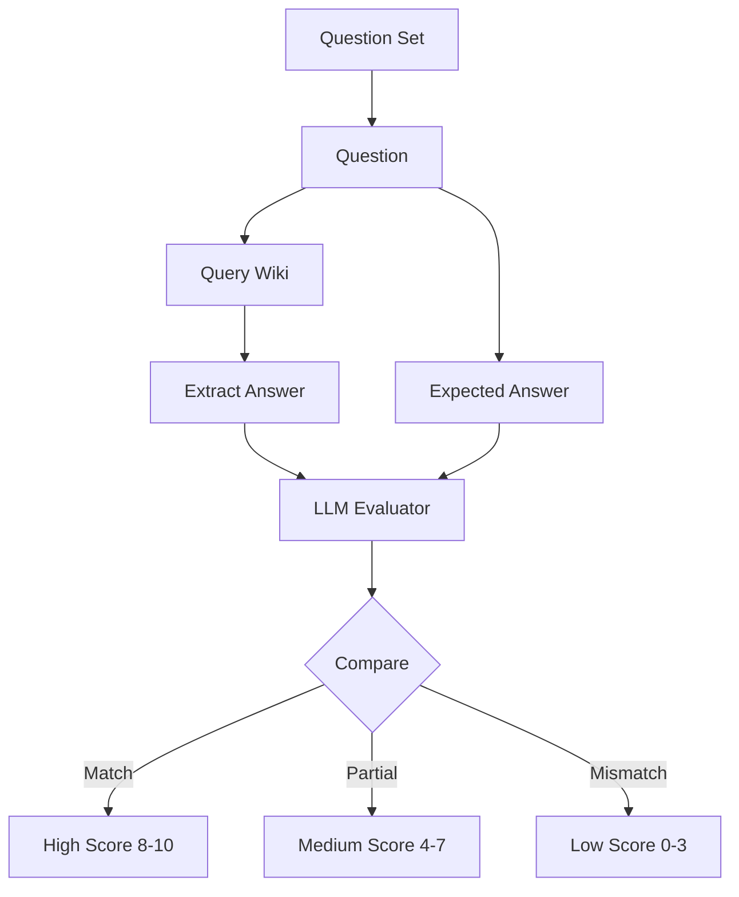

---

### Question Structure

**Question Object:**

| Field | Type | Description | Example |
|-------|------|-------------|---------|
| id | string | Unique identifier | q-123 |
| question | string | Natural language question | "How does authentication work?" |
| expectedAnswer | string | Correct answer or criteria | "Uses OAuth 2.0 with GitHub provider" |
| relevantPages | array | Pages that should answer | ["auth-overview", "github-integration"] |
| difficulty | string | Question difficulty | easy, medium, hard |
| category | string | Topic category | architecture, api, configuration |

**Question Categories:**

- **Architecture**: System design and structure questions
- **API**: Interface and usage questions
- **Configuration**: Setup and options questions
- **Behavior**: How things work questions
- **Troubleshooting**: Debugging and problem-solving questions

---

### Evaluation Process

**Answer Extraction:**

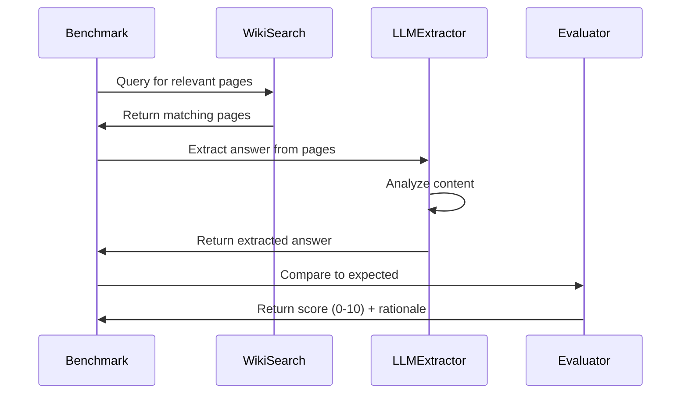

**Evaluator Prompt:**

```
Question: {question}

Expected Answer: {expectedAnswer}

Actual Answer (from wiki): {extractedAnswer}

Evaluate how well the actual answer matches the expected answer.

Score from 0-10:
- 10: Perfect match, all details correct
- 8-9: Mostly correct, minor details missing
- 5-7: Partially correct, some important details wrong
- 2-4: Mostly incorrect, few details right
- 0-1: Completely wrong or no answer found

Consider:
- Factual accuracy
- Completeness of answer
- Clarity of explanation
- Presence of key details

Provide score and brief justification.
```

---

### Scoring & Thresholds

**Score Interpretation:**

| Score | Status | Meaning | Action |
|-------|--------|---------|--------|
| 9-10 | Excellent | Answer is complete and accurate | No action |
| 7-8 | Good | Answer is mostly correct | Minor improvements |
| 5-6 | Acceptable | Answer has gaps | Review and enhance |
| 3-4 | Poor | Answer is incomplete or misleading | Regenerate page |
| 0-2 | Failed | No answer or completely wrong | Urgent regeneration |

**Passing Criteria:**
- **Individual Question**: Score ≥ 7.0
- **Page Average**: Average score ≥ 7.5 across all questions
- **Overall Benchmark**: 80%+ questions pass (score ≥ 7.0)

---

### Question Set Design

**Good Question Characteristics:**

1. **Specific and Testable**
   - ❌ "Is the code good?"
   - ✅ "What authentication method does the API use?"

2. **Clear Expected Answer**
   - ❌ "How does it work?" (too vague)
   - ✅ "What are the three phases of wiki generation?"

3. **Verifiable Against Code**
   - ❌ "Should we use this pattern?" (opinion)
   - ✅ "What database is used for storage?"

4. **Appropriate Difficulty**
   - Easy: Surface-level facts
   - Medium: Requires understanding of concepts
   - Hard: Requires deep knowledge or synthesis

**Example Question Set:**

```yaml
questions:
  - id: q1
    question: "What storage backends does CodeWiki support?"
    expectedAnswer: "MongoDB and file-based storage"
    relevantPages: ["configuration", "storage"]
    difficulty: easy
    category: configuration

  - id: q2
    question: "How many phases does the orchestrator use?"
    expectedAnswer: "Six phases: Reconnaissance, Skeleton, Breadth, Depth, Polish, Maintenance"
    relevantPages: ["orchestrator", "wiki-building-process"]
    difficulty: medium
    category: architecture

  - id: q3
    question: "What is the purpose of the LLM-as-judge pattern?"
    expectedAnswer: "To evaluate documentation quality using an LLM as an objective scorer"
    relevantPages: ["testing-strategy", "quality-benchmarking"]
    difficulty: hard
    category: architecture
```

---

## Auto-Benchmark System

### Overview

Auto-benchmark combines wiki generation with quality measurement in an **iterative improvement loop**. The system generates documentation, benchmarks it, identifies low-quality pages, regenerates them, and benchmarks again—repeating until quality targets are met or iteration limits reached.

---

### Iterative Improvement Cycle

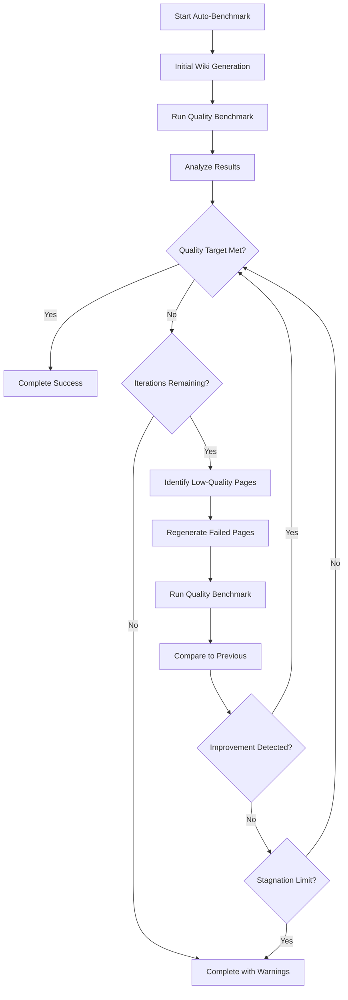

---

### Configuration

**Auto-Benchmark Parameters:**

| Parameter | Type | Default | Description |
|-----------|------|---------|-------------|
| maxIterations | int | 3 | Maximum generation-benchmark cycles |
| qualityTarget | float | 8.0 | Target average quality score |
| passingThreshold | float | 7.0 | Minimum acceptable page score |
| stagnationLimit | int | 2 | Iterations without improvement before stopping |
| regenerationStrategy | string | 'failed-only' | Which pages to regenerate |
| evaluatorModel | string | 'qwen/qwen-turbo' | LLM for benchmarking |
| costBudget | float | null | Maximum API cost (null = unlimited) |

**Regeneration Strategies:**

- **failed-only**: Only regenerate pages below passingThreshold
- **below-target**: Regenerate pages below qualityTarget
- **bottom-quartile**: Regenerate lowest 25% of pages
- **all-low**: Regenerate anything below 8.0

---

### Execution Flow

**Detailed Process:**

1. **Iteration 1 - Initial Generation**
   - Run full wiki generation process
   - Generate all pages from scratch
   - Track time and cost

2. **Benchmark After Iteration 1**
   - Evaluate all pages on quality dimensions
   - Calculate overall scores and grades
   - Identify failing pages

3. **Decision Point**
   - If average score ≥ qualityTarget: Success, exit
   - If no pages fail: Success, exit
   - Otherwise: Proceed to iteration 2

4. **Iteration 2 - Targeted Regeneration**
   - Regenerate only failed pages
   - Use enhanced prompts or context
   - Apply lessons from failures

5. **Benchmark After Iteration 2**
   - Re-evaluate regenerated pages
   - Compare scores to iteration 1
   - Track improvement

6. **Decision Point**
   - If improvement stagnates: Exit with warning
   - If quality target met: Success, exit
   - If iterations remain: Continue to iteration 3

7. **Iteration 3+ - Final Attempts**
   - Adjust regeneration strategy if needed
   - Try alternative agents or prompts
   - Final benchmark and report

---

### Improvement Tracking

**Metrics Tracked Per Iteration:**

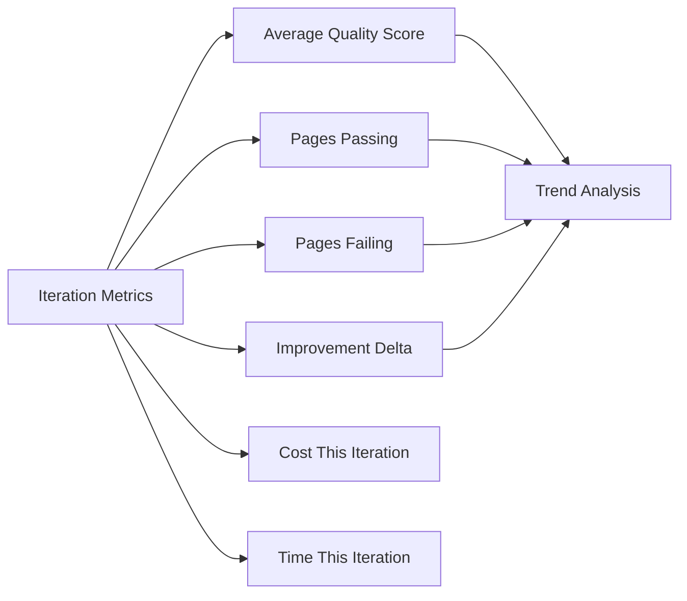

**Example Metrics:**

| Iteration | Avg Score | Passing | Failing | Improvement | Cost | Time |
|-----------|-----------|---------|---------|-------------|------|------|
| 1 | 7.2 | 45 | 15 | N/A | $2.50 | 45m |
| 2 | 7.8 | 52 | 8 | +0.6 | $0.80 | 12m |
| 3 | 8.1 | 58 | 2 | +0.3 | $0.30 | 5m |

**Outcome**: Quality target (8.0) achieved in iteration 3

---

### Stagnation Detection

**Stagnation Scenarios:**

1. **No Improvement**: Score doesn't increase between iterations
2. **Marginal Improvement**: Improvement < 0.1 per iteration
3. **Same Pages Failing**: Same pages fail repeatedly
4. **Score Regression**: Score decreases from previous iteration

**Stagnation Response:**

- Log warning about stagnation
- Try alternative regeneration strategy
- Adjust agent prompts
- If stagnation limit reached, exit gracefully
- Report which pages consistently fail

**Example:**

```
Iteration 2: Avg score 7.5 → 7.52 (+0.02)
Iteration 3: Avg score 7.52 → 7.53 (+0.01)
Stagnation detected: Improvement < 0.1 for 2 iterations
Attempting alternative strategy: Regenerate with enhanced context
```

---

## LLM-as-Judge Pattern

### Concept

The **LLM-as-judge pattern** uses one LLM to evaluate the outputs of another LLM. Instead of human reviewers or static metrics, a specialized evaluator LLM scores documentation on semantic dimensions that require understanding of natural language.

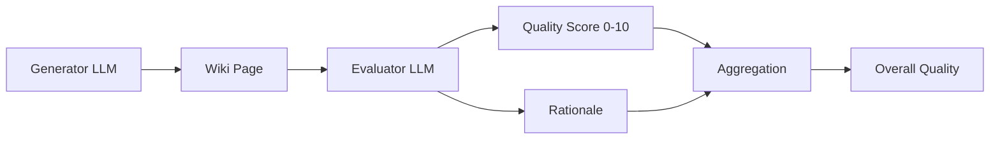

---

### Why LLM-as-Judge?

**Traditional Metrics Limitations:**

| Metric | What It Measures | What It Misses |
|--------|------------------|----------------|
| Code Coverage | Lines executed in tests | Semantic correctness |
| Word Count | Length of documentation | Quality of explanation |
| Readability Score | Sentence complexity | Conceptual clarity |
| Link Validation | Broken links | Content accuracy |
| Spell Check | Spelling errors | Factual errors |

**LLM-as-Judge Advantages:**

✅ **Semantic Understanding**: Can assess if explanation makes sense
✅ **Context Awareness**: Understands domain and audience
✅ **Consistency**: Same criteria applied across all pages
✅ **Scalability**: Automated, no human reviewers needed
✅ **Granularity**: Can provide dimension-specific scores
✅ **Explainability**: Can explain reasoning for scores

---

### Evaluator LLM Selection

**Desirable Characteristics:**

1. **Strong Reasoning**: Can assess quality dimensions accurately
2. **Cost-Effective**: Affordable for bulk evaluation
3. **Fast**: Low latency for quick benchmarks
4. **Reliable**: Consistent scoring behavior
5. **Instruction Following**: Adheres to scoring rubrics

**Default Model**: `qwen/qwen-turbo` via OpenRouter
- Cost: ~$0.10 per 1M tokens
- Speed: Low latency
- Quality: Good reasoning for evaluation tasks

**Alternative Models**:
- `gpt-4-turbo`: Higher accuracy, higher cost
- `claude-3-opus`: Best reasoning, most expensive
- `gpt-3.5-turbo`: Faster, cheaper, less accurate

---

### Prompt Engineering for Evaluation

**Key Principles:**

1. **Clear Rubric**: Define 0-10 scale with examples
2. **Specific Criteria**: List exactly what to assess
3. **Structured Output**: Request score + rationale
4. **Examples**: Provide example evaluations (few-shot)
5. **Context**: Give evaluator necessary background

**Example Evaluator Prompt Template:**

```
You are an expert documentation evaluator. Assess the following wiki page on the dimension: {dimension}.

Page Title: {title}
Page Content: {content}

Evaluation Criteria for {dimension}:
{criteria}

Scoring Scale (0-10):
- 0-2: {description_0_2}
- 3-4: {description_3_4}
- 5-6: {description_5_6}
- 7-8: {description_7_8}
- 9-10: {description_9_10}

Provide:
1. Score (0-10)
2. Brief rationale (2-3 sentences)

Format:
Score: X.X
Rationale: ...
```

---

### Calibration & Validation

**Evaluator Calibration:**

1. **Human Baseline**: Have humans score sample pages
2. **Compare to LLM**: Run LLM evaluator on same pages
3. **Measure Correlation**: Calculate agreement metrics
4. **Tune Prompts**: Adjust if correlation is low
5. **Validate**: Test on new samples

**Validation Metrics:**

- **Pearson Correlation**: How well LLM scores correlate with human scores
- **Mean Absolute Error**: Average difference in scores
- **Agreement Rate**: Percentage of scores within 1 point
- **Ranking Consistency**: Do LLM and humans rank pages similarly?

**Target Metrics:**
- Pearson correlation > 0.7
- Agreement within 1 point > 80%
- MAE < 1.0

---

## Scoring & Grading

### Score Aggregation

**Page-Level Aggregation:**

```
Page Overall Score = Σ (Dimension_i × Weight_i)

Where:
  i = 1 to 8 (dimensions)
  Weights sum to 1.0
```

**Benchmark-Level Aggregation:**

```
Benchmark Score = Σ (Page_j Score) / N

Where:
  j = 1 to N (pages evaluated)
  N = total pages
```

**Dimension-Level Statistics:**

- **Mean**: Average score across all pages
- **Median**: Middle score (robust to outliers)
- **Std Dev**: Variation in scores
- **Min/Max**: Range of scores
- **Percentiles**: Distribution of scores

---

### Grade Assignment

**Individual Page Grades:**

| Grade | Range | Description | Action |
|-------|-------|-------------|--------|
| A | 9.0 - 10.0 | Excellent | No action needed |
| B | 8.0 - 8.9 | Good | Optional minor improvements |
| C | 7.0 - 7.9 | Acceptable | Review for improvements |
| D | 6.0 - 6.9 | Poor | Recommend regeneration |
| F | 0.0 - 5.9 | Failing | Urgent regeneration |

**Benchmark Pass/Fail:**

```
Benchmark Passes If:
  - Average Score ≥ 7.5 AND
  - Percentage of Pages with Score ≥ 7.0 is ≥ 80%
```

---

### Trend Analysis

**Historical Comparison:**

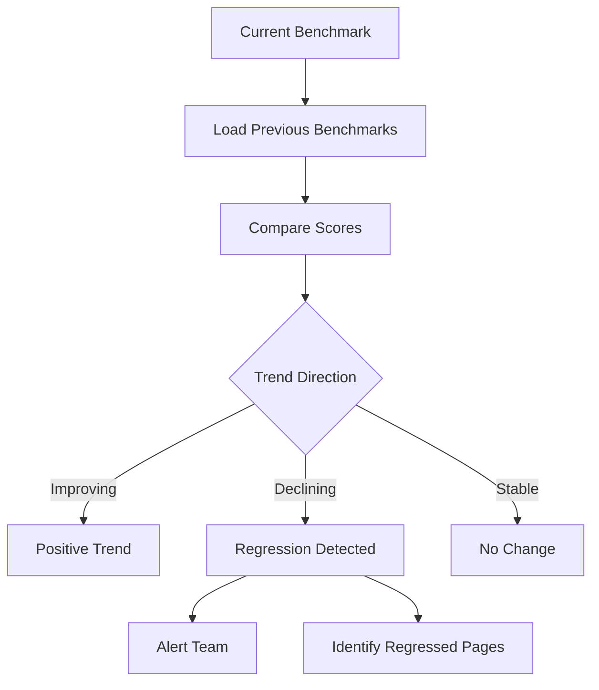

**Regression Detection:**

- **Page-Level Regression**: Page score drops > 1.0 from previous
- **Dimension Regression**: Dimension score drops > 1.5
- **Overall Regression**: Benchmark average drops > 0.5

**Improvement Tracking:**

- Calculate improvement per iteration
- Identify best and worst improving pages
- Correlate improvements to agent changes
- Build historical quality dataset

---

## Cost Management

### Cost Factors

**Primary Costs:**

1. **LLM API Calls**
   - Evaluator model calls (most significant)
   - Token usage per evaluation
   - Number of pages × dimensions × tokens

2. **Page Sampling**
   - Full benchmark: All pages evaluated
   - Sampled benchmark: Subset evaluated
   - Trade-off: Cost vs confidence

**Cost Calculation:**

```
Benchmark Cost =
  (Pages Evaluated) ×
  (Dimensions) ×
  (Avg Tokens per Evaluation) ×
  (Model Cost per Token)

Example:
  100 pages ×
  8 dimensions ×
  500 tokens/eval ×
  $0.10/1M tokens =
  $0.04 total
```

---

### Cost Optimization Strategies

**1. Model Selection**

| Model | Cost/1M Tokens | Speed | Accuracy | Best For |
|-------|----------------|-------|----------|----------|
| qwen-turbo | $0.10 | Fast | Good | Regular benchmarks |
| gpt-3.5-turbo | $0.50 | Fast | Good | Frequent checks |
| gpt-4-turbo | $10.00 | Medium | Excellent | Important validations |
| claude-opus | $15.00 | Slow | Best | Critical assessments |

**2. Sampling Strategies**

- **Random Sampling**: Sample N% of pages randomly
- **Stratified Sampling**: Sample proportionally by topic/quality
- **Confidence-Based**: Sample until confidence interval met
- **Adaptive**: Start with sample, full eval if issues found

**3. Dimension Selection**

- Evaluate only critical dimensions (accuracy, completeness)
- Skip low-weight dimensions for routine checks
- Full 8-dimension eval for comprehensive benchmarks

**4. Caching & Reuse**

- Cache evaluation results
- Only re-evaluate changed pages
- Reuse previous scores for unchanged pages
- Track page content hashes for change detection

---

### Budget Controls

**Budget Configuration:**

```yaml
costManagement:
  maxBudgetPerBenchmark: 5.00  # USD
  maxBudgetPerDay: 20.00       # USD
  maxBudgetPerMonth: 100.00    # USD
  alertThreshold: 0.8          # Alert at 80% of budget
  hardStop: true               # Stop if budget exceeded
```

**Budget Enforcement:**

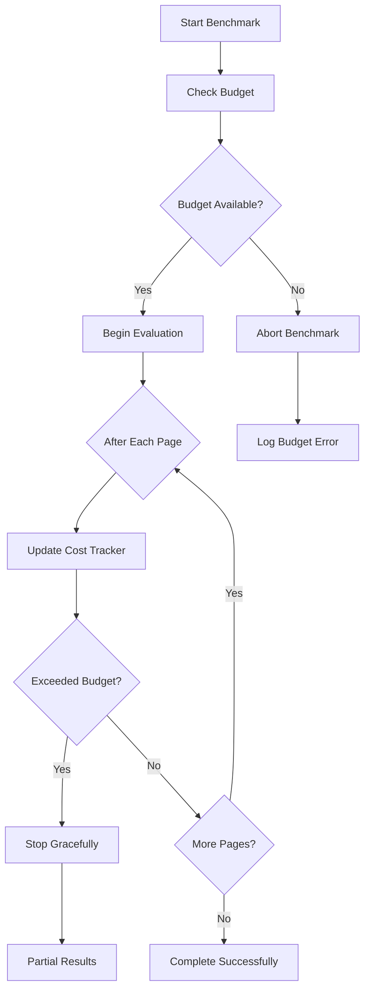

---

## Integration Points

### CLI Integration

**Commands:**

```bash
# Run quality benchmark on all pages
codewiki benchmark quality --all

# Run accuracy benchmark with question set
codewiki benchmark accuracy --questions=./questions.yaml

# Run auto-benchmark with 3 iterations
codewiki auto-benchmark --iterations=3 --target=8.0

# Run benchmark on specific pages
codewiki benchmark quality --pages=page-1,page-2,page-3

# View latest benchmark results
codewiki benchmark results --latest
```

---

### Web UI Integration

**Benchmark Dashboard:**

- Configure and launch benchmarks
- Monitor real-time progress
- View results and trends
- Export benchmark reports
- Compare historical benchmarks

**Quality Metrics Page:**

- View per-page quality scores
- Drill down to dimension scores
- Identify low-quality pages
- Trigger regeneration for failed pages

**Trend Charts:**

- Quality over time
- Dimension score trends
- Pass/fail rates
- Cost tracking

---

### CI/CD Integration

**Quality Gates:**

```yaml
# Example GitHub Actions workflow
- name: Quality Benchmark
  run: |
    npm run benchmark quality --all
    EXIT_CODE=$?
    if [ $EXIT_CODE -ne 0 ]; then
      echo "Quality benchmark failed"
      exit 1
    fi

- name: Check Quality Threshold
  run: |
    SCORE=$(npm run benchmark results --format=json | jq '.overallScore')
    if (( $(echo "$SCORE < 7.5" | bc -l) )); then
      echo "Quality score $SCORE below threshold 7.5"
      exit 1
    fi
```

**Pull Request Checks:**

- Run incremental benchmark on changed pages
- Comment with quality scores on PR
- Block merge if quality degrades
- Track quality trends per PR

---

### Agent Integration

**Agent Feedback Loop:**

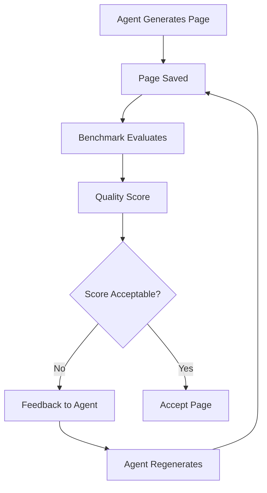

**Quality-Aware Generation:**

- Agents receive quality feedback
- Low scores trigger regeneration
- Agents learn from quality issues
- Prompts adjusted based on common failures

---

## Best Practices

### Benchmark Design

**✅ Do:**

- Run benchmarks regularly (daily or on each generation)
- Use consistent evaluator models for comparability
- Track historical trends
- Set realistic quality targets
- Sample large wikis to control costs
- Validate LLM-as-judge against human judgment periodically

**❌ Don't:**

- Benchmark only once (no trend data)
- Change evaluator models without recalibration
- Set unrealistic quality targets (e.g., 10.0)
- Benchmark every page every time (expensive for large wikis)
- Trust LLM scores blindly without validation
- Ignore cost budgets

---

### Quality Standards

**Recommended Thresholds:**

| Use Case | Minimum Score | Target Score | Action Threshold |
|----------|---------------|--------------|------------------|
| Internal docs | 7.0 | 8.0 | Regenerate < 6.5 |
| Public docs | 7.5 | 8.5 | Regenerate < 7.0 |
| Critical docs | 8.0 | 9.0 | Regenerate < 7.5 |
| Draft docs | 6.0 | 7.0 | Regenerate < 5.5 |

**Dimension-Specific Standards:**

- **Accuracy**: Never accept < 7.0 (factual correctness critical)
- **Completeness**: Allow 6.5+ for initial drafts
- **Clarity**: Target 7.5+ for public-facing docs
- **Timeliness**: Accept 6.0+ if code changes frequently

---

### Continuous Improvement

**Improvement Workflow:**

1. **Baseline**: Establish initial quality benchmark
2. **Monitor**: Run regular benchmarks to track trends
3. **Analyze**: Identify patterns in low-quality pages
4. **Improve**: Adjust agent prompts, tools, or strategies
5. **Validate**: Verify improvements in next benchmark
6. **Iterate**: Repeat cycle continuously

**Learning from Failures:**

- Review pages that consistently fail
- Identify common quality issues
- Adjust agent system prompts
- Enhance tool capabilities
- Improve context provided to agents
- Update quality rubrics if needed

---

### Reporting & Communication

**Benchmark Report Contents:**

1. **Executive Summary**
   - Overall score and grade
   - Pass/fail status
   - Comparison to previous benchmark
   - Key findings

2. **Detailed Metrics**
   - Per-dimension scores
   - Per-page scores
   - Distribution charts
   - Trend graphs

3. **Action Items**
   - Pages needing regeneration
   - Dimension-specific issues
   - Recommended improvements
   - Cost and time estimates

4. **Historical Context**
   - Trend over last N benchmarks
   - Improvement velocity
   - Regression detection
   - Quality stability

---

## Appendix A: Evaluator Prompt Templates

### Accuracy Dimension

```
You are evaluating the ACCURACY of technical documentation.

Page: {title}
Content: {content}

Codebase Context: {code_snippets}

Evaluate factual correctness on a scale of 0-10:

0-2: Severely inaccurate, major factual errors
3-4: Many inaccuracies, unreliable
5-6: Some inaccuracies, needs verification
7-8: Mostly accurate, minor errors
9-10: Completely accurate and verified

Consider:
- Do code examples match actual implementation?
- Are API signatures and types correct?
- Do behavior descriptions match code?
- Are technical details verifiable?

Output:
Score: X.X
Rationale: ...
```

### Completeness Dimension

```
You are evaluating the COMPLETENESS of technical documentation.

Page: {title}
Content: {content}

Expected Coverage: {topics}

Evaluate coverage depth on a scale of 0-10:

0-2: Bare minimum, major gaps
3-4: Incomplete, many missing aspects
5-6: Adequate, some gaps
7-8: Comprehensive, minor gaps
9-10: Exceptionally complete

Consider:
- Are all important aspects covered?
- Is depth appropriate for topic?
- Are edge cases mentioned?
- Are prerequisites explained?
- Would users have follow-up questions?

Output:
Score: X.X
Rationale: ...
```

---

## Appendix B: Sample Benchmark Report

```json
{
  "benchmarkId": "bm-2025-12-18-001",
  "type": "quality",
  "startedAt": "2025-12-18T10:00:00Z",
  "completedAt": "2025-12-18T10:15:00Z",
  "configuration": {
    "evaluatorModel": "qwen/qwen-turbo",
    "pagesSampled": "all",
    "dimensions": ["accuracy", "completeness", "clarity", "relevance", "consistency", "timeliness", "verifiability", "accessibility"]
  },
  "results": {
    "overallScore": 8.2,
    "grade": "B",
    "totalPages": 60,
    "pagesPassed": 52,
    "pagesFailed": 8,
    "passRate": 0.867,
    "dimensionScores": {
      "accuracy": 8.5,
      "completeness": 8.0,
      "clarity": 8.3,
      "relevance": 8.4,
      "consistency": 8.0,
      "timeliness": 7.8,
      "verifiability": 8.1,
      "accessibility": 8.2
    },
    "pageResults": [
      {
        "pageId": "page-123",
        "title": "Architecture Overview",
        "overallScore": 9.1,
        "grade": "A",
        "passed": true,
        "dimensions": {
          "accuracy": 9.5,
          "completeness": 9.0,
          "clarity": 9.0,
          "relevance": 9.2,
          "consistency": 9.0,
          "timeliness": 8.8,
          "verifiability": 9.0,
          "accessibility": 9.1
        }
      }
    ],
    "failedPages": [
      {
        "pageId": "page-456",
        "title": "Legacy API Reference",
        "overallScore": 6.2,
        "grade": "D",
        "issues": [
          {
            "dimension": "timeliness",
            "score": 4.5,
            "issue": "Documentation reflects outdated API version"
          },
          {
            "dimension": "accuracy",
            "score": 6.0,
            "issue": "Several API signatures are incorrect"
          }
        ]
      }
    ]
  },
  "cost": {
    "totalTokens": 125000,
    "totalCost": 0.0125,
    "currency": "USD"
  },
  "duration": 900,
  "trend": {
    "comparedTo": "bm-2025-12-17-001",
    "scoreDelta": 0.3,
    "direction": "improving",
    "pagesImproved": 12,
    "pagesRegressed": 3
  }
}
```

---

**Document Version**: 1.0
**Last Updated**: 2025-12-18
**Related Documents**:
- TESTING_STRATEGY.md - Comprehensive testing including LLM tests
- AGENT_CATALOG.md - Agents that generate content being benchmarked
- WEB_UI_FEATURES.md - Benchmark UI features
- DATA_MODEL.md - Benchmark and quality metrics entities
