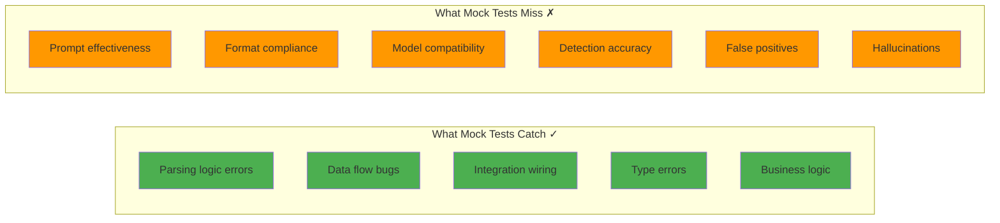
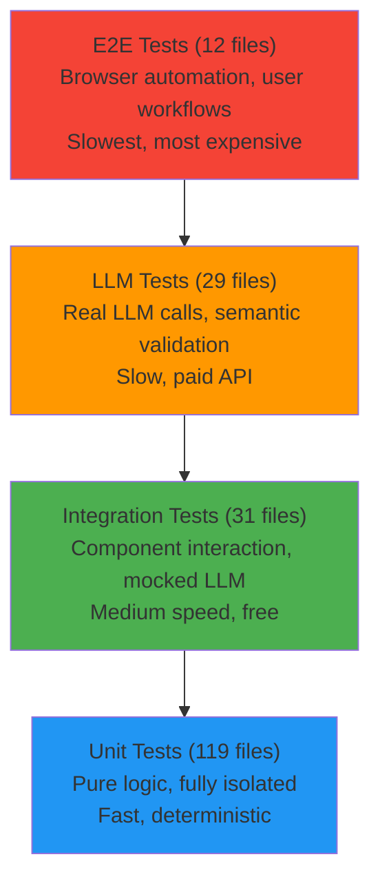
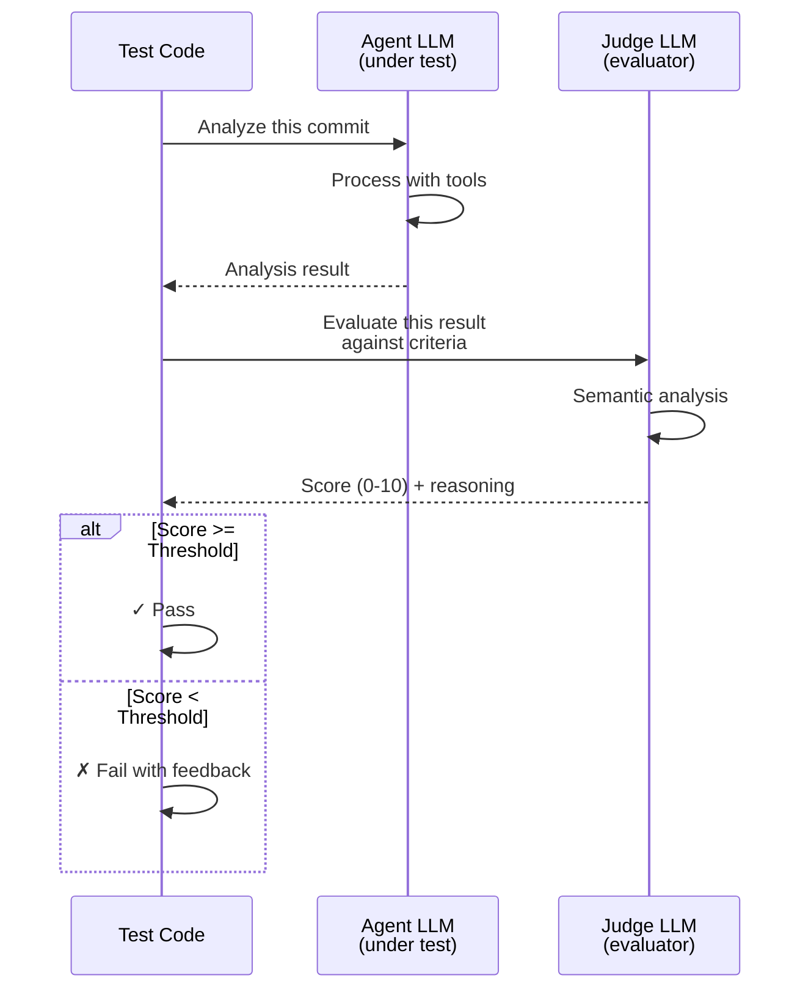
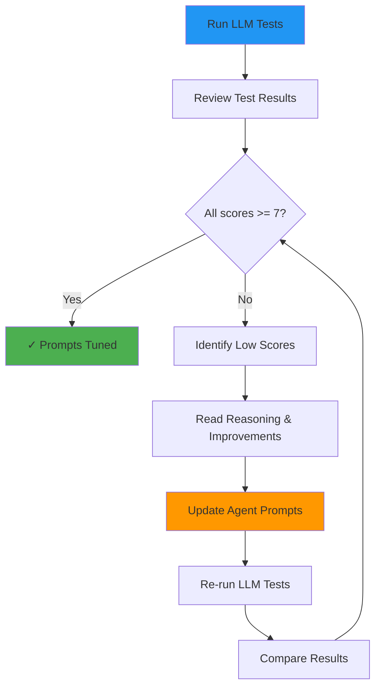

# CodeWiki Testing Strategy

**Version:** 1.0
**Date:** December 17, 2025
**Status:** Living Document

---

## Executive Summary

CodeWiki employs a **four-tier testing pyramid** designed to validate both traditional code logic and the unique challenges of LLM-powered systems. The test suite totals **191 test files** with a sophisticated **LLM-as-judge pattern** for semantic validation that traditional mocking cannot address.

**Test Distribution:**
- **Unit Tests**: 119 files (62%) - Fast, isolated, deterministic
- **Integration Tests**: 31 files (16%) - Component interaction with mocked LLM
- **LLM Tests**: 29 files (15%) - Real LLM calls with semantic evaluation ⭐
- **E2E Tests**: 12 files (6%) - Browser automation, user workflows

**Key Innovation**: The **LLM-as-judge pattern** uses one LLM to evaluate another LLM's output for semantic correctness, prompt effectiveness, and format compliance—areas where traditional assertions fall short.

---

## Table of Contents

1. [The Testing Gap](#the-testing-gap)
2. [Four-Tier Test Pyramid](#four-tier-test-pyramid)
3. [LLM-as-Judge Pattern](#llm-as-judge-pattern)
4. [LLM Test Categories](#llm-test-categories)
5. [Tuning Workflow](#tuning-workflow)
6. [Test Execution](#test-execution)
7. [Cost Management](#cost-management)
8. [Best Practices](#best-practices)

---

## 1. The Testing Gap

### What Traditional Mocking Misses

When testing LLM-powered systems, traditional mocking catches structural issues but misses semantic problems:



### The Assertion Problem

Traditional testing breaks down for semantic validation:

**Problem:**
```typescript
const result = await securityAgent.analyze(commit);

// How do you assert this is correct?
assert.equal(result.summary, ???);
// Can't hard-code expected summary - every analysis is unique!

// Regex matching?
assert.match(result.summary, /SQL injection/);
// Too brittle - misses nuanced correctness
```

**Solution: LLM-as-Judge**
```typescript
const result = await securityAgent.analyze(commit);

// Let an LLM evaluate the semantic correctness
await assertLLM(
  'The analysis identifies SQL injection vulnerability and ' +
  'explains the security risk of unparameterized queries',
  JSON.stringify(result),
  7 // threshold score
);

// Returns: Score 9/10
// "Correctly identified SQL injection in line 15.
//  Accurately described concatenation-based query construction.
//  Severity rating of HIGH is appropriate."
```

---

## 2. Four-Tier Test Pyramid

### Pyramid Structure



### Test Distribution by Purpose

| Test Type | Count | Speed | Cost | Purpose |
|-----------|-------|-------|------|---------|
| **Unit** | 119 | Milliseconds | Free | Pure logic, algorithms, parsing |
| **Integration** | 31 | Seconds | Free | Component interaction, workflows |
| **LLM** | 29 | 30-60s each | $0.001-0.01 | Semantic correctness, prompts |
| **E2E** | 12 | 5-30s each | Free | User-facing functionality |

### When to Use Each Type

**Unit Tests:**
- Pure functions and algorithms
- Parsing logic
- Domain model operations
- Configuration handling
- Work item prioritization

**Integration Tests:**
- Agent workflow (input → LLM → parsing → output)
- Wiki page creation/updates
- Commit processing pipelines
- Database operations
- Git service interactions

**LLM Tests:**
- Prompt effectiveness validation
- Detection accuracy (security, patterns, debt)
- False positive prevention
- Format compliance without fallbacks
- Multi-agent consistency

**E2E Tests:**
- API endpoint functionality
- Web UI user workflows
- Search and query features
- Authentication and access control

---

## 3. LLM-as-Judge Pattern

### Core Concept

Use an **evaluator LLM** to judge the semantic quality of outputs from an **agent LLM**.



### The Judge Prompt

**Location:** `tests/llm/helpers/llm-assert.ts`

The evaluator LLM receives this prompt:

```
Evaluate the following output against the given criteria.

Criteria: ${criteria}

Evidence:
${evidence}

Respond in this exact JSON format (no markdown, just raw JSON):
{
  "score": <0-10>,
  "reasoning": "<why you gave this score>",
  "improvements": ["<suggestion 1>", "<suggestion 2>"]
}

Be specific in your reasoning. A score of 7+ means the criteria is met.
```

### Evaluation Structure

**Result Format:**

```typescript
interface EvaluationResult {
  score: number;          // 0-10 scale
  passed: boolean;        // score >= threshold
  reasoning: string;      // Why this score was given
  improvements: string[]; // Specific suggestions for improvement
}
```

### Assertion Helper

**Usage:**

```typescript
import { assertLLM } from './helpers/llm-assert';

// Throws if score < threshold
await assertLLM(
  'The analysis identifies SQL injection vulnerability',
  JSON.stringify(result),
  7 // threshold
);

// Returns full evaluation for logging
const evaluation = await assertLLM(criteria, evidence, threshold);
logTestResult('SQL injection detection', evaluation);
```

### Threshold Guidelines

Different test types require different confidence levels:

| Test Type | Threshold | Rationale |
|-----------|-----------|-----------|
| **Detection** (must find issue) | 7 | Some flexibility in phrasing |
| **False Positive** (must not find) | 8 | Higher bar to avoid noise |
| **Content Quality** | 6 | Subjective, allow variation |
| **Format Compliance** | 9 | Should be nearly perfect |

### Example Output

```
✓ SecurityAgent detects SQL injection in vulnerable code
  Score: 9/10 (threshold: 7)
  Reasoning: Correctly identified SQL injection vulnerability in db.ts:15.
             Accurately described the concatenation-based query construction.
             Mentioned severity level (HIGH) appropriately.
             Clear explanation of the security risk.
  Improvements:
    - Could mention specific remediation (parameterized queries)
    - Could reference OWASP guidelines for SQL injection prevention
  Duration: 3.2s
  Cost: $0.004
```

### Benefits Over Traditional Assertions

| Aspect | Traditional Assert | LLM-as-Judge |
|--------|-------------------|--------------|
| **Debugging** | "Test failed" | "Score 4/10 because X, Y, Z" |
| **Near-misses** | Hidden | "Score 6/10 - almost passing" |
| **Quality trends** | Not tracked | Track scores over time |
| **Improvement hints** | None | Specific suggestions |
| **Threshold tuning** | Binary pass/fail | Adjust threshold per test |
| **Semantic validation** | Not possible | Core strength |

---

## 4. LLM Test Categories

### 4.1. Agent-Specific Tests

**Location:** `tests/llm/<agent-name>.test.ts`

Tests individual agent correctness with real LLM calls:

**Security Agent Example:**

```typescript
it('detects SQL injection in vulnerable code', async () => {
  // 1. Create test repository with vulnerable code
  await createTestRepo(ctx, repoId, { 'README.md': '# Test' });

  const commitSha = await addCommit(ctx, repoId, {
    'src/db/queries.ts': `
      // VULNERABLE: Direct string concatenation
      const query = "SELECT * FROM users WHERE email = '" + email + "'";
      return db.query(query);
    `
  }, 'Add user query functions');

  // 2. Run REAL SecurityAgent with REAL LLM
  const agent = new SecurityAgent();
  const result = await agent.run(
    createCommitTarget(commitSha),
    await ctx.agentContext(repoId)
  );

  // 3. Deterministic check: Structure exists
  assert.ok(result.result.findings.length > 0);
  assert.ok(typeof result.result.confidence === 'number');

  // 4. LLM-as-judge: Semantic correctness
  const evaluation = await assertLLM(
    'The security analysis identifies SQL injection vulnerability. ' +
    'It should mention string concatenation or template literals being used ' +
    'unsafely in SQL queries.',
    JSON.stringify(result.result),
    7
  );

  // 5. Log result for trend tracking
  logTestResult('SQL injection detection', evaluation);
});
```

**Agents Tested:**
- `security-agent.test.ts` - Vulnerability detection
- `pattern-agent.test.ts` - Design pattern recognition
- `code-change-agent.test.ts` - Code change analysis
- `narrative-agent.test.ts` - Architectural decisions
- `technical-debt-agent.test.ts` - TODOs and debt detection
- `dependency-agent.test.ts` - Dependency tracking
- `bootstrap-agent.test.ts` - Wiki initialization
- `writer-agent.test.ts` - Content transformation
- `category-agent.test.ts` - Categorization logic

### 4.2. Format Compliance Tests

**Location:** `tests/llm/format-compliance.test.ts`

Validates that LLM outputs strictly follow expected formats **without fallback parsing**.

**Pattern:**

```typescript
it('codebase-explorer produces parseable output without fallbacks', async () => {
  const agent = new CodebaseExplorerAgent();
  const result = await agent.run(
    { type: 'path', path: 'src/agents' },
    agentCtx
  );

  // STRICT: No fallbacks allowed
  assertNoFallbacks(result.parseStats);

  // Verify required sections parsed successfully
  assertParseSuccess(result.parseStats, ['SUMMARY', 'WIKI_PAGES', 'CONFIDENCE']);

  // No silent data loss
  assert.strictEqual(result.removedPaths?.length ?? 0, 0);

  // Log degradation metrics
  const metrics = calculateDegradationMetrics(result.parseStats, result.removedPaths);
  console.log(`Degradation score: ${metrics.degradationScore}/100`);
});
```

**Helpers:**

```typescript
// Assert no fallback patterns used (strict mode)
function assertNoFallbacks(parseStats: ParseStats): void

// Assert required sections parsed successfully
function assertParseSuccess(
  parseStats: ParseStats,
  requiredSections: string[]
): void

// Check health without throwing (for metrics)
function checkParseHealth(parseStats: ParseStats): ParseHealthResult
```

**Benefits:**
- Detects prompt degradation early
- Ensures consistent output format
- Tracks parsing success rates
- Identifies sections needing prompt improvements

### 4.3. False Positive Tests

**Location:** `tests/llm/false-positives/safe-patterns.test.ts`

Ensures agents **don't** incorrectly flag safe code patterns.

**Pattern:**

```typescript
it('does not flag safe parameterized queries as SQL injection', async () => {
  const commitSha = await addCommit(ctx, repoId, {
    'src/db/safe-queries.ts': `
      // SAFE: Parameterized query prevents SQL injection
      return db.query('SELECT * FROM users WHERE email = ?', [email]);
    `
  }, 'Add safe parameterized query functions');

  const result = await securityAgent.run(createCommitTarget(commitSha), agentCtx);

  // Higher threshold (8) for false positive prevention
  const evaluation = await assertLLM(
    'The security analysis correctly recognizes that parameterized/prepared ' +
    'statements are SAFE and does NOT flag them as SQL injection vulnerabilities.',
    JSON.stringify(result.result),
    8 // stricter threshold
  );

  // Log but allow conservative LLMs to be cautious
  if (!evaluation.passed) {
    console.log('⚠️  Note: LLM flagged safe code. Prompt may need tuning.');
  }

  logTestResult('Safe parameterized query recognition', evaluation);
});
```

**Why Higher Thresholds:**
False positives are more damaging than false negatives in production. We require stronger confidence (8+) that safe code is recognized as safe.

### 4.4. Edge Case Tests

**Location:** `tests/llm/edge-cases/`

Tests agent behavior on unusual inputs:

**Large Inputs Test:**

```typescript
it('handles files with 5000+ lines gracefully', async () => {
  const largeFile = 'export const data = [\n' +
    Array(5000).fill('  { id: 1, value: "data" },').join('\n') +
    '\n];';

  const commitSha = await addCommit(ctx, repoId, {
    'src/data/large-dataset.ts': largeFile
  }, 'Add large dataset');

  const result = await agent.run(createCommitTarget(commitSha), agentCtx);

  // Should handle gracefully without errors
  assert.ok(result.updates.length > 0);

  // Should still provide meaningful analysis
  await assertLLM(
    'The analysis acknowledges the large data file and provides useful context ' +
    '(e.g., dataset size, purpose) without hallucinating specific values.',
    JSON.stringify(result),
    6
  );
});
```

**Empty Commits Test:**

```typescript
it('handles empty commits gracefully', async () => {
  // Commit with no actual changes
  const commitSha = await addEmptyCommit(ctx, repoId, 'Trigger CI rebuild');

  const result = await agent.run(createCommitTarget(commitSha), agentCtx);

  // Should not crash
  assert.ok(result);

  // Should acknowledge no substantial changes
  await assertLLM(
    'The analysis recognizes there are no substantial code changes and ' +
    'provides minimal or no documentation updates.',
    JSON.stringify(result),
    6
  );
});
```

### 4.5. Multi-Language Tests

**Location:** `tests/llm/multi-language/`

Validates agents work across programming languages:

**Python Security Test:**

```typescript
it('detects Python SQL injection', async () => {
  const commitSha = await addCommit(ctx, repoId, {
    'src/db/queries.py': `
def get_user(email):
    # VULNERABLE: String formatting in SQL
    query = f"SELECT * FROM users WHERE email = '{email}'"
    return db.execute(query)
    `
  }, 'Add Python user query');

  const result = await securityAgent.run(createCommitTarget(commitSha), agentCtx);

  await assertLLM(
    'The analysis identifies SQL injection vulnerability in the Python code, ' +
    'specifically noting the unsafe f-string formatting in SQL queries.',
    JSON.stringify(result.result),
    7
  );
});
```

**Go Security Test:**

```typescript
it('detects Go SQL injection', async () => {
  const commitSha = await addCommit(ctx, repoId, {
    'src/db/queries.go': `
func GetUser(email string) (User, error) {
    // VULNERABLE: String concatenation in SQL
    query := "SELECT * FROM users WHERE email = '" + email + "'"
    return db.Query(query)
}
    `
  }, 'Add Go user query');

  const result = await securityAgent.run(createCommitTarget(commitSha), agentCtx);

  await assertLLM(
    'The analysis identifies SQL injection vulnerability in the Go code, ' +
    'noting the unsafe string concatenation in SQL queries.',
    JSON.stringify(result.result),
    7
  );
});
```

### 4.6. Integration Tests

**Location:** `tests/llm/integration/multi-agent.test.ts`

Validates that multiple agents produce **consistent, non-contradictory** results on the same commit:

```typescript
it('multiple agents analyze same commit consistently', async () => {
  const commitSha = await addCommit(ctx, repoId, {
    'src/auth/user-repository.ts': `/* Repository pattern + auth code */`
  }, 'Implement authentication repository');

  // Run multiple agents on same commit
  const securityResult = await securityAgent.run(
    createCommitTarget(commitSha),
    agentCtx
  );

  const patternResult = await patternAgent.run(
    createCommitTarget(commitSha),
    agentCtx
  );

  const codeChangeResult = await codeChangeAgent.run(
    createCommitTarget(commitSha),
    agentCtx
  );

  // Combine all analyses
  const combined = JSON.stringify({
    security: securityResult.result,
    pattern: patternResult.result,
    codeChange: codeChangeResult.result
  });

  // Verify consistency
  await assertLLM(
    'The analyses from different agents (security, pattern, code-change) are ' +
    'consistent and complementary. None of the analyses contradict each other. ' +
    'They should provide different perspectives on the same code.',
    combined,
    6 // Lower threshold - some variance expected
  );
});
```

### 4.7. E2E Pipeline Tests

**Location:** `tests/llm/e2e/wiki-generation.test.ts`

Validates complete wiki generation from bootstrap through synthesis:

```typescript
it('generates coherent wiki from realistic repository', async () => {
  // 1. Create realistic project structure
  await createTestRepo(ctx, repoId, {
    'README.md': '# TaskFlow API\n\nA task management REST API built with Express...',
    'package.json': JSON.stringify({ name: 'taskflow-api', /* ... */ }),
    'src/index.ts': '/* Express server setup */',
    'src/routes/tasks.ts': '/* Task routes */',
    'src/models/task.ts': '/* Task model */',
    'src/services/task-service.ts': '/* Task business logic */'
  });

  // 2. Run bootstrap agent
  const bootstrapAgent = new BootstrapAgent();
  const bootstrapResult = await bootstrapAgent.run(
    createWikiTarget(),
    agentCtx
  );
  await saveWikiPages(agentCtx.wikiId, bootstrapResult.updates);

  // 3. Run codebase explorer on src/
  const explorerAgent = new CodebaseExplorerAgent();
  const explorerResult = await explorerAgent.run(
    { type: 'path', path: 'src' },
    agentCtx
  );
  await saveWikiPages(agentCtx.wikiId, explorerResult.updates);

  // 4. Run synthesis agents
  const overviewAgent = new ProjectOverviewAgent();
  const overviewResult = await overviewAgent.run(
    createWikiTarget(),
    agentCtx
  );
  await saveWikiPages(agentCtx.wikiId, overviewResult.updates);

  // 5. Get all wiki pages
  const wikiPages = await getWikiPages(agentCtx.wikiId);
  const wikiContent = wikiPages
    .map(p => `## ${p.title}\n${p.content}`)
    .join('\n\n');

  // 6. Verify overall wiki coherence
  await assertLLM(
    'The generated wiki provides a useful, coherent overview of the TaskFlow API project. ' +
    'It should describe task management functionality, mention Express/TypeScript, ' +
    'document key routes and models, and provide architectural information. ' +
    'Content should read like documentation, not commit messages.',
    wikiContent,
    6
  );
});
```

---

## 5. Tuning Workflow

### The Prompt Improvement Cycle



### Step-by-Step Tuning Process

**Step 1: Run LLM Test Suite**

```bash
export OPENROUTER_API_KEY=your-key-here
npm run test:llm
```

**Step 2: Review Results**

Results are saved to `tests/llm/results/<timestamp>.json`:

```json
{
  "runId": "2025-12-18T10-30-00-000Z",
  "timestamp": "2025-12-18T10:30:00.000Z",
  "model": "qwen/qwen-turbo",
  "tests": [
    {
      "name": "SecurityAgent SQL injection detection",
      "passed": true,
      "score": 9,
      "reasoning": "Correctly identified SQL injection...",
      "improvements": ["Could mention parameterized queries"]
    },
    {
      "name": "SecurityAgent safe code recognition",
      "passed": false,
      "score": 4,
      "reasoning": "Agent flagged safe parameterized query as potential vulnerability",
      "improvements": [
        "Should explicitly recognize parameterized queries as safe",
        "Should not create findings for properly secured code"
      ]
    }
  ],
  "summary": {
    "total": 12,
    "passed": 11,
    "failed": 1,
    "avgScore": 7.8
  }
}
```

**Step 3: Identify Issues**

Look for:
- Tests with scores < 7
- Recurring themes in `reasoning`
- Common suggestions in `improvements`

**Step 4: Analyze Feedback**

```json
{
  "name": "SecurityAgent safe code recognition",
  "score": 4,
  "reasoning": "Agent flagged safe parameterized query as potential vulnerability",
  "improvements": [
    "Should explicitly recognize parameterized queries as safe",
    "Should not create findings for properly secured code"
  ]
}
```

**Interpretation:**
- Prompt lacks guidance on safe patterns
- Agent is too conservative (false positives)
- Need to add examples of safe code

**Step 5: Update Prompts**

**Before:**
```typescript
const SYSTEM_PROMPT = `
You are a security analyst reviewing code changes.

Look for:
- SQL injection vulnerabilities
- Unvalidated user input
- Hardcoded credentials
`;
```

**After:**
```typescript
const SYSTEM_PROMPT = `
You are a security analyst reviewing code changes.

Look for:
- SQL injection vulnerabilities (string concatenation in queries)
- Unvalidated user input
- Hardcoded credentials

SAFE PATTERNS (do not flag):
- Parameterized queries: db.query("SELECT * WHERE id = ?", [id])
- Prepared statements: db.prepare("...").bind(params)
- ORM query builders: User.findOne({ where: { id } })

Only flag code that has actual security issues.
`;
```

**Step 6: Re-test**

```bash
npm run test:llm
```

**Step 7: Compare Results**

```typescript
// Use result logger comparison
import { compareRuns } from './tests/llm/helpers/result-logger';

const comparison = await compareRuns(
  '2025-12-18T10-30-00-000Z',  // old run
  '2025-12-18T14-15-00-000Z'   // new run
);

console.log('Improved tests:', comparison.improved);
// ["SecurityAgent safe code recognition: 4 → 9"]

console.log('Regressed tests:', comparison.regressed);
// []
```

### Result Tracking

**Location:** `tests/llm/helpers/result-logger.ts`

**Functions:**

```typescript
// Start a test run
startTestRun(model: string): void

// Log individual test result
logTestResult(testName: string, result: EvaluationResult): void

// Save run to disk
await saveTestRun(): Promise<string>

// Compare two runs
await compareRuns(runId1: string, runId2: string): Promise<Comparison>

// Get all runs
await listTestRuns(): Promise<RunSummary[]>
```

**Example Usage:**

```typescript
import { startTestRun, logTestResult, saveTestRun } from './helpers/result-logger';

// In test file
before(() => {
  startTestRun('claude-sonnet-4.5');
});

it('detects SQL injection', async () => {
  // ... test logic ...
  const evaluation = await assertLLM(criteria, evidence, threshold);
  logTestResult('SQL injection detection', evaluation);
});

after(async () => {
  const runId = await saveTestRun();
  console.log(`Results saved: ${runId}`);
});
```

### Degradation Tracking

**Location:** `tests/llm/helpers/degradation-tracker.ts`

Tracks format degradation over time:

```typescript
interface DegradationMetrics {
  fallbacksByType: {
    summary: number;
    findings: number;
    wikiPages: number;
    confidence: number;
    other: number;
  };
  totalFallbacks: number;
  pathsRemoved: number;
  proseExtractionsUsed: number;
  defaultConfidenceUsed: boolean;
  degradationScore: number; // 0-100, lower is better
}

class DegradationTracker {
  addRun(parseStats: ParseStats, removedPaths: string[]): DegradationMetrics;
  getAggregate(): AggregateDegradationMetrics;
}
```

**Usage:**

```typescript
const tracker = new DegradationTracker();

for (const testPath of testPaths) {
  const result = await agent.run(testPath, agentCtx);
  tracker.addRun(result.parseStats, result.removedPaths);
}

const aggregate = tracker.getAggregate();
console.log(`Clean runs: ${aggregate.cleanRunRate * 100}%`);
console.log(`Avg degradation score: ${aggregate.avgDegradationScore}/100`);

// Track over time
if (aggregate.avgDegradationScore > 20) {
  console.log('⚠️  Format degradation detected. Review prompts.');
}
```

### Real-World Example

**Baseline Run:**
```
📊 BASELINE DEGRADATION METRICS
================================
Total runs: 5
Healthy runs (no fallbacks): 2/5 (40%)

Fallback breakdown:
  Total fallbacks: 7
  - Markdown fallbacks: 3 (markdown-header-SUMMARY)
  - Prose fallbacks: 2 (prose-extraction-WIKI_PAGES)
  - Default value fallbacks: 2 (default-CONFIDENCE)

Per-path details:
  src/services: ✗ 2 fallbacks
  src/agents: ✗ 1 fallback
  src/models: ✗ 3 fallbacks
  src/utils: ✓ healthy
  src/controllers: ✓ healthy
```

**After Prompt Improvements:**
```
📊 CURRENT DEGRADATION METRICS
================================
Total runs: 5
Healthy runs (no fallbacks): 5/5 (100%) ✓

Fallback breakdown:
  Total fallbacks: 0

Clean run rate improved from 40% → 100% 🎉
```

---

## 6. Test Execution

### Running Tests

**Unit + Integration (Fast, Free):**
```bash
# All fast tests
npm run test

# Specific test file
node --import tsx --test tests/unit/orchestrator.test.ts
```

**LLM Tests (Slow, Paid):**
```bash
# Requires API key
export OPENROUTER_API_KEY=your-key-here

# All LLM tests (~$0.50-2.00 total)
npm run test:llm

# Specific agent
node --import tsx --test tests/llm/security-agent.test.ts

# Format compliance only (~$0.20)
node --import tsx --test tests/llm/format-compliance.test.ts

# Integration tests (~$0.30)
node --import tsx --test tests/llm/integration/multi-agent.test.ts

# E2E pipeline (~$0.15)
node --import tsx --test tests/llm/e2e/wiki-generation.test.ts
```

**E2E Tests (Browser Automation):**
```bash
# Install browsers first (one-time)
npx playwright install

# Run E2E tests
npm run test:e2e

# Specific E2E test
npx playwright test tests/e2e/wiki.spec.ts
```

**Code Coverage:**
```bash
npm run test:coverage
```

### Continuous Integration

**On Every Commit (Fast Tests):**
```bash
npm run lint && npm run typecheck && npm run test
```

**On Pull Request (Add E2E):**
```bash
npm run lint && npm run typecheck && npm run test && npm run test:e2e
```

**Manual/Scheduled (LLM Tests):**
```bash
# After prompt changes
npm run test:llm

# Weekly quality check
npm run test:llm && cat tests/llm/results/*.json | jq .summary
```

### Test Timeouts

| Test Type | Default Timeout | Override |
|-----------|----------------|----------|
| Unit | 5 seconds | `--test-timeout=5000` |
| Integration | 30 seconds | `--test-timeout=30000` |
| LLM | 120 seconds | `--test-timeout=120000` |
| E2E | 60 seconds | Playwright config |

---

## 7. Cost Management

### LLM Test Costs

| Component | Model | Purpose | Cost per Call |
|-----------|-------|---------|---------------|
| **Agent Under Test** | Production (configurable) | Real behavior | ~$0.002-0.01 |
| **LLM-as-Judge** | `qwen/qwen-turbo` (default) | Evaluation | ~$0.0005-0.001 |

**Total per test:** ~$0.003-0.011 (agent + evaluation)

### Cost Estimation

**Full LLM Test Suite:**
- 29 test files × ~3-5 tests/file = ~87-145 tests
- Average cost: ~$0.005/test
- **Total: ~$0.50-2.00 per full suite run**

**Subset Examples:**
- Single agent (5 tests): ~$0.03
- Format compliance (10 tests): ~$0.05
- Integration tests (8 tests): ~$0.04

### Cost Control Strategies

1. **Run LLM tests selectively**
   - After prompt changes (affected agents only)
   - Before releases (full suite)
   - Weekly scheduled run (monitoring)

2. **Use cheap evaluator model**
   - Default: `qwen/qwen-turbo` (~$0.0005/call)
   - JSON evaluation is simple, cheap models work well

3. **Cache test results**
   - Results saved to `tests/llm/results/`
   - Compare runs without re-execution
   - Track trends over time

4. **Parallel execution limits**
   - Respect rate limits
   - 2-3 concurrent tests max
   - Prevents API throttling

### Debugging Without Cost

**Use Integration Tests First:**
```typescript
// Integration test with mocked LLM (free)
ctx.llm.setDefaultResponse(mockSecurityAnalysis);
const result = await agent.run(target, ctx);

// Once working, validate with LLM test (paid)
// npm run test:llm security-agent.test.ts
```

**Incremental LLM Testing:**
```bash
# Test one agent at a time
node --import tsx --test tests/llm/security-agent.test.ts  # $0.03

# If passes, test next agent
node --import tsx --test tests/llm/pattern-agent.test.ts   # $0.02

# Full suite only when ready
npm run test:llm  # $2.00
```

---

## 8. Best Practices

### Layered Assertions

Combine multiple validation levels:

```typescript
it('detects security vulnerability', async () => {
  const result = await agent.run(target, ctx);

  // Layer 1: Structure (deterministic, free)
  assert.ok(result.result.findings.length > 0);
  assert.ok(typeof result.result.confidence === 'number');
  assert.ok(result.result.confidence >= 0 && result.result.confidence <= 1);

  // Layer 2: Format compliance (deterministic, free)
  assertNoFallbacks(result.parseStats);
  assertParseSuccess(result.parseStats, ['SUMMARY', 'FINDINGS', 'CONFIDENCE']);

  // Layer 3: Semantic correctness (LLM-as-judge, paid)
  const evaluation = await assertLLM(
    'The analysis identifies SQL injection vulnerability and explains the security risk',
    JSON.stringify(result.result),
    7
  );

  // Layer 4: Metrics logging (for trends)
  logTestResult('SQL injection detection', evaluation);

  // Layer 5: Degradation tracking
  const degradation = calculateDegradationMetrics(result.parseStats, result.removedPaths);
  if (degradation.degradationScore > 20) {
    console.log('⚠️  Format degradation detected');
  }
});
```

### Progressive Thresholds

Different criteria require different confidence levels:

```typescript
// Detection: "Did it find the issue?" - Threshold 7
await assertLLM(
  'Identifies SQL injection vulnerability',
  result,
  7
);

// False positives: "Did it avoid noise?" - Threshold 8 (stricter)
await assertLLM(
  'Does NOT flag safe parameterized queries',
  result,
  8
);

// Format: "Is output parseable?" - Threshold 9 (very strict)
await assertLLM(
  'Follows exact output format without fallbacks',
  result,
  9
);
```

### Soft Assertions for Metrics

Don't fail tests on metrics, but track them:

```typescript
// Check health without throwing
const health = checkParseHealth(result.parseStats);

if (!health.healthy) {
  console.log('⚠️  Degradation detected:');
  console.log(`  Fallbacks: ${health.fallbacksUsed.join(', ')}`);
  console.log('  Consider prompt tuning.');
}

// Log for trend analysis (doesn't fail test)
logTestResult('Parse health', {
  passed: health.healthy,
  score: health.healthy ? 10 : Math.max(0, 10 - health.fallbacksUsed.length * 2),
  reasoning: health.message,
  improvements: health.fallbacksUsed
});
```

### Test Data Realism

Create realistic test repositories:

```typescript
// ✗ BAD: Minimal test data
await addCommit(ctx, repoId, {
  'file.ts': 'code'
}, 'commit');

// ✓ GOOD: Realistic project structure
await createTestRepo(ctx, repoId, {
  'README.md': '# TaskFlow\n\nA task management API...',
  'package.json': JSON.stringify({
    name: 'taskflow-api',
    dependencies: { express: '^4.18.0' }
  }),
  'src/index.ts': `
    import express from 'express';
    const app = express();
    // Realistic server setup
  `,
  'src/routes/tasks.ts': '/* Realistic route handlers */',
  'src/models/task.ts': '/* Realistic data model */'
});
```

### Test Organization

Group related tests logically:

```typescript
describe('SecurityAgent', () => {
  describe('SQL Injection Detection', () => {
    it('detects string concatenation vulnerability', async () => { /* ... */ });
    it('detects template literal vulnerability', async () => { /* ... */ });
    it('does not flag parameterized queries', async () => { /* ... */ });
  });

  describe('XSS Detection', () => {
    it('detects unescaped user input in HTML', async () => { /* ... */ });
    it('does not flag properly escaped output', async () => { /* ... */ });
  });
});
```

### Documentation in Tests

Use test names and criteria as documentation:

```typescript
// ✗ BAD: Vague test name
it('works correctly', async () => {
  await assertLLM('Does the right thing', result, 7);
});

// ✓ GOOD: Descriptive test name and criteria
it('identifies SQL injection from string concatenation in WHERE clauses', async () => {
  await assertLLM(
    'The analysis identifies SQL injection vulnerability specifically caused by ' +
    'string concatenation in the WHERE clause. It should mention the unsafe practice ' +
    'and suggest parameterized queries or prepared statements as remediation.',
    result,
    7
  );
});
```

---

## Appendix A: File Locations

### Test Directories

- **Unit Tests**: `tests/unit/` (119 files)
- **Integration Tests**: `tests/integration/` (31 files)
- **LLM Tests**: `tests/llm/` (29 files)
  - Agent-specific: `tests/llm/<agent-name>.test.ts`
  - Format compliance: `tests/llm/format-compliance.test.ts`
  - False positives: `tests/llm/false-positives/safe-patterns.test.ts`
  - Edge cases: `tests/llm/edge-cases/`
  - Multi-language: `tests/llm/multi-language/`
  - Integration: `tests/llm/integration/multi-agent.test.ts`
  - E2E: `tests/llm/e2e/wiki-generation.test.ts`
- **E2E Tests**: `tests/e2e/` (12 files)
- **Helpers**: `tests/helpers/`, `tests/llm/helpers/`
- **Fixtures**: `tests/fixtures/`

### LLM Test Helpers

- **LLM Assert**: `tests/llm/helpers/llm-assert.ts`
- **Result Logger**: `tests/llm/helpers/result-logger.ts`
- **Test Context**: `tests/llm/helpers/test-context.ts`
- **Parse Assert**: `tests/llm/helpers/parse-assert.ts`
- **Degradation Tracker**: `tests/llm/helpers/degradation-tracker.ts`
- **File Validator**: `tests/llm/helpers/file-reference-validator.ts`

### Result Storage

- **Test Run Results**: `tests/llm/results/<timestamp>.json`
- **Format**: JSON with scores, reasoning, improvements

### Documentation

- **Testing Strategy**: `docs/REAL_LLM_TESTING_STRATEGY.md`
- **Project Instructions**: `CLAUDE.md`

---

## Appendix B: Example Test Run

**Command:**
```bash
export OPENROUTER_API_KEY=sk-or-...
node --import tsx --test tests/llm/security-agent.test.ts
```

**Output:**
```
SecurityAgent
  SQL Injection Detection
    ✓ detects string concatenation vulnerability (3.2s)
      Score: 9/10 (threshold: 7)
      Reasoning: Correctly identified SQL injection in queries.ts:15.
                 Mentioned unsafe concatenation pattern.
                 Appropriate severity (HIGH).
      Improvements: Could suggest parameterized queries explicitly
      Cost: $0.004

    ✓ detects template literal vulnerability (2.8s)
      Score: 8/10 (threshold: 7)
      Reasoning: Identified vulnerability in template literal usage.
      Improvements: Could explain why template literals don't prevent injection
      Cost: $0.003

    ✓ does not flag parameterized queries (3.5s)
      Score: 9/10 (threshold: 8)
      Reasoning: Correctly recognized parameterized query as safe.
                 Did not create false positive finding.
      Improvements: None
      Cost: $0.004

  XSS Detection
    ✓ detects unescaped HTML output (3.1s)
      Score: 8/10 (threshold: 7)
      Reasoning: Identified XSS vulnerability in template rendering.
      Improvements: Could mention specific escaping libraries
      Cost: $0.004

4 passing (12.6s)

📊 Test Run Summary
Total: 4 tests
Passed: 4 (100%)
Failed: 0
Average score: 8.5/10
Total cost: $0.015

Results saved: tests/llm/results/2025-12-18T14-30-00-000Z.json
```

---

## Document Maintenance

This document should be updated when:
- New test types are added
- LLM-as-judge pattern evolves
- New evaluation helpers are created
- Tuning workflows change
- Cost structure changes

**Review Schedule:** Quarterly or after major testing changes
**Owner:** Engineering team
**Last Updated:** December 17, 2025
