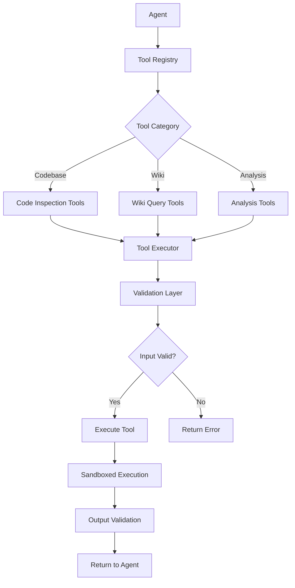
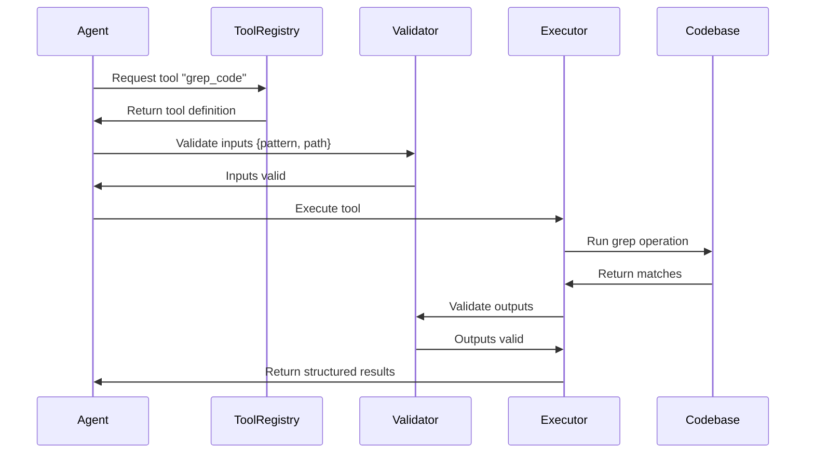
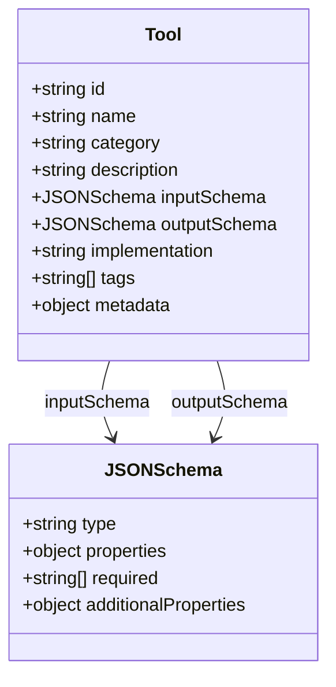
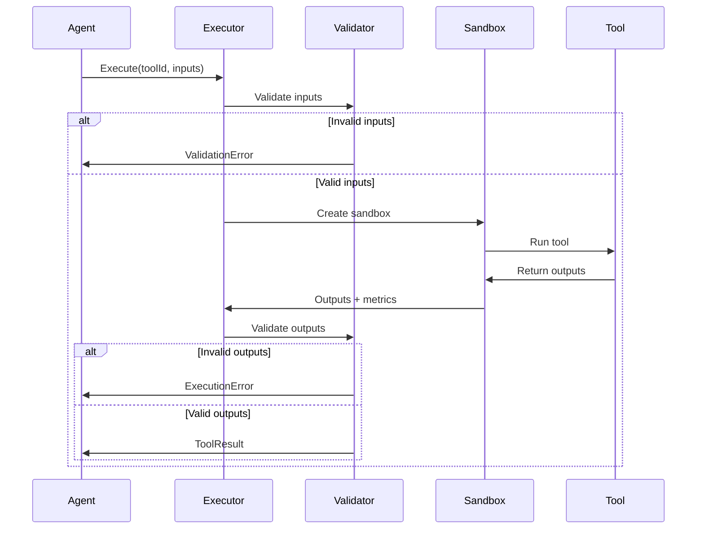
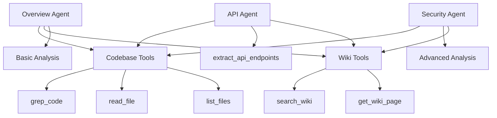
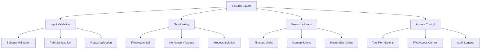

# Tool System for Agents

## Executive Summary

The CodeWiki tool system empowers AI agents with **verifiable capabilities** beyond pure text generation. While LLMs excel at generating plausible documentation, they can produce hallucinations or outdated information. Tools ground agent outputs in reality by enabling direct inspection of codebases, validation against wikis, and execution of analysis functions.

**Core Principles:**

- **Verification over Generation**: Tools validate claims rather than just generating text
- **Structured Outputs**: Tools return structured data, not natural language
- **Deterministic Behavior**: Same inputs always produce same outputs
- **Composable Operations**: Tools combine to enable complex workflows
- **Type Safety**: Tools enforce input/output schemas via JSON Schema

**Three Tool Categories:**

1. **Codebase Tools**: Inspect source code directly (grep, AST parsing, tree-sitter)
2. **Wiki Tools**: Query existing documentation (search, retrieve, validate)
3. **Analysis Tools**: Perform computations and reasoning (complexity, relationships, dependencies)

The tool system transforms agents from creative writers into **verifiable documentation engineers** whose outputs can be fact-checked and grounded in actual codebase state.

---

## Table of Contents

1. [Architecture Overview](#architecture-overview)
2. [Tool Definition System](#tool-definition-system)
3. [Codebase Tools](#codebase-tools)
4. [Wiki Tools](#wiki-tools)
5. [Analysis Tools](#analysis-tools)
6. [Tool Execution Framework](#tool-execution-framework)
7. [Agent-Tool Integration](#agent-tool-integration)
8. [Tool Development Guide](#tool-development-guide)
9. [Security & Sandboxing](#security--sandboxing)
10. [Performance Considerations](#performance-considerations)

---

## Architecture Overview

### Tool System Components



---

### Tool Lifecycle



---

### Core Abstractions

**Tool Definition:**
- Name and description
- Input schema (JSON Schema)
- Output schema (JSON Schema)
- Implementation reference
- Category and tags

**Tool Execution:**
- Input validation
- Sandboxed execution
- Output validation
- Error handling
- Timeout management

**Tool Registry:**
- Centralized tool catalog
- Discovery by category/tag
- Access control per agent
- Versioning support

---

## Tool Definition System

### Tool Structure

Every tool is defined by a structured specification that enables type-safe usage and validation.



---

### Tool Metadata

**Standard Fields:**

| Field | Type | Required | Description |
|-------|------|----------|-------------|
| id | string | Yes | Unique tool identifier (slug) |
| name | string | Yes | Display name |
| category | string | Yes | codebase, wiki, or analysis |
| description | string | Yes | Human-readable description |
| inputSchema | object | Yes | JSON Schema for inputs |
| outputSchema | object | Yes | JSON Schema for outputs |
| implementation | string | Yes | Module path or function name |
| tags | array | No | Searchable tags |
| metadata | object | No | Additional metadata |

**Metadata Fields:**

- **version**: Tool version (semver)
- **author**: Tool author
- **cost**: Estimated cost (tokens, time, resources)
- **deterministic**: Boolean, always same output for same input
- **idempotent**: Boolean, safe to call multiple times
- **sideEffects**: Boolean, modifies external state
- **deprecated**: Boolean, should not be used

---

### Example Tool Definition

**grep_code Tool:**

```json
{
  "id": "grep_code",
  "name": "Grep Code",
  "category": "codebase",
  "description": "Search codebase for regex pattern matches",
  "inputSchema": {
    "type": "object",
    "properties": {
      "pattern": {
        "type": "string",
        "description": "Regex pattern to search for"
      },
      "path": {
        "type": "string",
        "description": "Optional file or directory path to search within"
      },
      "fileGlob": {
        "type": "string",
        "description": "Optional glob pattern to filter files (e.g., '*.ts')"
      },
      "maxResults": {
        "type": "integer",
        "description": "Maximum number of results to return",
        "default": 100
      }
    },
    "required": ["pattern"]
  },
  "outputSchema": {
    "type": "object",
    "properties": {
      "matches": {
        "type": "array",
        "items": {
          "type": "object",
          "properties": {
            "file": {"type": "string"},
            "line": {"type": "integer"},
            "column": {"type": "integer"},
            "content": {"type": "string"},
            "context": {
              "type": "object",
              "properties": {
                "before": {"type": "array", "items": {"type": "string"}},
                "after": {"type": "array", "items": {"type": "string"}}
              }
            }
          }
        }
      },
      "totalMatches": {"type": "integer"},
      "truncated": {"type": "boolean"}
    }
  },
  "implementation": "tools/codebase/grepCode",
  "tags": ["search", "regex", "code"],
  "metadata": {
    "version": "1.0.0",
    "deterministic": true,
    "idempotent": true,
    "sideEffects": false
  }
}
```

---

## Codebase Tools

### Overview

Codebase tools provide direct access to source code for inspection, analysis, and validation. They enable agents to verify claims against actual code rather than relying on LLM knowledge or assumptions.

---

### grep_code Tool

**Purpose**: Search codebase using regex patterns

**Use Cases:**
- Find function definitions
- Locate API endpoints
- Identify usage patterns
- Verify existence of code elements

**Input Parameters:**

| Parameter | Type | Required | Description |
|-----------|------|----------|-------------|
| pattern | string | Yes | Regex pattern to match |
| path | string | No | File or directory to search |
| fileGlob | string | No | File pattern filter (*.ts, *.py) |
| maxResults | integer | No | Limit results (default: 100) |
| contextLines | integer | No | Lines of context (default: 2) |

**Output Structure:**

```typescript
{
  matches: Array<{
    file: string;           // Relative file path
    line: number;           // Line number (1-indexed)
    column: number;         // Column number (1-indexed)
    content: string;        // Matching line
    context: {
      before: string[];     // Lines before match
      after: string[];      // Lines after match
    }
  }>;
  totalMatches: number;     // Total found (may be > matches.length if truncated)
  truncated: boolean;       // True if results limited by maxResults
}
```

**Example Usage:**

```json
{
  "pattern": "class.*Agent",
  "fileGlob": "*.ts",
  "maxResults": 50
}
```

**Example Output:**

```json
{
  "matches": [
    {
      "file": "src/agents/OverviewAgent.ts",
      "line": 15,
      "column": 7,
      "content": "export class OverviewAgent extends BaseAgent {",
      "context": {
        "before": [
          "import { BaseAgent } from './BaseAgent';",
          ""
        ],
        "after": [
          "  constructor(context: AgentContext) {",
          "    super(context);"
        ]
      }
    }
  ],
  "totalMatches": 1,
  "truncated": false
}
```

---

### ast_query Tool

**Purpose**: Parse and query Abstract Syntax Tree (AST) of code files

**Use Cases:**
- Find all class definitions
- Extract function signatures
- Identify imports/exports
- Analyze code structure

**Input Parameters:**

| Parameter | Type | Required | Description |
|-----------|------|----------|-------------|
| file | string | Yes | Path to file to parse |
| query | string | Yes | Tree-sitter query pattern |
| language | string | No | Language (auto-detected if omitted) |

**Output Structure:**

```typescript
{
  matches: Array<{
    type: string;           // Node type (class, function, etc.)
    name: string;           // Element name
    startLine: number;
    endLine: number;
    text: string;           // Matched code text
    children: Array<any>;   // Child nodes
  }>;
  parseErrors: string[];    // Any parse errors encountered
}
```

**Example Usage:**

```json
{
  "file": "src/agents/BaseAgent.ts",
  "query": "(class_declaration name: (identifier) @class_name)"
}
```

**Example Output:**

```json
{
  "matches": [
    {
      "type": "class_declaration",
      "name": "BaseAgent",
      "startLine": 10,
      "endLine": 150,
      "text": "export class BaseAgent { ... }",
      "children": [/* method nodes */]
    }
  ],
  "parseErrors": []
}
```

---

### read_file Tool

**Purpose**: Read contents of a specific file

**Use Cases:**
- Read entire file for analysis
- Extract file metadata
- Verify file existence

**Input Parameters:**

| Parameter | Type | Required | Description |
|-----------|------|----------|-------------|
| path | string | Yes | Relative path to file |
| encoding | string | No | File encoding (default: utf-8) |
| maxLines | integer | No | Limit lines read |

**Output Structure:**

```typescript
{
  content: string;          // File contents
  lines: number;            // Total line count
  size: number;             // File size in bytes
  encoding: string;         // Actual encoding used
  truncated: boolean;       // True if maxLines applied
}
```

---

### list_files Tool

**Purpose**: List files in directory matching criteria

**Use Cases:**
- Discover files in directory
- Filter by extension or pattern
- Build file inventory

**Input Parameters:**

| Parameter | Type | Required | Description |
|-----------|------|----------|-------------|
| path | string | No | Directory path (default: repo root) |
| glob | string | No | Glob pattern filter |
| recursive | boolean | No | Recursive listing (default: false) |
| maxDepth | integer | No | Max recursion depth |

**Output Structure:**

```typescript
{
  files: Array<{
    path: string;           // Relative file path
    name: string;           // File name
    size: number;           // Size in bytes
    type: string;           // File extension
    isDirectory: boolean;
  }>;
  totalFiles: number;
  directories: number;
}
```

---

### get_symbol_definition Tool

**Purpose**: Find definition of a symbol (function, class, variable)

**Use Cases:**
- Locate where symbol is defined
- Get symbol signature
- Find symbol documentation

**Input Parameters:**

| Parameter | Type | Required | Description |
|-----------|------|----------|-------------|
| symbol | string | Yes | Symbol name to find |
| type | string | No | Symbol type hint (function, class, etc.) |
| scope | string | No | File/directory to search within |

**Output Structure:**

```typescript
{
  found: boolean;
  definitions: Array<{
    file: string;
    line: number;
    type: string;           // function, class, variable, etc.
    signature: string;      // Full signature
    documentation: string;  // JSDoc or docstring if present
    scope: string;          // public, private, protected
  }>;
}
```

---

## Wiki Tools

### Overview

Wiki tools enable agents to query and validate against existing wiki pages. This ensures consistency, prevents duplication, and enables agents to reference and build upon prior documentation.

---

### search_wiki Tool

**Purpose**: Search wiki pages for content

**Use Cases:**
- Find existing documentation on topic
- Check if topic already covered
- Find related pages
- Validate no duplication

**Input Parameters:**

| Parameter | Type | Required | Description |
|-----------|------|----------|-------------|
| query | string | Yes | Search query text |
| filters | object | No | Filter criteria (topics, quality, etc.) |
| maxResults | integer | No | Limit results (default: 20) |

**Filters Object:**

```typescript
{
  topics?: string[];        // Filter by topic tags
  minQuality?: number;      // Minimum quality score
  dateAfter?: string;       // ISO date, pages after this date
  excludePages?: string[];  // Page IDs to exclude
}
```

**Output Structure:**

```typescript
{
  results: Array<{
    pageId: string;
    title: string;
    excerpt: string;        // Relevant excerpt with query highlighted
    relevanceScore: number; // 0-1 relevance score
    topics: string[];
    qualityScore: number;
    lastUpdated: string;    // ISO date
  }>;
  totalResults: number;
  truncated: boolean;
}
```

---

### get_wiki_page Tool

**Purpose**: Retrieve full wiki page content

**Use Cases:**
- Read existing page for reference
- Extract specific information
- Verify page details
- Build on existing content

**Input Parameters:**

| Parameter | Type | Required | Description |
|-----------|------|----------|-------------|
| pageId | string | Yes | Page identifier |
| includeMetadata | boolean | No | Include full metadata (default: true) |

**Output Structure:**

```typescript
{
  pageId: string;
  title: string;
  content: string;          // Full markdown content
  topics: string[];
  metadata: {
    agent: string;          // Generating agent
    phase: string;          // Generation phase
    sourceFiles: string[];
    relatedPages: string[];
    wordCount: number;
    createdAt: string;
    updatedAt: string;
  };
  qualityScore: {
    overall: number;
    dimensions: object;     // 8 dimension scores
  };
}
```

---

### list_wiki_topics Tool

**Purpose**: Get all topics used in wiki

**Use Cases:**
- Discover existing topics
- Ensure topic consistency
- Find related topics
- Topic tag validation

**Input Parameters:**

| Parameter | Type | Required | Description |
|-----------|------|----------|-------------|
| sortBy | string | No | Sort by: name, count (default: count) |

**Output Structure:**

```typescript
{
  topics: Array<{
    name: string;
    pageCount: number;
    category: string;       // architecture, api, guide, etc.
    relatedTopics: string[];
  }>;
  totalTopics: number;
}
```

---

### check_page_exists Tool

**Purpose**: Check if page on topic exists

**Use Cases:**
- Prevent duplicate pages
- Verify coverage
- Conditional page creation

**Input Parameters:**

| Parameter | Type | Required | Description |
|-----------|------|----------|-------------|
| title | string | No | Exact title match |
| topics | array | No | Topic match (any or all) |
| matchMode | string | No | any or all (default: any) |

**Output Structure:**

```typescript
{
  exists: boolean;
  matches: Array<{
    pageId: string;
    title: string;
    topics: string[];
    relevance: number;      // How closely it matches criteria
  }>;
}
```

---

### validate_wiki_links Tool

**Purpose**: Check if code references in page are valid

**Use Cases:**
- Verify page accuracy
- Find broken references
- Update stale links

**Input Parameters:**

| Parameter | Type | Required | Description |
|-----------|------|----------|-------------|
| pageId | string | Yes | Page to validate |

**Output Structure:**

```typescript
{
  valid: boolean;
  brokenReferences: Array<{
    type: string;           // file, function, class, etc.
    reference: string;      // What was referenced
    line: number;           // Line in page content
    reason: string;         // Why it's broken
  }>;
  validReferences: number;
  totalReferences: number;
}
```

---

## Analysis Tools

### Overview

Analysis tools perform computations, reasoning, and higher-level analysis tasks that combine data from multiple sources or require specialized algorithms.

---

### calculate_complexity Tool

**Purpose**: Compute cyclomatic complexity of code

**Use Cases:**
- Identify complex functions
- Guide documentation depth
- Prioritize refactoring candidates

**Input Parameters:**

| Parameter | Type | Required | Description |
|-----------|------|----------|-------------|
| file | string | Yes | File to analyze |
| function | string | No | Specific function (or all if omitted) |

**Output Structure:**

```typescript
{
  complexityScores: Array<{
    name: string;           // Function name
    complexity: number;     // Cyclomatic complexity
    lines: number;          // Lines of code
    parameters: number;     // Parameter count
    recommendation: string; // low, medium, high complexity
  }>;
  fileAverage: number;
  recommendation: string;
}
```

---

### find_dependencies Tool

**Purpose**: Identify dependencies between code elements

**Use Cases:**
- Understand module relationships
- Document dependencies
- Find coupling

**Input Parameters:**

| Parameter | Type | Required | Description |
|-----------|------|----------|-------------|
| file | string | Yes | File to analyze |
| type | string | No | imports, exports, calls (default: all) |

**Output Structure:**

```typescript
{
  imports: Array<{
    module: string;
    symbols: string[];
    isExternal: boolean;
  }>;
  exports: Array<{
    name: string;
    type: string;           // function, class, variable, etc.
  }>;
  calls: Array<{
    caller: string;
    callee: string;
    location: { file: string; line: number };
  }>;
}
```

---

### analyze_directory_structure Tool

**Purpose**: Analyze directory organization and patterns

**Use Cases:**
- Document architecture
- Identify structure patterns
- Guide organization pages

**Input Parameters:**

| Parameter | Type | Required | Description |
|-----------|------|----------|-------------|
| path | string | No | Directory path (default: root) |
| maxDepth | integer | No | Analysis depth (default: 3) |

**Output Structure:**

```typescript
{
  structure: {
    directories: number;
    files: number;
    depth: number;
  };
  fileTypes: {
    [extension: string]: {
      count: number;
      totalSize: number;
    }
  };
  patterns: Array<{
    pattern: string;        // e.g., "feature-based", "layered"
    confidence: number;     // 0-1
    evidence: string[];
  }>;
  recommendations: string[];
}
```

---

### extract_api_endpoints Tool

**Purpose**: Find and document API endpoints

**Use Cases:**
- Generate API documentation
- Validate endpoint coverage
- Find REST/GraphQL patterns

**Input Parameters:**

| Parameter | Type | Required | Description |
|-----------|------|----------|-------------|
| path | string | No | Directory to search (default: all) |
| framework | string | No | express, fastify, etc. (auto-detect) |

**Output Structure:**

```typescript
{
  endpoints: Array<{
    method: string;         // GET, POST, etc.
    path: string;           // Route path
    handler: {
      file: string;
      function: string;
      line: number;
    };
    parameters: Array<{
      name: string;
      type: string;         // path, query, body
      required: boolean;
    }>;
    responses: Array<{
      statusCode: number;
      description: string;
    }>;
  }>;
  totalEndpoints: number;
}
```

---

### identify_patterns Tool

**Purpose**: Detect design patterns and idioms

**Use Cases:**
- Document architectural patterns
- Identify best practices
- Find inconsistencies

**Input Parameters:**

| Parameter | Type | Required | Description |
|-----------|------|----------|-------------|
| scope | string | No | File/directory scope (default: all) |
| patternTypes | array | No | Specific patterns to look for |

**Output Structure:**

```typescript
{
  patterns: Array<{
    name: string;           // Singleton, Factory, Observer, etc.
    instances: Array<{
      file: string;
      line: number;
      description: string;
    }>;
    confidence: number;     // 0-1
  }>;
}
```

---

## Tool Execution Framework

### Execution Flow



---

### Input Validation

**Validation Steps:**

1. **Schema Validation**
   - Validate against JSON Schema
   - Check required fields present
   - Verify types match
   - Validate constraints (min, max, pattern)

2. **Semantic Validation**
   - File paths exist and accessible
   - Patterns are valid regex
   - Numeric values in reasonable ranges
   - No dangerous inputs (path traversal, injection)

3. **Access Control**
   - Agent has permission to use tool
   - Tool can access requested resources
   - Rate limits not exceeded

**Example Validation:**

```typescript
function validateInputs(tool: Tool, inputs: any): ValidationResult {
  // JSON Schema validation
  const schemaValid = validateJsonSchema(inputs, tool.inputSchema);
  if (!schemaValid.valid) {
    return { valid: false, errors: schemaValid.errors };
  }

  // Semantic validation
  if (inputs.path && !isPathSafe(inputs.path)) {
    return { valid: false, errors: ['Path traversal detected'] };
  }

  if (inputs.pattern && !isValidRegex(inputs.pattern)) {
    return { valid: false, errors: ['Invalid regex pattern'] };
  }

  return { valid: true };
}
```

---

### Sandboxed Execution

**Sandbox Constraints:**

- **Filesystem Access**: Read-only, restricted to repository
- **Network Access**: Denied (no external API calls)
- **Process Execution**: Limited to safe commands
- **Memory Limit**: Configurable per tool
- **Time Limit**: Timeout after N seconds (default: 30s)
- **CPU Limit**: Prevent infinite loops

**Sandbox Implementation:**

```typescript
async function executeSandboxed(
  tool: Tool,
  inputs: any,
  limits: SandboxLimits
): Promise<ToolResult> {
  const sandbox = createSandbox({
    filesystemRoot: config.repositoryPath,
    filesystemMode: 'read-only',
    networkAccess: false,
    timeout: limits.timeout || 30000,
    memoryLimit: limits.memory || '512MB'
  });

  try {
    const startTime = Date.now();
    const result = await sandbox.run(tool.implementation, inputs);
    const duration = Date.now() - startTime;

    return {
      success: true,
      output: result,
      metadata: { duration, tool: tool.id }
    };
  } catch (error) {
    if (error instanceof TimeoutError) {
      return { success: false, error: 'Tool execution timeout' };
    }
    return { success: false, error: error.message };
  } finally {
    sandbox.destroy();
  }
}
```

---

### Output Validation

**Validation Steps:**

1. **Schema Validation**
   - Validate against output JSON Schema
   - Ensure all required fields present
   - Verify types correct

2. **Result Sanity Checks**
   - Results not suspiciously empty
   - Counts match array lengths
   - No obvious errors in data

3. **Resource Limits**
   - Output size within limits
   - Result count within limits
   - No excessive resource usage

---

### Error Handling

**Error Types:**

| Error Type | When | Agent Action |
|------------|------|--------------|
| ValidationError | Invalid inputs | Fix inputs, retry |
| ExecutionError | Tool fails | Handle failure, try alternative |
| TimeoutError | Tool runs too long | Use simpler query or tool |
| PermissionError | No access | Choose different tool |
| ResourceError | Memory/CPU limit | Reduce scope, retry |

**Error Response Structure:**

```typescript
{
  success: false,
  error: string,            // Human-readable error
  errorType: string,        // Error category
  context: {
    tool: string,
    inputs: any,
    stack?: string          // Stack trace if available
  },
  suggestions: string[]     // How to fix
}
```

---

## Agent-Tool Integration

### Tool Assignment

**Agent Tool Permissions:**

Each agent is assigned a specific set of allowed tools based on its purpose and trust level.



**Example Agent Configuration:**

```json
{
  "agentId": "overview-agent",
  "allowedTools": [
    "grep_code",
    "ast_query",
    "read_file",
    "list_files",
    "search_wiki",
    "get_wiki_page",
    "list_wiki_topics",
    "analyze_directory_structure"
  ],
  "toolLimits": {
    "grep_code": { "maxResults": 200 },
    "search_wiki": { "maxResults": 50 }
  }
}
```

---

### Tool Discovery

**How Agents Discover Tools:**

1. **Tool Registry Query**
   - Agent queries registry for available tools
   - Filters by category or tags
   - Receives tool definitions

2. **LLM System Prompt**
   - Tool names and descriptions in prompt
   - Usage examples provided
   - Schema information included

3. **Dynamic Tool Loading**
   - Tools loaded on-demand
   - Reduces prompt size
   - Enables large tool catalogs

**Example System Prompt Excerpt:**

```
You have access to the following tools:

1. grep_code(pattern, path?, fileGlob?, maxResults?)
   - Search codebase for regex pattern matches
   - Returns: Array of matches with file, line, content
   - Use for: Finding code elements, verifying existence

2. search_wiki(query, filters?, maxResults?)
   - Search wiki pages for content
   - Returns: Ranked results with excerpts
   - Use for: Finding existing docs, preventing duplication

...

When making claims about the codebase, use tools to verify facts.
Format tool calls as:
<tool_call>
{
  "tool": "grep_code",
  "inputs": { "pattern": "class.*Agent", "fileGlob": "*.ts" }
}
</tool_call>
```

---

### Tool Usage Patterns

**Pattern 1: Verify Before Claiming**

```
Agent Goal: Document authentication system

1. search_wiki(query: "authentication")
   → Check if already documented

2. grep_code(pattern: "auth|Auth", fileGlob: "*.ts")
   → Find authentication-related code

3. ast_query(file: "src/auth/AuthService.ts", query: "class_declaration")
   → Get class structure

4. get_symbol_definition(symbol: "authenticateUser")
   → Find implementation details

5. Generate documentation with verified facts
```

**Pattern 2: Iterative Refinement**

```
Agent Goal: Find all API endpoints

1. extract_api_endpoints()
   → Get initial list

2. For each endpoint:
   a. read_file(path: handler file)
   b. ast_query(file: handler, query: function)
   c. Document endpoint with details

3. validate_wiki_links(pageId: generated page)
   → Verify all references valid
```

**Pattern 3: Cross-Validation**

```
Agent Goal: Document database schema

1. grep_code(pattern: "Schema|Model")
   → Find schema definitions

2. search_wiki(query: "database schema")
   → Check existing docs

3. find_dependencies(file: "src/models/User.ts")
   → Understand relationships

4. Cross-reference findings
5. Generate consistent documentation
```

---

## Tool Development Guide

### Creating a New Tool

**Step 1: Define Tool Specification**

```typescript
// tools/my-new-tool.json
{
  "id": "my_new_tool",
  "name": "My New Tool",
  "category": "codebase",
  "description": "Does something useful with code",
  "inputSchema": {
    "type": "object",
    "properties": {
      "param1": { "type": "string", "description": "..." }
    },
    "required": ["param1"]
  },
  "outputSchema": {
    "type": "object",
    "properties": {
      "result": { "type": "array", "items": {"type": "string"} }
    }
  },
  "implementation": "tools/codebase/myNewTool",
  "tags": ["search", "analysis"]
}
```

**Step 2: Implement Tool Function**

```typescript
// tools/codebase/myNewTool.ts
import { ToolInput, ToolOutput } from '../types';

export async function myNewTool(
  inputs: ToolInput
): Promise<ToolOutput> {
  // Validate inputs (additional validation beyond schema)
  if (!inputs.param1) {
    throw new Error('param1 is required');
  }

  // Perform tool operation
  const result = await performOperation(inputs.param1);

  // Return structured output
  return {
    result: result,
    metadata: {
      itemsProcessed: result.length
    }
  };
}

async function performOperation(param: string): Promise<string[]> {
  // Implementation details
  return [];
}
```

**Step 3: Add Tests**

```typescript
// tests/tools/myNewTool.test.ts
import { describe, it } from 'node:test';
import assert from 'node:assert';
import { myNewTool } from '../../src/tools/codebase/myNewTool';

describe('myNewTool', () => {
  it('should return expected results for valid input', async () => {
    const result = await myNewTool({ param1: 'test' });
    assert.ok(result.result.length > 0);
  });

  it('should throw error for invalid input', async () => {
    await assert.rejects(
      async () => myNewTool({ param1: '' }),
      /param1 is required/
    );
  });
});
```

**Step 4: Register Tool**

```typescript
// tools/registry.ts
import { myNewTool } from './codebase/myNewTool';
import toolSpec from './my-new-tool.json';

toolRegistry.register({
  ...toolSpec,
  implementation: myNewTool
});
```

---

### Best Practices

**✅ Do:**

- Keep tools focused on single responsibility
- Validate inputs thoroughly
- Return structured, parseable outputs
- Handle errors gracefully
- Document limitations and edge cases
- Make tools deterministic when possible
- Include usage examples
- Write comprehensive tests

**❌ Don't:**

- Make tools that require human interaction
- Return unstructured text (return JSON)
- Have side effects unless necessary
- Make network calls without sandboxing
- Trust user inputs without validation
- Return unbounded result sets
- Assume specific file structures
- Hardcode paths or values

---

## Security & Sandboxing

### Security Considerations

**Threat Model:**

1. **Malicious Inputs**: Agent provides crafted inputs to exploit tool
2. **Resource Exhaustion**: Tool consumes excessive CPU/memory
3. **Information Disclosure**: Tool leaks sensitive data
4. **Privilege Escalation**: Tool accesses unauthorized resources

**Mitigations:**



---

### Input Sanitization

**Path Traversal Prevention:**

```typescript
function sanitizePath(path: string, repoRoot: string): string {
  // Resolve to absolute path
  const absolute = path.resolve(repoRoot, path);

  // Ensure within repo root
  if (!absolute.startsWith(repoRoot)) {
    throw new Error('Path traversal attempt detected');
  }

  return absolute;
}
```

**Regex Safety:**

```typescript
function validateRegex(pattern: string): boolean {
  try {
    // Check for catastrophic backtracking patterns
    const dangerous = /(\(.*\))\1\+|(\(.*\*.*\)){2,}/;
    if (dangerous.test(pattern)) {
      return false;
    }

    // Test regex compiles
    new RegExp(pattern);
    return true;
  } catch {
    return false;
  }
}
```

---

### Resource Isolation

**Filesystem Isolation:**

- Tools run in chroot-like environment
- Only repository directory accessible
- Read-only access by default
- No access to system files or sensitive paths

**Process Isolation:**

- Each tool execution in separate process
- Process killed on timeout
- Limited syscalls available
- No shell access

**Network Isolation:**

- No network access by default
- Exceptions require explicit configuration
- All network calls logged and monitored

---

## Performance Considerations

### Tool Performance

**Performance Metrics:**

| Tool | Avg Duration | Memory Usage | CPU Intensity |
|------|--------------|--------------|---------------|
| grep_code | 50-500ms | Low (50MB) | Medium |
| ast_query | 100-1000ms | Medium (200MB) | High |
| read_file | 10-100ms | Low (varies) | Low |
| search_wiki | 20-200ms | Low (100MB) | Low |
| calculate_complexity | 200-2000ms | Medium (300MB) | High |

---

### Optimization Strategies

**1. Caching**

```typescript
const toolCache = new LRUCache({
  max: 1000,
  ttl: 1000 * 60 * 5 // 5 minutes
});

function cachedToolExecution(toolId: string, inputs: any): Promise<any> {
  const cacheKey = `${toolId}:${hashInputs(inputs)}`;

  if (toolCache.has(cacheKey)) {
    return Promise.resolve(toolCache.get(cacheKey));
  }

  return executeTool(toolId, inputs).then(result => {
    toolCache.set(cacheKey, result);
    return result;
  });
}
```

**2. Batching**

- Batch multiple tool calls together
- Reduce overhead of sandbox creation
- Amortize validation costs

**3. Lazy Loading**

- Load tool implementations on-demand
- Don't load all tools at startup
- Reduce memory footprint

**4. Result Streaming**

- Stream large results instead of buffering
- Allow agent to process incrementally
- Reduce peak memory usage

---

## Appendix A: Complete Tool Catalog

### Codebase Tools

| Tool | Purpose | Input | Output |
|------|---------|-------|--------|
| grep_code | Search code with regex | pattern, path, glob | Matches array |
| ast_query | Query AST | file, query, language | AST nodes |
| read_file | Read file contents | path, encoding, maxLines | File content |
| list_files | List directory files | path, glob, recursive | File list |
| get_symbol_definition | Find symbol definition | symbol, type, scope | Definition info |
| get_imports | Get file imports | file | Import list |
| get_exports | Get file exports | file | Export list |
| find_references | Find symbol usages | symbol, scope | Reference list |

### Wiki Tools

| Tool | Purpose | Input | Output |
|------|---------|-------|--------|
| search_wiki | Search pages | query, filters, max | Search results |
| get_wiki_page | Get page content | pageId, includeMeta | Page object |
| list_wiki_topics | List all topics | sortBy | Topic list |
| check_page_exists | Check page exists | title, topics, mode | Exists + matches |
| validate_wiki_links | Validate references | pageId | Validation result |
| get_related_pages | Find related pages | pageId, limit | Page list |

### Analysis Tools

| Tool | Purpose | Input | Output |
|------|---------|-------|--------|
| calculate_complexity | Compute complexity | file, function | Complexity scores |
| find_dependencies | Analyze dependencies | file, type | Dependency graph |
| analyze_directory_structure | Analyze structure | path, maxDepth | Structure info |
| extract_api_endpoints | Find API endpoints | path, framework | Endpoint list |
| identify_patterns | Detect patterns | scope, patternTypes | Pattern instances |
| calculate_coverage | Get test coverage | scope | Coverage metrics |
| analyze_coupling | Measure coupling | scope | Coupling metrics |

---

**Document Version**: 1.0
**Last Updated**: 2025-12-18
**Related Documents**:
- AGENT_CATALOG.md - Agents that use these tools
- ARCHITECTURE.md - System architecture including tool framework
- TESTING_STRATEGY.md - Testing tools and tool implementations
