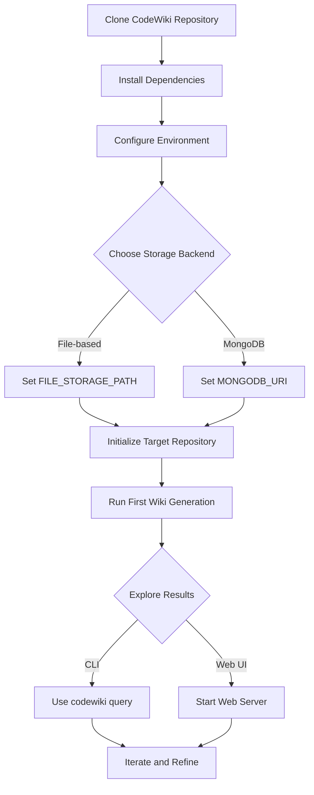
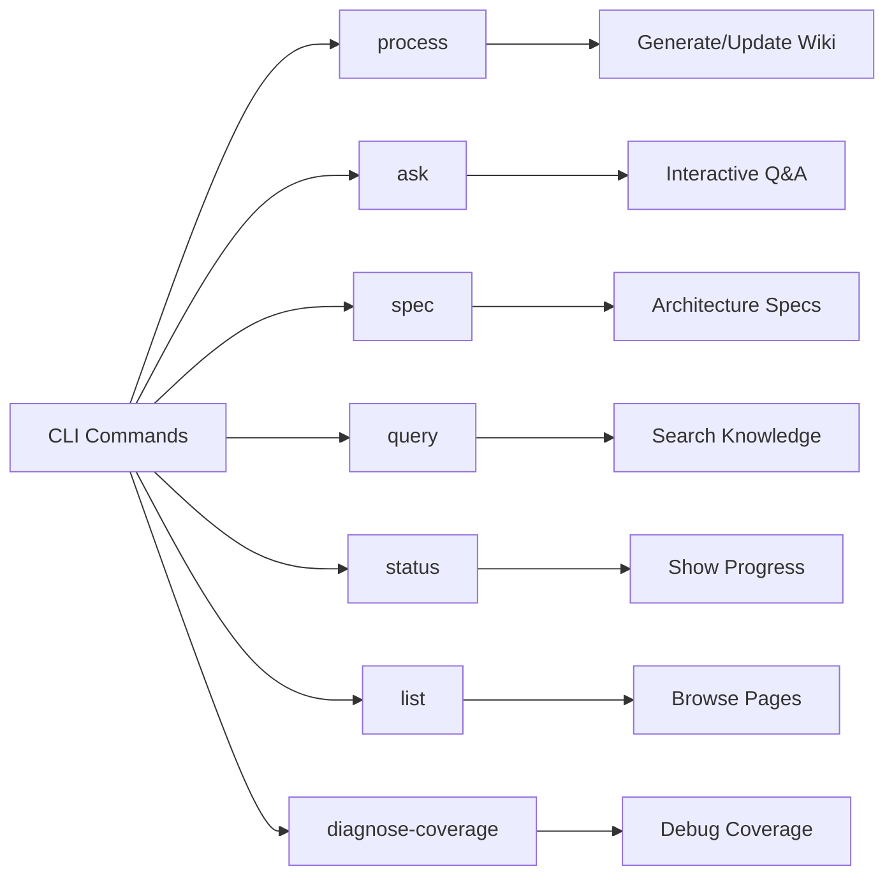
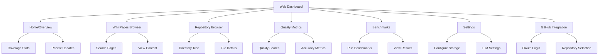
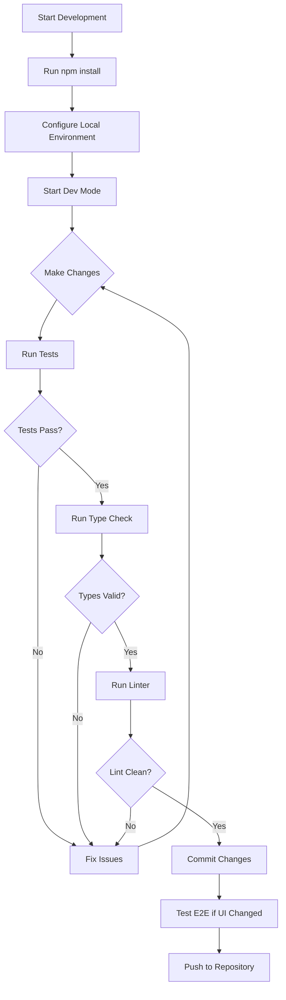
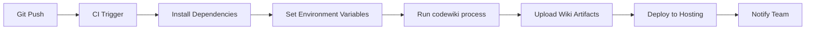
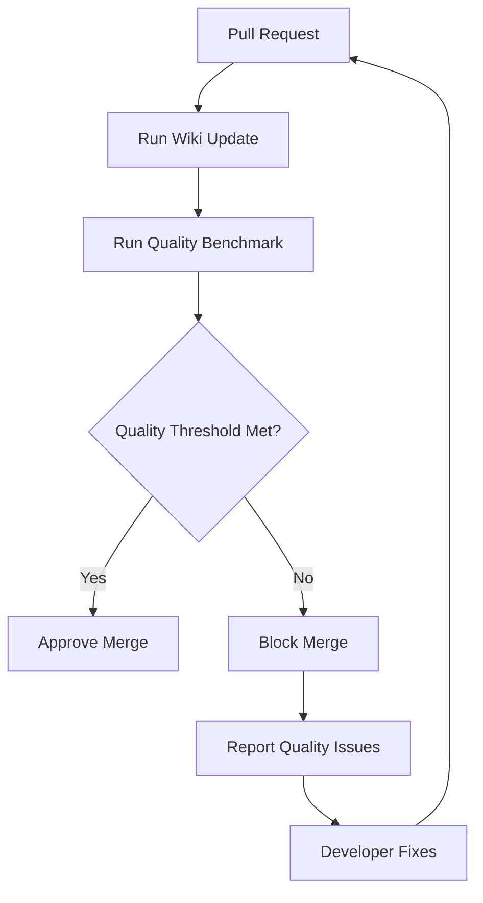
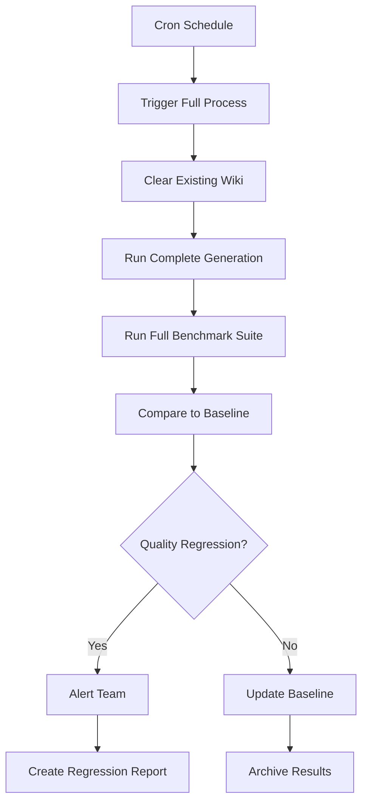
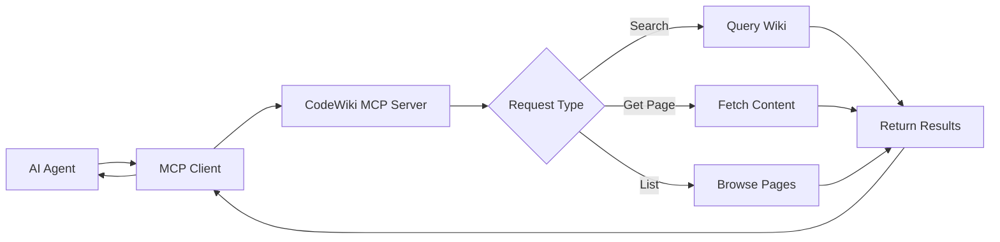
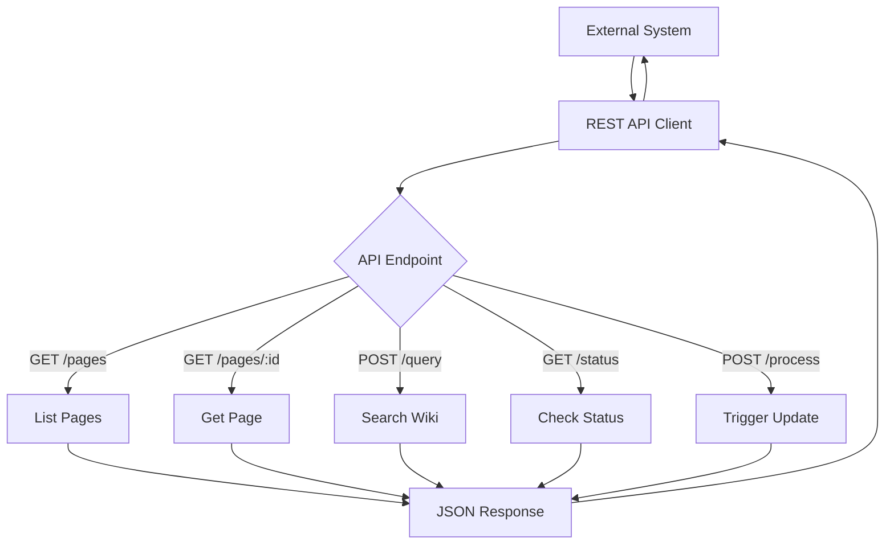
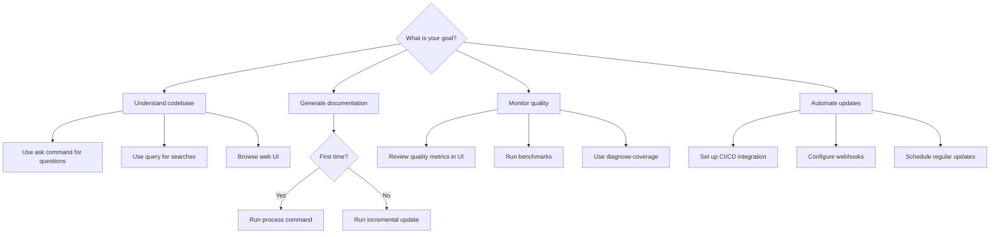

# User Workflows & Usage Patterns

## Executive Summary

CodeWiki serves three primary user personas: **developers seeking living documentation**, **teams building institutional memory**, and **AI agents consuming structured knowledge**. The system provides both command-line and web interfaces, supporting workflows from one-time wiki generation to continuous documentation maintenance.

This document details how users interact with CodeWiki across different contexts: local development, CI/CD pipelines, web dashboards, and programmatic integration. It covers the complete user journey from first installation through daily usage patterns, common workflows, and troubleshooting strategies.

**Key User Workflows:**
- **One-Shot Generation**: Single command to generate comprehensive wiki from repository
- **Continuous Maintenance**: Automated updates as codebase evolves
- **Interactive Exploration**: Web UI for browsing, searching, and quality metrics
- **AI-First Consumption**: MCP server integration for agent-driven knowledge access
- **Quality Monitoring**: Benchmarking and scoring workflows for documentation quality

---

## Table of Contents

1. [User Personas & Goals](#user-personas--goals)
2. [Getting Started Journey](#getting-started-journey)
3. [CLI Workflows](#cli-workflows)
4. [Web UI Workflows](#web-ui-workflows)
5. [Development Workflows](#development-workflows)
6. [CI/CD Integration Patterns](#cicd-integration-patterns)
7. [Team Collaboration Workflows](#team-collaboration-workflows)
8. [AI Agent Workflows](#ai-agent-workflows)
9. [Troubleshooting Workflows](#troubleshooting-workflows)
10. [Advanced Usage Patterns](#advanced-usage-patterns)

---

## User Personas & Goals

### Persona 1: Individual Developer

**Profile**: Software engineer working on unfamiliar or legacy codebase

**Goals**:
- Quickly understand large, complex codebases
- Generate documentation without manual effort
- Keep documentation synchronized with code changes
- Answer specific questions about code architecture

**Primary Workflows**:
- One-shot wiki generation for new projects
- Query-driven exploration for specific questions
- Local development with file-based storage

**Typical Tools Used**: CLI exclusively, occasional web UI for browsing

---

### Persona 2: Engineering Team

**Profile**: Development team maintaining multiple repositories

**Goals**:
- Build institutional knowledge that survives team changes
- Maintain consistent documentation standards
- Automate documentation in CI/CD pipelines
- Monitor documentation quality over time

**Primary Workflows**:
- Continuous wiki updates triggered by commits
- Quality benchmarking for documentation standards
- Team-wide wiki hosting with web dashboard
- Shared MongoDB storage for collaboration

**Typical Tools Used**: CI/CD integration, web UI, CLI for local development

---

### Persona 3: AI Agent System

**Profile**: Autonomous agent or LLM application requiring code knowledge

**Goals**:
- Access structured, verified code knowledge
- Query specific implementation details programmatically
- Integrate code understanding into agent workflows
- Consume documentation through standardized protocols

**Primary Workflows**:
- MCP server integration for real-time queries
- REST API consumption for programmatic access
- Automated wiki updates for fresh knowledge

**Typical Tools Used**: MCP protocol, REST API, background processing

---

## Getting Started Journey

### First-Time User Experience

**Step-by-Step Initial Setup**:

1. **Installation**
   - Clone CodeWiki repository
   - Run dependency installation
   - Install Playwright for E2E tests if developing

2. **Configuration**
   - Copy environment template
   - Set OpenRouter API key for LLM access
   - Choose storage backend (file vs MongoDB)
   - Configure data directory path

3. **First Wiki Generation**
   - Point CodeWiki at target repository
   - Run process command with repository path
   - Wait for multi-phase generation to complete
   - Review generated wiki pages

4. **Validation**
   - Browse wiki via web UI
   - Query specific topics via CLI
   - Review quality metrics
   - Check coverage statistics

**Expected Outcomes**:
- Comprehensive wiki covering repository structure
- Searchable knowledge base of code concepts
- Quality scores and coverage metrics
- Ready for continuous updates or one-time use

---

## CLI Workflows

### Command Overview

CodeWiki provides seven primary CLI commands, each serving distinct workflow needs:

---

### Workflow 1: Complete Wiki Generation

**Use Case**: Generate comprehensive documentation for entire repository

**Command**: `codewiki process`

**Typical Flow**:

1. User initiates full wiki generation
2. System performs six-phase orchestration:
   - Reconnaissance: Analyze repository structure
   - Skeleton: Generate foundational pages
   - Breadth: Ensure broad coverage
   - Depth: Add detailed documentation
   - Polish: Refine and consolidate
   - Maintenance: Handle updates
3. User monitors progress via status command
4. System generates wiki pages incrementally
5. User reviews results via web UI or query command

**When to Use**:
- First-time documentation of new repository
- Major refactoring or architecture changes
- Scheduled full regeneration (weekly/monthly)
- Quality baseline establishment

**Expected Duration**: Varies by repository size (minutes to hours)

**Output**: Complete wiki with pages covering architecture, modules, patterns, guides

---

### Workflow 2: Interactive Question Answering

**Use Case**: Get specific answers about codebase without browsing full wiki

**Command**: `codewiki ask`

**Typical Flow**:

1. User asks natural language question
2. System analyzes question and identifies relevant context
3. Specialized agent formulates answer using wiki knowledge
4. User receives direct answer with references
5. User can ask follow-up questions in same session

**When to Use**:
- Quick lookups during development
- Understanding specific features or patterns
- Onboarding new team members
- Debugging specific issues

**Example Questions**:
- "How does authentication work in this codebase?"
- "What database schema is used for user management?"
- "Where are API endpoints defined?"

**Output**: Conversational answer with wiki page references

---

### Workflow 3: Architecture Specification Generation

**Use Case**: Generate focused architectural documentation

**Command**: `codewiki spec`

**Typical Flow**:

1. User requests specification for specific architectural area
2. System identifies relevant code and patterns
3. Specialized agents generate structured specification
4. User receives detailed architectural documentation
5. Specification can be versioned with code

**When to Use**:
- Creating architecture decision records (ADRs)
- Documenting system design for stakeholders
- Preparing technical proposals
- Compliance and audit documentation

**Output**: Structured specification document with diagrams and explanations

---

### Workflow 4: Knowledge Base Query

**Use Case**: Search existing wiki for specific information

**Command**: `codewiki query`

**Typical Flow**:

1. User provides search terms or concepts
2. System searches wiki pages for relevant content
3. Results ranked by relevance and quality
4. User reviews matching pages and excerpts
5. User can refine query based on results

**When to Use**:
- Finding existing documentation
- Locating specific implementation details
- Verifying documentation coverage
- Quick reference lookups

**Output**: List of relevant wiki pages with excerpts

---

### Workflow 5: Progress Monitoring

**Use Case**: Track wiki generation progress and system status

**Command**: `codewiki status`

**Typical Flow**:

1. User checks status during long-running process
2. System reports current phase and progress metrics
3. User sees coverage statistics and completion estimates
4. User can identify bottlenecks or issues
5. User waits or intervenes based on status

**When to Use**:
- Monitoring long-running wiki generation
- Debugging stalled processes
- Understanding system workload
- Planning resource allocation

**Output**: Current phase, progress percentage, coverage stats, active agents

---

### Workflow 6: Wiki Content Browsing

**Use Case**: List and browse generated wiki pages

**Command**: `codewiki list`

**Typical Flow**:

1. User requests list of wiki pages
2. System returns all pages with metadata
3. User identifies pages of interest
4. User can filter or sort by various criteria
5. User reads specific pages or exports content

**When to Use**:
- Understanding wiki structure
- Finding specific documentation
- Validating coverage
- Exporting documentation

**Output**: List of wiki page titles with quality scores and topics

---

### Workflow 7: Coverage Diagnosis

**Use Case**: Debug coverage gaps and understand documentation completeness

**Command**: `codewiki diagnose-coverage`

**Typical Flow**:

1. User identifies coverage gaps or issues
2. System analyzes coverage metrics in detail
3. Reports show which files lack documentation
4. User identifies patterns in gaps
5. User can trigger targeted wiki updates

**When to Use**:
- Debugging incomplete documentation
- Understanding coverage algorithm
- Identifying neglected code areas
- Planning focused documentation efforts

**Output**: Detailed coverage report with gap analysis

---

## Web UI Workflows

### Dashboard Overview

---

### Workflow 1: Wiki Exploration

**Entry Point**: Wiki pages list view

**User Journey**:

1. **Browse Available Pages**
   - View list of all generated wiki pages
   - See page titles, topics, quality scores
   - Sort by relevance, date, or quality
   - Filter by topic or category

2. **Search Content**
   - Enter search query in wiki search
   - View ranked results with excerpts
   - Click through to full page content
   - Navigate related pages via links

3. **Read Documentation**
   - View formatted wiki content
   - See embedded diagrams and examples
   - Navigate to referenced files
   - Access quality metadata

4. **Track Coverage**
   - See which files are documented
   - Identify gaps in coverage
   - View documentation depth scores
   - Plan wiki updates based on gaps

**Primary Value**: Self-service knowledge discovery without CLI

---

### Workflow 2: Quality Monitoring

**Entry Point**: Quality metrics dashboard

**User Journey**:

1. **Review Overall Quality**
   - View aggregate quality scores
   - See quality distribution across pages
   - Identify low-quality pages needing attention
   - Track quality trends over time

2. **Analyze Specific Dimensions**
   - Review 8 quality dimensions separately:
     - Accuracy: Factual correctness
     - Completeness: Coverage depth
     - Clarity: Readability and structure
     - Relevance: Topic appropriateness
     - Consistency: Internal coherence
     - Timeliness: Freshness
     - Verifiability: Tool-checked facts
     - Accessibility: Ease of understanding

3. **Drill Down to Pages**
   - Click low-scoring pages for details
   - Review specific quality issues
   - Understand score composition
   - Plan remediation actions

4. **Set Quality Standards**
   - Define minimum acceptable scores
   - Configure quality thresholds
   - Trigger regeneration for low-quality pages
   - Monitor quality improvements

**Primary Value**: Proactive quality management and continuous improvement

---

### Workflow 3: Repository Analysis

**Entry Point**: Repository browser

**User Journey**:

1. **Browse Directory Structure**
   - Navigate repository tree visually
   - See file organization and hierarchy
   - Identify major modules and components
   - Understand codebase layout

2. **View File Details**
   - Click files to see metadata
   - Review which wiki pages reference file
   - See documentation depth scores
   - Identify undocumented files

3. **Analyze Coverage**
   - View coverage heat map by directory
   - Identify well-documented vs neglected areas
   - Understand documentation distribution
   - Plan targeted documentation efforts

4. **Trigger Updates**
   - Request wiki updates for specific files
   - Monitor update progress
   - Review newly generated content
   - Validate coverage improvements

**Primary Value**: Visual understanding of documentation coverage

---

### Workflow 4: Benchmark Execution

**Entry Point**: Benchmarks dashboard

**User Journey**:

1. **Configure Benchmark**
   - Select benchmark type (accuracy vs quality)
   - Choose target pages or full wiki
   - Set evaluation criteria
   - Configure question sets for accuracy tests

2. **Run Benchmark**
   - Initiate benchmark execution
   - Monitor progress in real-time
   - See per-page evaluation results
   - Wait for completion (can be long-running)

3. **Review Results**
   - View aggregate scores and statistics
   - Identify failing pages or questions
   - Analyze score distributions
   - Compare against previous benchmarks

4. **Take Action**
   - Regenerate low-scoring pages
   - Adjust agent prompts or strategies
   - Document quality issues
   - Schedule regular benchmarks

**Primary Value**: Objective quality measurement and regression detection

---

### Workflow 5: GitHub Integration

**Entry Point**: GitHub OAuth login

**User Journey**:

1. **Authenticate**
   - Click GitHub login button
   - Authorize CodeWiki application
   - Receive OAuth token with refresh
   - See authenticated status

2. **Select Repository**
   - Browse accessible repositories
   - Choose target for documentation
   - Grant necessary permissions
   - Clone or link repository

3. **Configure Automation**
   - Set up webhook for push events
   - Configure auto-update triggers
   - Define update frequency
   - Specify branch to track

4. **Monitor Updates**
   - See recent repository changes
   - View triggered wiki updates
   - Track synchronization status
   - Review update history

**Primary Value**: Seamless integration with GitHub workflow

---

## Development Workflows

### Local Development Pattern

**Scenario**: Developer working on CodeWiki itself or customizing for organization

**Key Commands**:
- Development mode with watch
- Test execution with coverage
- Type checking for validation
- Linting for code style
- E2E tests for UI changes

**Best Practices**:
- Follow TDD approach: write tests first
- Research existing tests before adding new ones
- Run full validation suite before commits
- Use integration tests for system behavior
- Test LLM agents with real calls when needed

---

### Test-Driven Development Flow

**Scenario**: Adding new feature to CodeWiki

**Steps**:

1. **Research Phase**
   - Explore existing tests for similar features
   - Understand test helpers and patterns
   - Review LLM test suite if agent-related
   - Identify integration points

2. **Test Writing Phase**
   - Write failing test describing expected behavior
   - Use MockLLMService for unit tests
   - Write integration test for real system behavior
   - Add LLM test if agent semantics matter

3. **Implementation Phase**
   - Write minimum code to pass tests
   - Follow red-green-refactor cycle
   - Keep changes minimal and focused
   - Avoid over-engineering

4. **Validation Phase**
   - Run unit tests for isolated logic
   - Run integration tests for interactions
   - Run E2E tests if UI affected
   - Run LLM tests for agent behavior

5. **Refinement Phase**
   - Refactor while keeping tests green
   - Ensure type safety
   - Pass linter checks
   - Update documentation

---

## CI/CD Integration Patterns

### Pattern 1: Wiki Generation on Push

**Use Case**: Automatically update wiki when code changes

**Implementation**:

**Configuration Requirements**:
- OpenRouter API key in CI secrets
- Storage backend configuration (file or MongoDB)
- Repository access permissions
- Artifact storage for wiki output

**Best Practices**:
- Run on main branch pushes only
- Use caching for dependencies
- Set reasonable timeouts for large repos
- Store artifacts for historical comparison
- Monitor API costs

---

### Pattern 2: Quality Gate Enforcement

**Use Case**: Block merges if documentation quality falls below threshold

**Implementation**:

**Configuration Requirements**:
- Quality score thresholds defined
- Benchmark question sets prepared
- CI integration for PR checks
- Clear failure messages

**Best Practices**:
- Set realistic thresholds (not 100%)
- Provide actionable feedback
- Allow overrides for emergencies
- Track quality trends over time

---

### Pattern 3: Scheduled Full Regeneration

**Use Case**: Weekly complete wiki rebuild for consistency

**Implementation**:

**Configuration Requirements**:
- Scheduled trigger (cron or CI scheduler)
- Baseline quality metrics stored
- Alerting system integrated
- Historical tracking enabled

**Best Practices**:
- Run during low-usage periods
- Archive previous wiki versions
- Monitor cost and duration trends
- Use results for quality retrospectives

---

## Team Collaboration Workflows

### Workflow 1: Onboarding New Team Members

**Goal**: Help new developers understand codebase quickly

**Steps**:

1. **Initial Orientation**
   - Share wiki web UI URL
   - Explain wiki structure and navigation
   - Demonstrate search functionality
   - Show how to ask questions

2. **Guided Exploration**
   - Assign specific wiki pages to read
   - Provide architecture overview pages
   - Review getting started guides
   - Explore module documentation

3. **Interactive Learning**
   - Encourage asking questions via CLI
   - Use wiki to answer "how does X work?"
   - Reference wiki in code reviews
   - Build mental model through exploration

4. **Contribution**
   - Validate wiki accuracy during learning
   - Report outdated or incorrect content
   - Suggest areas needing more documentation
   - Participate in wiki quality reviews

**Expected Outcome**: Faster onboarding with self-service documentation

---

### Workflow 2: Architecture Decision Records

**Goal**: Document architectural decisions with wiki integration

**Steps**:

1. **Decision Making**
   - Use wiki to understand current architecture
   - Research existing patterns via query
   - Evaluate alternatives with spec command
   - Make informed decision

2. **Documentation**
   - Create ADR document in repository
   - Trigger wiki update to include ADR
   - Ensure wiki references ADR appropriately
   - Link related wiki pages to ADR

3. **Team Review**
   - Share ADR via wiki link
   - Review in context of full architecture
   - Discuss implications using wiki knowledge
   - Approve and commit

4. **Maintenance**
   - Update wiki as decisions evolve
   - Keep ADR and wiki synchronized
   - Reference in future decisions
   - Track decision outcomes

**Expected Outcome**: Living architecture documentation that evolves with code

---

### Workflow 3: Code Review Enhancement

**Goal**: Use wiki knowledge to improve code review quality

**Steps**:

1. **Pre-Review Preparation**
   - Reviewer reads relevant wiki pages
   - Understands context and patterns
   - Identifies architectural principles
   - Reviews related implementation

2. **Review Process**
   - Reference wiki in review comments
   - Verify changes align with documented architecture
   - Check consistency with established patterns
   - Suggest wiki pages for author context

3. **Post-Review Updates**
   - Identify wiki gaps revealed by review
   - Trigger wiki updates for new patterns
   - Document new architectural decisions
   - Update wiki with learned insights

4. **Continuous Improvement**
   - Use wiki as shared knowledge base
   - Reduce repeated explanation in reviews
   - Build team-wide understanding
   - Maintain consistent standards

**Expected Outcome**: Faster reviews with better context and consistency

---

## AI Agent Workflows

### MCP Server Integration

**Use Case**: AI agent needs to query codebase knowledge

**Setup Steps**:

1. **Server Configuration**
   - Install CodeWiki MCP server
   - Configure storage backend connection
   - Set authentication if required
   - Test connectivity

2. **Client Integration**
   - Add MCP server to agent configuration
   - Implement query logic in agent
   - Handle response parsing
   - Add error handling

3. **Usage Patterns**
   - Agent queries wiki for specific knowledge
   - Receives structured responses
   - Uses knowledge in reasoning
   - Can trigger wiki updates if needed

**Supported Operations**:
- Search wiki by keyword or concept
- Retrieve specific page content
- List available pages and topics
- Query metadata and quality scores

---

### REST API Integration

**Use Case**: Programmatic access to wiki from external systems

**Integration Steps**:

1. **API Access**
   - Obtain API endpoint URL
   - Configure authentication token if needed
   - Test connectivity
   - Review API documentation

2. **Client Development**
   - Implement HTTP client
   - Add request/response handling
   - Implement retry logic
   - Add rate limiting

3. **Workflow Integration**
   - Call API from automated workflows
   - Process responses programmatically
   - Handle errors gracefully
   - Monitor API usage

**Common Use Cases**:
- Export wiki to other documentation systems
- Build custom search interfaces
- Integrate with chatbots
- Create documentation portals

---

## Troubleshooting Workflows

### Workflow 1: Wiki Generation Stalled

**Symptoms**: Process command runs indefinitely without completing

**Diagnosis Steps**:

1. **Check Status**
   - Run status command
   - Identify current phase
   - Review active agents
   - Check for errors in logs

2. **Review Logs**
   - Check console output for rate limiting
   - Look for LLM API errors
   - Identify stuck agents
   - Review timeout issues

3. **Check Resources**
   - Verify API key is valid
   - Confirm API credits available
   - Check network connectivity
   - Review disk space

**Resolution**:

- Rate limiting: Wait for retry (normal behavior)
- API errors: Check credentials and service status
- Stuck agents: Restart process with continue flag
- Resource issues: Add credits or fix connectivity

---

### Workflow 2: Low Quality Scores

**Symptoms**: Benchmark shows quality below threshold

**Diagnosis Steps**:

1. **Review Score Breakdown**
   - Identify which dimensions score low
   - Check if specific pages or all pages affected
   - Compare to baseline scores
   - Identify patterns in failures

2. **Analyze Content**
   - Read low-scoring pages manually
   - Verify factual accuracy
   - Check for completeness
   - Review clarity and structure

3. **Check Agent Behavior**
   - Review agent prompts for quality dimensions
   - Check if agents have necessary tools
   - Verify context being provided
   - Test agents with LLM tests

**Resolution**:

- Inaccurate content: Regenerate with better context
- Incomplete pages: Trigger depth phase updates
- Unclear writing: Adjust agent prompts for clarity
- Systemic issues: Review and tune agent strategies

---

### Workflow 3: Coverage Gaps

**Symptoms**: Important files not documented in wiki

**Diagnosis Steps**:

1. **Run Coverage Diagnosis**
   - Use diagnose-coverage command
   - Identify undocumented files
   - Check coverage scores by directory
   - Review breadth coverage patterns

2. **Analyze Selection Logic**
   - Review how files are prioritized
   - Check if files match selection criteria
   - Verify no exclusions blocking coverage
   - Test selection algorithm manually

3. **Check Agent Execution**
   - See if agents ran for missing files
   - Review agent outputs for those files
   - Check for errors during generation
   - Verify work item creation

**Resolution**:

- Selection issues: Adjust selection criteria or priorities
- Agent failures: Fix errors and retry
- Depth not reached: Run more depth iterations
- Explicit gaps: Manually trigger coverage for specific files

---

## Advanced Usage Patterns

### Pattern 1: Multi-Repository Documentation

**Use Case**: Generate and maintain wikis for multiple related repositories

**Approach**:

1. **Shared Configuration**
   - Use centralized environment configuration
   - Share MongoDB instance across repositories
   - Implement namespace per repository
   - Centralize API key management

2. **Orchestrated Updates**
   - Schedule updates across repositories
   - Coordinate timing to manage costs
   - Aggregate metrics across wikis
   - Cross-reference between wikis

3. **Unified Access**
   - Single web UI showing all wikis
   - Cross-repository search
   - Shared quality standards
   - Consolidated reporting

**Benefits**:
- Consistent documentation across organization
- Shared knowledge between related projects
- Centralized quality monitoring
- Reduced operational overhead

---

### Pattern 2: Incremental Documentation

**Use Case**: Document large codebase gradually over time

**Approach**:

1. **Prioritized Coverage**
   - Start with core modules and architecture
   - Document public APIs before internals
   - Focus on frequently changed areas
   - Add depth incrementally

2. **Staged Execution**
   - Run reconnaissance and skeleton phases first
   - Pause after breadth coverage
   - Run depth phase in batches
   - Polish over multiple iterations

3. **Progress Tracking**
   - Monitor coverage percentage
   - Track quality trends
   - Identify remaining gaps
   - Set completion milestones

**Benefits**:
- Manage LLM API costs
- Provide value early
- Adapt based on feedback
- Avoid overwhelming users with content

---

### Pattern 3: Custom Agent Development

**Use Case**: Add domain-specific documentation agents

**Approach**:

1. **Identify Need**
   - Recognize domain-specific patterns not covered
   - Define agent objective clearly
   - Determine required tools and context
   - Plan integration with orchestrator

2. **Implement Agent**
   - Create agent class following framework
   - Define system prompt with clear instructions
   - Specify context and tool requirements
   - Add to agent registry

3. **Test Agent**
   - Write unit tests for agent logic
   - Create LLM tests for semantic accuracy
   - Benchmark against quality standards
   - Iterate on prompt and tools

4. **Deploy and Monitor**
   - Integrate with scheduling system
   - Monitor execution and outputs
   - Track quality metrics
   - Tune based on results

**Benefits**:
- Tailored documentation for specific needs
- Improved quality for specialized topics
- Organizational knowledge embedded
- Extensible documentation system

---

## Appendix A: Command Reference Quick Guide

| Command | Purpose | When to Use |
|---------|---------|-------------|
| `codewiki process` | Generate/update complete wiki | Initial setup, major updates, scheduled regeneration |
| `codewiki ask` | Interactive Q&A about code | Quick lookups, debugging, learning |
| `codewiki spec` | Generate architecture specs | ADRs, design docs, compliance |
| `codewiki query` | Search existing wiki | Finding documentation, verification |
| `codewiki status` | Monitor progress | Long-running processes, debugging |
| `codewiki list` | Browse wiki pages | Understanding structure, navigation |
| `codewiki diagnose-coverage` | Debug coverage gaps | Coverage issues, targeted updates |

---

## Appendix B: Common Configuration Patterns

### File-Based Storage (Development)

**Best for**: Individual developers, local usage, simple setup

**Configuration**:
- Set FILE_STORAGE_PATH to local directory
- No database required
- Fast setup and teardown
- Easy backup and version control

**Limitations**:
- No concurrent access
- No collaboration features
- Manual synchronization

---

### MongoDB Storage (Production)

**Best for**: Teams, CI/CD, web hosting, collaboration

**Configuration**:
- Set MONGODB_URI to database connection
- Supports concurrent access
- Enables collaboration
- Better for large datasets

**Benefits**:
- Shared knowledge base
- Web UI fully functional
- Better query performance
- Professional deployment

---

## Appendix C: Workflow Decision Tree

---

**Document Version**: 1.0
**Last Updated**: 2025-12-18
**Related Documents**:
- ARCHITECTURE.md - System architecture details
- CLI_REFERENCE.md - Complete CLI documentation
- WEB_UI_FEATURES.md - Web interface documentation
- CONFIGURATION.md - Environment and deployment configuration
