# Web UI Features

## Executive Summary

The CodeWiki web interface provides a comprehensive dashboard for exploring generated wikis, monitoring quality metrics, managing repositories, and controlling wiki generation. Built as a modern single-page application, the UI serves as the primary interface for teams and individuals who prefer visual exploration over command-line interaction.

**Core Capabilities:**
- **Wiki exploration** with full-text search and semantic browsing
- **Quality monitoring** with real-time metrics and benchmark execution
- **Repository management** with GitHub OAuth integration
- **Coverage visualization** showing documentation depth across codebase
- **Administrative controls** for configuration and system management

The interface emphasizes self-service knowledge discovery, making complex codebase understanding accessible to all team members regardless of technical expertise.

---

## Table of Contents

1. [Architecture Overview](#architecture-overview)
2. [Navigation & Layout](#navigation--layout)
3. [Home Dashboard](#home-dashboard)
4. [Wiki Pages Interface](#wiki-pages-interface)
5. [Repository Browser](#repository-browser)
6. [Quality Metrics Dashboard](#quality-metrics-dashboard)
7. [Benchmarking Interface](#benchmarking-interface)
8. [Settings & Configuration](#settings--configuration)
9. [GitHub Integration](#github-integration)
10. [Search Functionality](#search-functionality)
11. [Real-Time Updates](#real-time-updates)
12. [API Integration](#api-integration)

---

## Architecture Overview

### Technology Stack

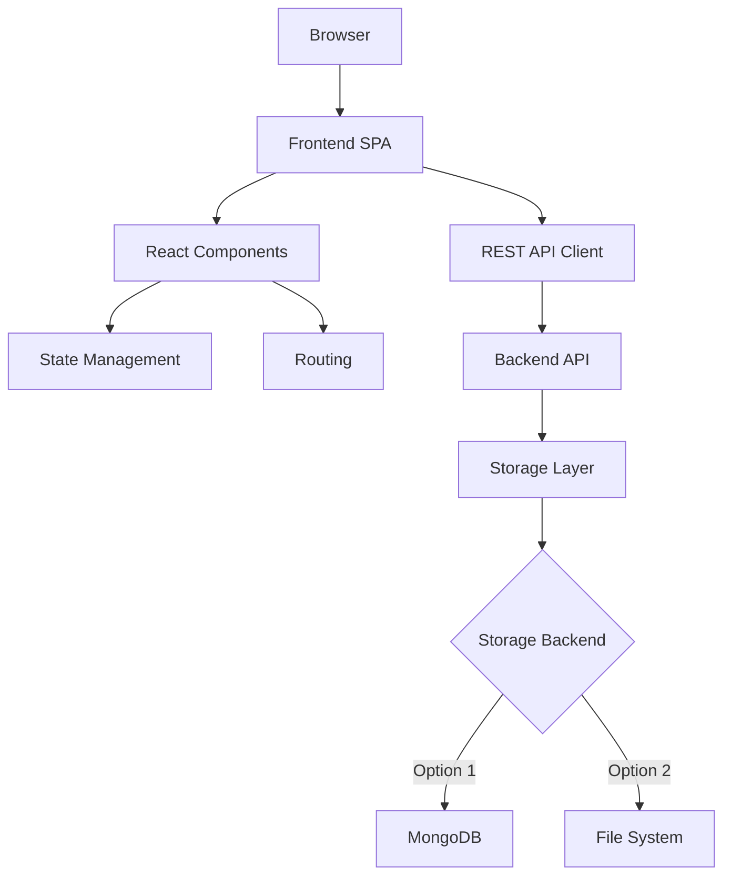

**Frontend Components:**
- Single-page application with client-side routing
- Component-based UI architecture
- Responsive design for various screen sizes
- Real-time updates via polling or WebSocket

**Backend Integration:**
- RESTful API for all operations
- JSON data exchange format
- Session management for authentication
- GitHub OAuth integration

---

### Page Structure

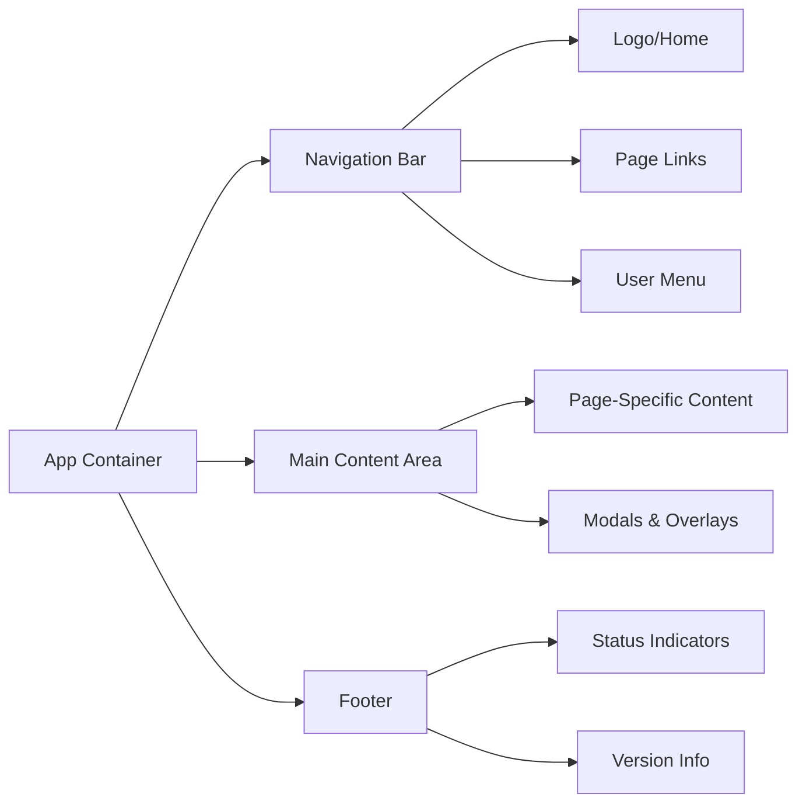

---

## Navigation & Layout

### Primary Navigation

**Top-Level Pages:**

| Page | Route | Purpose | Icon/Label |
|------|-------|---------|------------|
| Home | `/` | Overview dashboard with stats | Home |
| Wiki Pages | `/pages` | Browse and search wiki content | Pages |
| Repository | `/repository` | Explore codebase structure | Repository |
| Quality | `/quality` | View quality metrics | Quality |
| Benchmarks | `/benchmarks` | Run and view benchmark results | Benchmarks |
| Settings | `/settings` | Configure system | Settings |
| GitHub | `/github` | OAuth and repository selection | GitHub |

---

### Navigation Bar

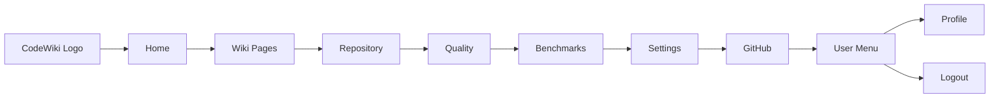

**Features:**
- Active page highlighting
- Breadcrumb navigation on detail pages
- Quick access to search from any page
- User authentication status display
- Responsive collapse on mobile

---

### Layout Patterns

**Standard Page Layout:**

1. **Header Section**
   - Page title and description
   - Primary action buttons
   - Filter and sort controls

2. **Content Area**
   - Main content display (list, grid, or detail view)
   - Sidebars for additional context
   - Inline actions and controls

3. **Footer Section**
   - Pagination controls
   - Status information
   - Help and documentation links

---

## Home Dashboard

### Overview

The home dashboard provides an at-a-glance view of wiki status, recent activity, and key metrics.

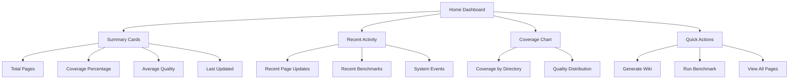

---

### Summary Statistics

**Metric Cards Display:**

1. **Total Wiki Pages**
   - Count of all generated pages
   - Comparison to previous count
   - Trend indicator (up/down/stable)

2. **Code Coverage**
   - Percentage of files documented
   - Coverage depth score
   - Progress bar visualization

3. **Average Quality Score**
   - Aggregate quality across all pages
   - Quality grade (A/B/C/D/F)
   - Change from last benchmark

4. **Last Update Time**
   - Timestamp of most recent generation
   - Time since last update
   - Next scheduled update (if configured)

---

### Recent Activity Feed

**Activity Types:**

- **Page Created**: New wiki page generated
- **Page Updated**: Existing page regenerated
- **Benchmark Completed**: Quality or accuracy benchmark finished
- **Coverage Improved**: New files documented
- **Quality Change**: Significant quality score change

**Activity Item Format:**
- Icon representing activity type
- Descriptive text of what happened
- Timestamp (relative and absolute)
- Link to relevant page or resource

---

### Coverage Visualization

**Directory Coverage Chart:**

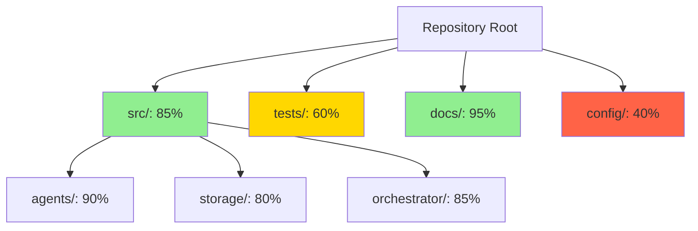

**Visualization Features:**
- Tree map or hierarchical view
- Color coding by coverage percentage
- Drill-down capability to subdirectories
- Hover tooltips with detailed metrics
- Click to navigate to directory details

---

### Quick Actions

**Primary Actions:**

1. **Generate Wiki**
   - Triggers full or incremental wiki generation
   - Shows progress modal during execution
   - Redirects to status page

2. **Run Benchmark**
   - Opens benchmark configuration modal
   - Allows selecting benchmark type
   - Initiates benchmark execution

3. **View All Pages**
   - Navigates to wiki pages list
   - Shows all available documentation
   - Default sorted by quality or recency

4. **Browse Repository**
   - Opens repository browser
   - Shows directory structure
   - Highlights coverage status

---

## Wiki Pages Interface

### Page List View

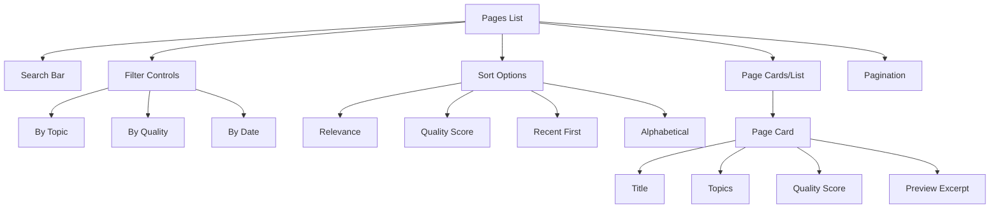

---

### Page Card Components

**Each Page Card Displays:**

1. **Page Title**
   - Clear, descriptive title
   - Click to view full content
   - Hover shows tooltip with metadata

2. **Topic Tags**
   - Visual tags for page topics
   - Click tag to filter by that topic
   - Color-coded by category

3. **Quality Indicator**
   - Numeric score (0-10) or grade (A-F)
   - Visual indicator (color, icon)
   - Breakdown available on hover

4. **Content Preview**
   - First few lines of page content
   - Highlights search terms if applicable
   - Truncated with ellipsis

5. **Metadata**
   - Last updated timestamp
   - Word count or length indicator
   - Source files referenced

6. **Action Buttons**
   - View full page
   - Regenerate page
   - Share link
   - Export content

---

### Filtering & Sorting

**Filter Options:**

| Filter Type | Values | Behavior |
|-------------|--------|----------|
| Topic | All available topics | Show only pages with selected topics |
| Quality | A/B/C/D/F grades or score ranges | Show pages meeting quality threshold |
| Date | Today, Week, Month, All Time | Show pages updated within timeframe |
| Coverage | High/Medium/Low depth | Show pages by documentation depth |

**Sort Options:**

- **Relevance**: Based on search query match (if search active)
- **Quality**: Highest to lowest quality score
- **Recent**: Most recently updated first
- **Alphabetical**: By title A-Z
- **Length**: By word count or content size

---

### Page Detail View

**Full Page Display:**

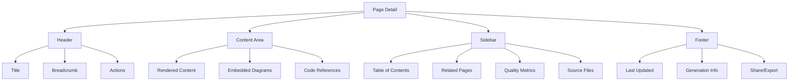

**Content Rendering:**
- Markdown rendering with syntax highlighting
- Mermaid diagram visualization
- Collapsible sections for long content
- Anchor links for headings
- Smooth scrolling navigation

**Interactive Elements:**
- Click code references to jump to repository view
- Click related page links for quick navigation
- Expand/collapse sections
- Copy code snippets with click
- Print-friendly formatting

---

## Repository Browser

### Directory Tree View

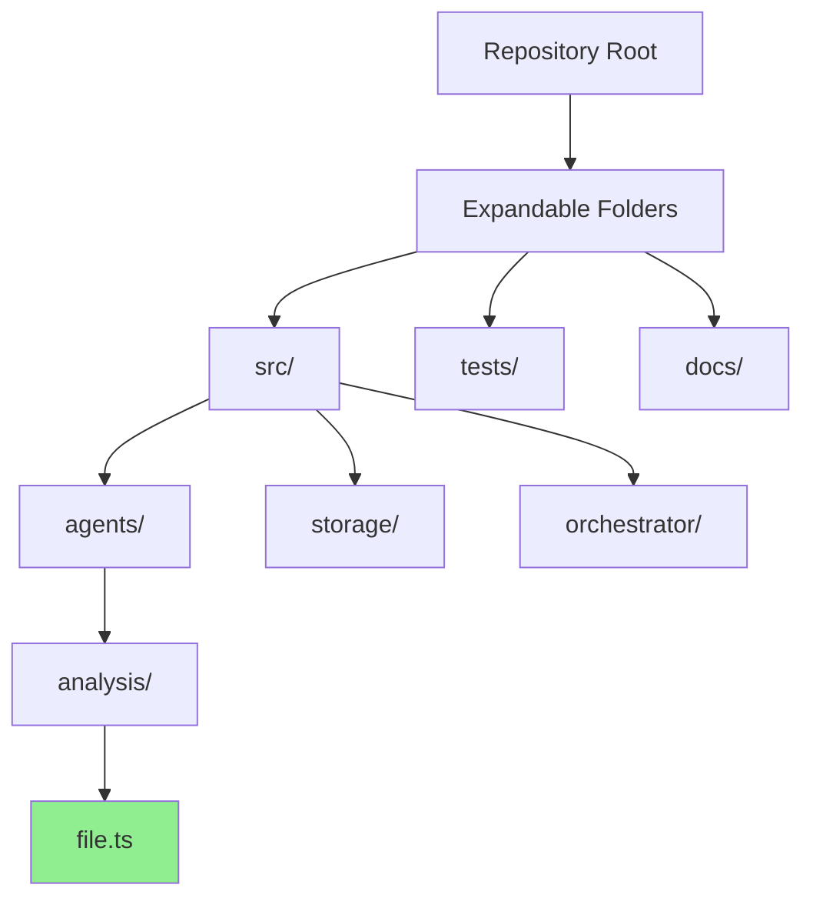

**Tree Features:**

1. **Expand/Collapse**
   - Click folder to expand/collapse
   - Maintain expansion state across navigation
   - Keyboard shortcuts for quick navigation

2. **Coverage Indicators**
   - Color coding by documentation status:
     - Green: Well documented
     - Yellow: Partial documentation
     - Red: Not documented
   - Coverage percentage per directory
   - Visual progress bars

3. **File Metadata**
   - File size and type
   - Last modified date
   - Number of wiki pages referencing file
   - Lines of code (if applicable)

---

### File Detail View

**When Clicking a File:**

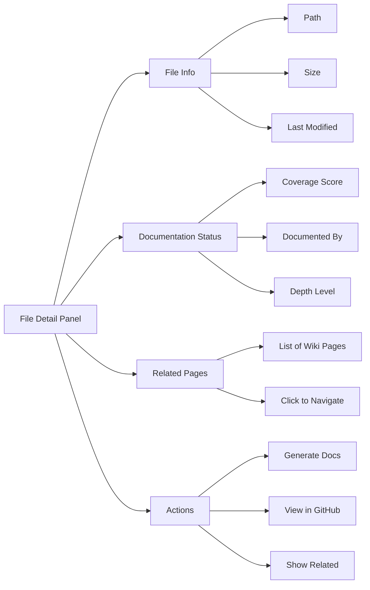

**Information Displayed:**

1. **File Metadata**
   - Full file path
   - File type and size
   - Last modification date from Git
   - Author and commit info

2. **Documentation Coverage**
   - Coverage score (0-100%)
   - Documentation depth level
   - List of wiki pages that reference this file
   - Gaps in documentation

3. **Related Content**
   - Other files in same directory
   - Files with similar purpose
   - Related wiki pages
   - Cross-references

4. **Available Actions**
   - Generate documentation for this file
   - View file content (syntax highlighted)
   - View in GitHub (if integrated)
   - Download file

---

### Coverage Heat Map

**Visual Representation:**

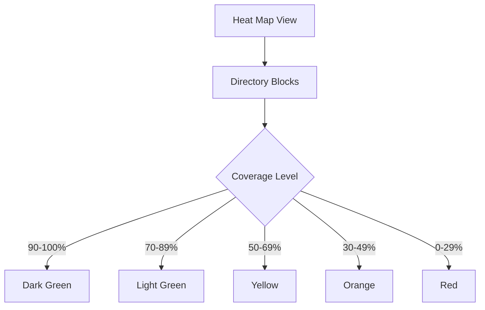

**Features:**
- Block size represents file/directory size
- Color represents coverage percentage
- Hover shows detailed metrics
- Click to drill down
- Zoom and pan for large repositories

---

## Quality Metrics Dashboard

### Overview Layout

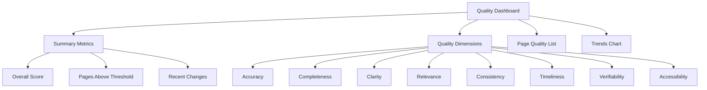

---

### Quality Dimensions Display

**Eight Dimensions Tracked:**

1. **Accuracy** (Weight: 25%)
   - Factual correctness of content
   - Verified against codebase
   - Tool-based fact checking
   - Visual: Progress bar + score

2. **Completeness** (Weight: 20%)
   - Coverage of relevant topics
   - Depth of explanation
   - Missing information detection
   - Visual: Percentage complete

3. **Clarity** (Weight: 15%)
   - Readability and structure
   - Clear explanations
   - Good organization
   - Visual: Grade A-F

4. **Relevance** (Weight: 10%)
   - Appropriate topic focus
   - Audience alignment
   - Context suitability
   - Visual: Score 0-10

5. **Consistency** (Weight: 10%)
   - Internal coherence
   - Terminology consistency
   - Style uniformity
   - Visual: Score 0-10

6. **Timeliness** (Weight: 10%)
   - Freshness of content
   - Recent updates
   - Reflects current code
   - Visual: Last updated time

7. **Verifiability** (Weight: 5%)
   - Tool-verified facts
   - Code reference links
   - Traceable claims
   - Visual: Verification percentage

8. **Accessibility** (Weight: 5%)
   - Ease of understanding
   - Clear language
   - Good examples
   - Visual: Readability score

---

### Dimension Detail View

**Clicking a Dimension:**

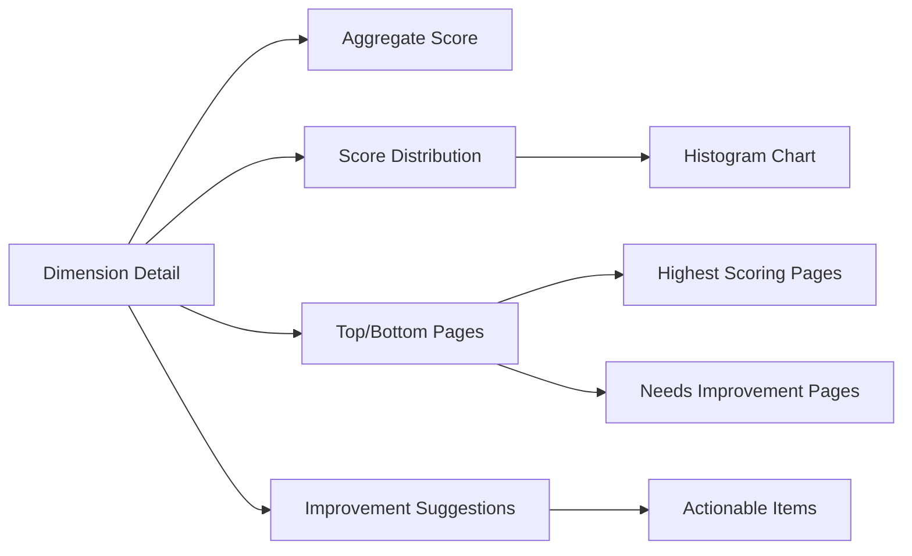

**Information Provided:**
- Overall dimension score across all pages
- Distribution chart showing score spread
- List of best and worst performing pages
- Specific issues identified
- Suggested improvements
- Regeneration recommendations

---

### Page Quality List

**Sortable Table View:**

| Page Title | Overall | Accuracy | Completeness | Clarity | Actions |
|------------|---------|----------|--------------|---------|---------|
| Architecture Overview | A (9.2) | 9.5 | 9.0 | 9.0 | View, Regen |
| API Reference | B (8.1) | 8.5 | 8.0 | 7.8 | View, Regen |
| Setup Guide | C (7.3) | 7.0 | 7.5 | 7.5 | View, Regen |

**Features:**
- Sort by any quality dimension
- Filter by quality threshold
- Highlight pages needing attention
- Bulk actions for regeneration
- Export quality report

---

### Quality Trends Chart

**Time Series Visualization:**

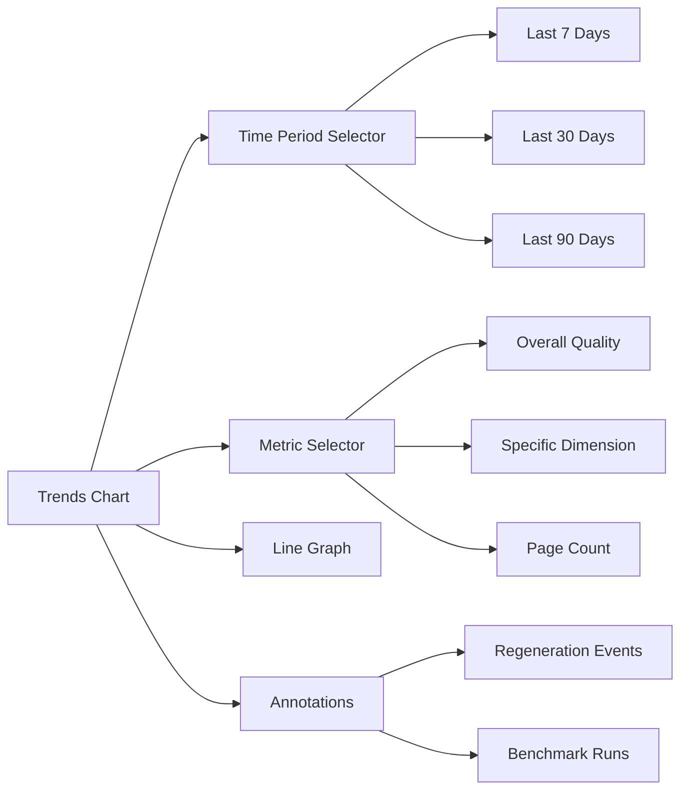

**Chart Features:**
- Multi-line comparison (e.g., accuracy vs completeness)
- Interactive tooltips on hover
- Zoom and pan capabilities
- Export chart as image
- Event markers for regenerations and benchmarks

---

## Benchmarking Interface

### Benchmark Configuration

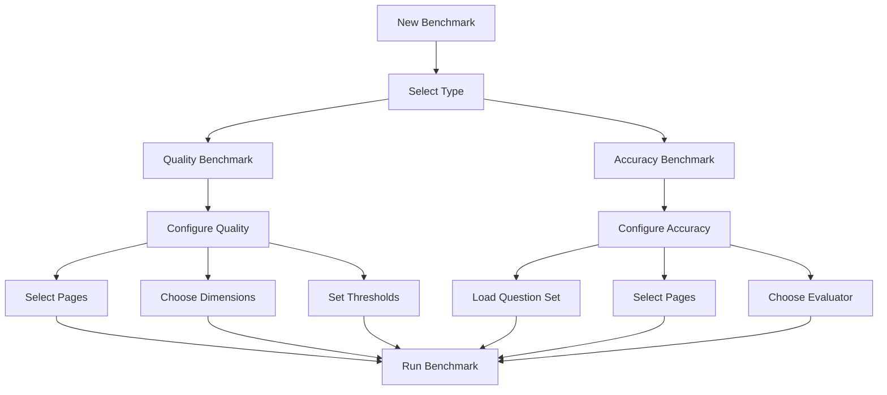

---

### Quality Benchmark Setup

**Configuration Options:**

1. **Scope Selection**
   - All pages
   - Specific pages (multi-select)
   - By topic filter
   - By directory

2. **Dimension Selection**
   - All eight dimensions
   - Specific dimensions only
   - Custom weighting

3. **Threshold Configuration**
   - Minimum acceptable scores per dimension
   - Overall passing grade
   - Warning vs failing thresholds

4. **Execution Settings**
   - Immediate or scheduled
   - Evaluator model selection
   - Cost budget limits
   - Notification preferences

---

### Accuracy Benchmark Setup

**Configuration Options:**

1. **Question Set**
   - Upload custom questions (JSON/YAML)
   - Use default question set
   - Generate questions automatically
   - Edit questions inline

2. **Question Format**
   - Question text
   - Expected answer or answer criteria
   - Relevant wiki pages
   - Difficulty level

3. **Evaluation Configuration**
   - Evaluator LLM model
   - Scoring rubric (0-10 scale)
   - Passing threshold
   - Partial credit rules

---

### Benchmark Execution View

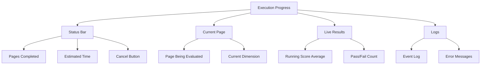

**Real-Time Updates:**
- Progress bar showing completion percentage
- Current page being evaluated
- Running average of scores
- Estimated time remaining
- Live event log
- Ability to cancel execution

---

### Benchmark Results View

**Results Dashboard:**

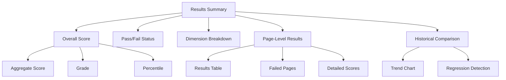

**Information Displayed:**

1. **Summary Statistics**
   - Overall benchmark score
   - Pass/fail determination
   - Number of pages evaluated
   - Total cost of evaluation

2. **Dimension Breakdown**
   - Score for each quality dimension
   - Comparison to previous benchmarks
   - Identification of regressions
   - Improvement areas

3. **Page-Level Results**
   - List of all evaluated pages
   - Individual scores and grades
   - Failed pages highlighted
   - Drill-down to question-level detail

4. **Historical Comparison**
   - Trend graph vs previous runs
   - Regression detection
   - Improvement tracking
   - Benchmark-to-benchmark changes

---

### Accuracy Benchmark Results

**Question-Level Results:**

| Question | Expected | Actual | Score | Status |
|----------|----------|--------|-------|--------|
| How does auth work? | OAuth flow | OAuth flow | 9.5 | Pass |
| What DB is used? | MongoDB | PostgreSQL | 2.0 | Fail |
| API rate limits? | 100/min | Not documented | 0.0 | Fail |

**Features:**
- View exact question text and expected answer
- See actual answer from wiki
- Understand scoring rationale
- Identify knowledge gaps
- Export results for analysis

---

## Settings & Configuration

### Settings Categories

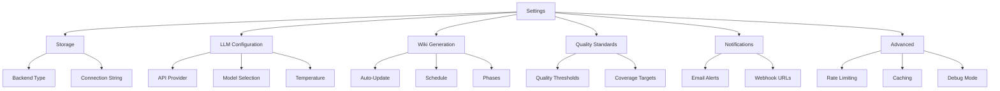

---

### Storage Configuration

**Backend Selection:**

1. **File-Based Storage**
   - Configure data directory path
   - Set file permissions
   - Manage backup settings
   - Simple setup, local only

2. **MongoDB Storage**
   - Enter connection URI
   - Configure database name
   - Set collection preferences
   - Test connection
   - Supports collaboration

**Display Elements:**
- Radio buttons for backend type
- Text input for paths/URIs
- Test connection button
- Connection status indicator
- Save and apply button

---

### LLM Configuration

**Provider Settings:**

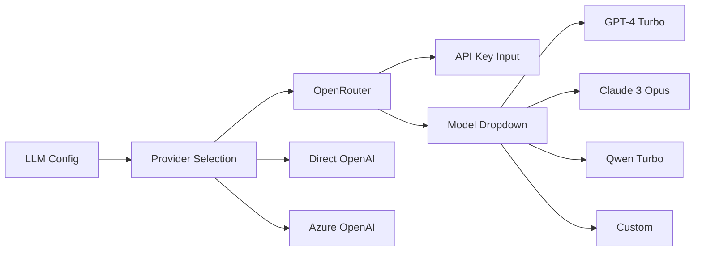

**Configurable Parameters:**
- API provider (OpenRouter, OpenAI, Azure)
- API key (masked input)
- Default model for agents
- Model for benchmarking
- Temperature setting
- Max tokens per request
- Rate limit configuration
- Cost budget alerts

---

### Wiki Generation Settings

**Auto-Update Configuration:**

- **Enable/Disable**: Toggle automatic wiki updates
- **Trigger**: On push, on schedule, or manual
- **Schedule**: Cron expression or simple recurrence
- **Phases**: Which phases to run (all or subset)
- **Scope**: Full or incremental updates

**Phase-Specific Settings:**
- Reconnaissance depth
- Skeleton coverage targets
- Breadth strategy (BFS vs DFS)
- Depth iteration limits
- Polish regeneration rules
- Maintenance triggers

---

### Quality Standards

**Threshold Configuration:**

| Dimension | Minimum Score | Warning Level | Action |
|-----------|---------------|---------------|--------|
| Accuracy | 8.0 | 7.0 | Auto-regenerate below 7.0 |
| Completeness | 7.5 | 6.5 | Flag for review |
| Clarity | 7.0 | 6.0 | No action |

**Features:**
- Slider controls for score thresholds
- Pass/warn/fail color indicators
- Automated action configuration
- Global vs per-dimension settings
- Save as quality policy

---

## GitHub Integration

### OAuth Authentication Flow

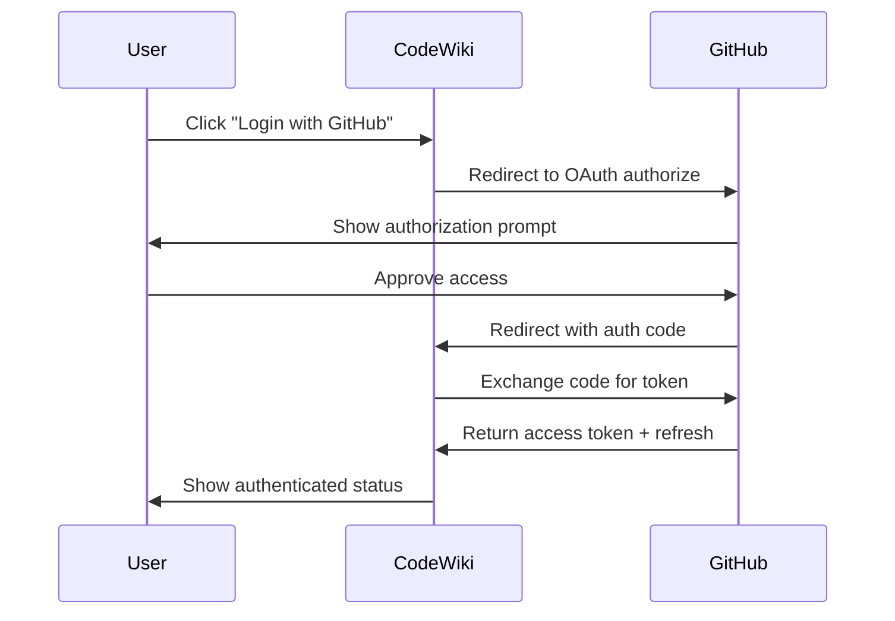

---

### Repository Selection

**After Authentication:**

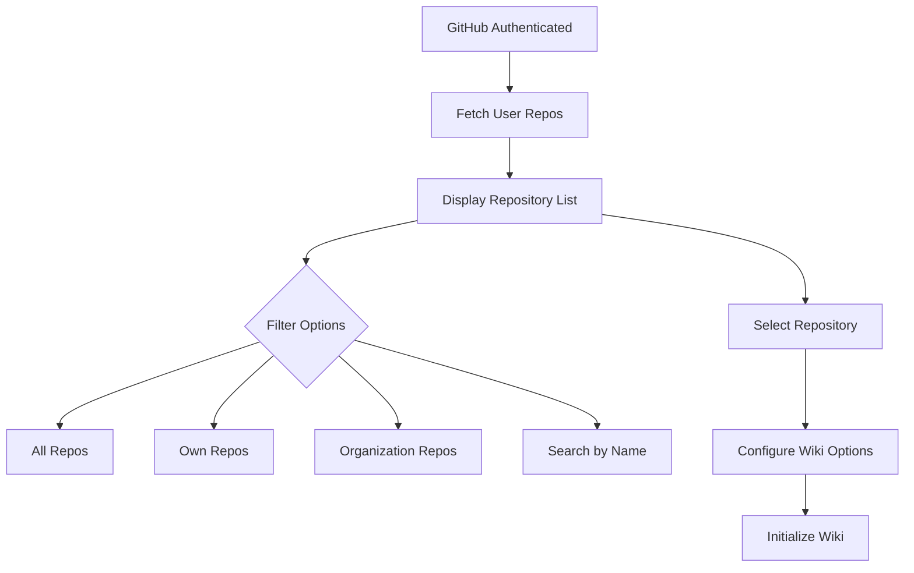

**Repository List Features:**
- Search and filter repositories
- Show repository metadata (stars, language, size)
- Display existing wiki status
- Select repository for documentation
- Clone or link repository
- Configure auto-update settings

---

### Repository Management

**Per-Repository Settings:**

1. **Auto-Update Configuration**
   - Enable webhook for push events
   - Set update frequency
   - Choose branch to track
   - Define update scope

2. **Access Control**
   - Review permissions granted
   - Manage OAuth scopes
   - Revoke access if needed
   - Re-authenticate if expired

3. **Wiki Options**
   - Public vs private wiki
   - Collaboration settings
   - Export options
   - Deletion controls

---

## Search Functionality

### Global Search

```mermaid
graph TD
    A[Search Bar] --> B[Enter Query]
    B --> C[Search Across All Pages]
    C --> D{Result Types}
    D --> E[Wiki Pages]
    D --> F[Code References]
    D --> G[Topics]
    D --> H[Files]

    E --> I[Ranked Results]
    F --> I
    G --> I
    H --> I

    I --> J[Display Results]
    J --> K[Result Card]
    K --> K1[Title + Excerpt]
    K --> K2[Relevance Score]
    K --> K3[Breadcrumb Path]
```

---

### Search Features

**Query Processing:**
- Full-text search across all wiki content
- Semantic search using embeddings
- Fuzzy matching for typos
- Phrase matching with quotes
- Boolean operators (AND, OR, NOT)
- Wildcard support

**Result Ranking:**
- Relevance score based on:
  - Keyword match frequency
  - Title vs body matches
  - Quality score of page
  - Recency of update
  - User interaction history

**Result Display:**
- Highlighted search terms in context
- Excerpt showing relevant section
- Click to view full page
- Filter results by type or topic
- Sort by relevance or date

---

### Advanced Search

**Filter Options:**

```mermaid
graph LR
    A[Advanced Search] --> B[Content Type]
    A --> C[Date Range]
    A --> D[Quality Filter]
    A --> E[Topic Filter]
    A --> F[File Extension]

    B --> B1[Wiki Pages]
    B --> B2[Architecture]
    B --> B3[Guides]

    D --> D1[High Quality Only]
    D --> D2[All Quality Levels]

    E --> E1[Multi-select Topics]
```

**Search History:**
- Recent searches saved
- Quick re-run of previous searches
- Clear history option
- Search suggestions based on history

---

## Real-Time Updates

### Progress Tracking

```mermaid
graph TD
    A[Long-Running Operation] --> B[Backend Updates State]
    B --> C[Frontend Polls API]
    C --> D[Receive Progress Data]
    D --> E[Update UI]
    E --> C

    D --> F{Operation Complete?}
    F -->|No| C
    F -->|Yes| G[Show Final Results]
```

**Real-Time Features:**

1. **Wiki Generation Progress**
   - Current phase indicator
   - Progress bar per phase
   - Pages generated count
   - Estimated time remaining
   - Live agent activity log

2. **Benchmark Execution**
   - Pages evaluated count
   - Current evaluation status
   - Running score average
   - Live results streaming

3. **System Status**
   - API rate limit status
   - Queue depth
   - Active processes
   - Error notifications

---

### Notification System

**Notification Types:**

| Type | Trigger | Display | Action |
|------|---------|---------|--------|
| Success | Operation completes | Green toast | Dismiss, View |
| Warning | Threshold exceeded | Yellow toast | Dismiss, Review |
| Error | Operation fails | Red toast | Dismiss, Retry |
| Info | Status update | Blue toast | Dismiss |

**Notification Features:**
- Non-blocking toast notifications
- Notification center for history
- Configurable persistence
- Click to navigate to relevant page
- Batch similar notifications

---

## API Integration

### REST API Endpoints

**Available Endpoints:**

```mermaid
graph TD
    A[REST API] --> B[Pages]
    A --> C[Repository]
    A --> D[Quality]
    A --> E[Benchmarks]
    A --> F[System]

    B --> B1[GET /api/pages]
    B --> B2[GET /api/pages/:id]
    B --> B3[POST /api/pages/search]

    C --> C1[GET /api/repository/tree]
    C --> C2[GET /api/repository/file/:path]

    D --> D1[GET /api/quality/metrics]
    D --> D2[GET /api/quality/dimensions]

    E --> E1[POST /api/benchmarks/run]
    E --> E2[GET /api/benchmarks/results/:id]

    F --> F1[GET /api/system/status]
    F --> F2[POST /api/system/process]
```

---

### Frontend-Backend Communication

**Request/Response Pattern:**

1. **List Wiki Pages**
   - Request: `GET /api/pages?topic=architecture&sort=quality`
   - Response: Array of page objects with metadata
   - Pagination via query parameters

2. **Get Page Content**
   - Request: `GET /api/pages/page-id`
   - Response: Full page content, metadata, references
   - Includes quality scores and related pages

3. **Search Pages**
   - Request: `POST /api/pages/search` with query body
   - Response: Ranked search results with excerpts
   - Includes relevance scores

4. **Trigger Wiki Generation**
   - Request: `POST /api/system/process` with scope
   - Response: Operation ID for tracking
   - Poll status endpoint for progress

5. **Run Benchmark**
   - Request: `POST /api/benchmarks/run` with config
   - Response: Benchmark ID
   - Poll for results until complete

---

### Error Handling

**API Error Responses:**

```mermaid
graph TD
    A[API Request] --> B{Status Code}
    B -->|200| C[Success]
    B -->|400| D[Bad Request]
    B -->|401| E[Unauthorized]
    B -->|404| F[Not Found]
    B -->|500| G[Server Error]

    D --> H[Show Validation Error]
    E --> I[Redirect to Login]
    F --> J[Show Not Found Message]
    G --> K[Show Error, Offer Retry]
```

**Error Display:**
- User-friendly error messages
- Technical details in expandable section
- Suggested actions (retry, contact support)
- Log error details for debugging
- Graceful degradation when possible

---

## Appendix A: UI Component Reference

### Common Components

| Component | Purpose | Properties |
|-----------|---------|------------|
| PageCard | Display wiki page summary | title, quality, excerpt, topics |
| QualityBadge | Show quality score | score, dimension, size |
| ProgressBar | Show operation progress | percentage, label, color |
| SearchBar | Global search input | placeholder, onSubmit, autocomplete |
| TreeView | Hierarchical file browser | nodes, onExpand, onSelect |
| MetricCard | Display single metric | value, label, trend, icon |
| NotificationToast | Show temporary message | type, message, duration, action |
| FilterPanel | Sidebar with filters | filters, onApply, onReset |
| ResultsList | Display search results | results, onSelect, pagination |

---

## Appendix B: Keyboard Shortcuts

| Shortcut | Action | Context |
|----------|--------|---------|
| `/` | Focus search bar | Global |
| `Esc` | Close modal/clear search | Global |
| `?` | Show keyboard shortcuts | Global |
| `g h` | Go to home | Global |
| `g p` | Go to pages | Global |
| `g r` | Go to repository | Global |
| `g q` | Go to quality | Global |
| `↑/↓` | Navigate results | Search results |
| `Enter` | Open selected item | Search results |
| `Ctrl+K` | Command palette | Global |

---

## Appendix C: Responsive Design

### Breakpoints

| Breakpoint | Width | Layout Changes |
|------------|-------|----------------|
| Mobile | < 768px | Single column, hamburger menu, stacked cards |
| Tablet | 768px - 1024px | Two columns, sidebar collapses, condensed nav |
| Desktop | 1024px - 1440px | Full layout, all features visible |
| Wide | > 1440px | Expanded content area, larger visualizations |

**Mobile Optimizations:**
- Touch-friendly targets (44px minimum)
- Swipe gestures for navigation
- Condensed information display
- Progressive disclosure
- Lazy loading for performance

---

**Document Version**: 1.0
**Last Updated**: 2025-12-18
**Related Documents**:
- USER_WORKFLOWS.md - User interaction patterns
- ARCHITECTURE.md - System architecture
- CLI_REFERENCE.md - Command-line interface
- CONFIGURATION.md - Configuration options
