# How CodeWiki Builds Wikis: The Orchestrator Strategy

**Version:** 1.0
**Date:** December 17, 2025
**Status:** Living Document

---

## Executive Summary

CodeWiki generates comprehensive documentation through a **six-phase adaptive orchestration system** that progressively builds wiki depth based on maturity. The Phased Orchestrator operates deterministically (no LLM required), using quantitative metrics to detect the current phase and apply phase-specific work generation strategies.

**Key Innovation:** Rather than batch-processing all commits sequentially, CodeWiki delivers an 80% useful wiki in 20 minutes by prioritizing recent commits and high-value directories, then progressively backfilling historical context and deepening coverage.

---

## Table of Contents

1. [Overview: Two-Loop Architecture](#overview-two-loop-architecture)
2. [The Six-Phase Progression Model](#the-six-phase-progression-model)
3. [Orchestrator Core Mechanics](#orchestrator-core-mechanics)
4. [Phase-Specific Strategies](#phase-specific-strategies)
5. [Coverage Tracking System](#coverage-tracking-system)
6. [Work Item Lifecycle](#work-item-lifecycle)
7. [Complete Wiki Building Journey](#complete-wiki-building-journey)
8. [Adaptive Behaviors](#adaptive-behaviors)

---

## 1. Overview: Two-Loop Architecture

CodeWiki uses a **separation of concerns** between deciding what to do (Orchestrator) and doing it (Executor).

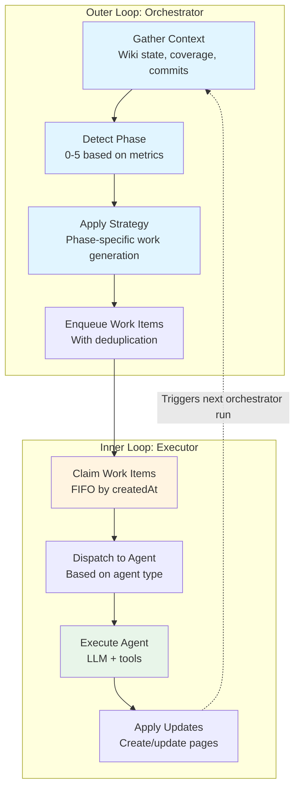

### Outer Loop: Orchestrator

**Responsibility:** Decide what work needs to be done

**Operation:**
1. **Gather Context**: Collect comprehensive snapshot of wiki state, file coverage, commit status
2. **Detect Phase**: Use decision tree based on quantitative metrics
3. **Apply Strategy**: Generate phase-appropriate work items
4. **Enqueue Work**: Add to work queue with deduplication

**Frequency:** After each iteration completes, or when manually triggered

**Output:** Prioritized list of work items (agent + target pairs)

### Inner Loop: Executor

**Responsibility:** Execute work items and apply results

**Operation:**
1. **Claim Work**: Take oldest pending work item (FIFO)
2. **Dispatch**: Route to appropriate agent based on type
3. **Execute**: Run agent with LLM + tools
4. **Apply Updates**: Create/update wiki pages from agent output

**Frequency:** Continuous parallel processing (up to 4 concurrent workers)

**Output:** Updated wiki pages, agent run records, iteration completion

---

## 2. The Six-Phase Progression Model

The orchestrator adapts its strategy through six distinct phases based on wiki maturity:

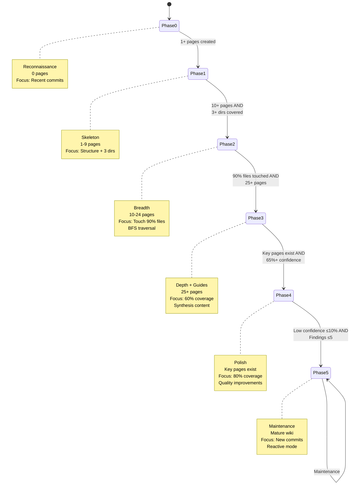

### Phase Transition Criteria

| Phase | Entry Criteria | Exit Criteria | Coverage Target |
|-------|----------------|---------------|-----------------|
| **0: Reconnaissance** | Empty wiki (0 pages) | 1+ pages created | N/A |
| **1: Skeleton** | 1+ pages | 10+ pages AND 3+ dirs covered | 30% |
| **2: Breadth** | 10+ pages, 3+ dirs | 90% files touched AND 25+ pages | Touch all files |
| **3: Depth + Guides** | 90% touched, 25+ pages | Key pages exist AND 65%+ confidence | 60% |
| **4: Polish** | Key pages, 65%+ confidence | Low confidence ≤10% AND findings ≤5 | 80% |
| **5: Maintenance** | Quality thresholds met | Never (stable state) | Maintain 80%+ |

**Key Metrics Tracked:**
- **pages**: Total wiki pages
- **directoriesWithAnyCoverage**: Directories with documented files
- **touchedFilesRatio**: Percentage of source files with ANY coverage (>0%)
- **avgConfidence**: Average page confidence score (0-1)
- **lowConfidenceRatio**: Percentage of pages with confidence <50%
- **openFindings**: Count of unresolved issues from meta agents

---

## 3. Orchestrator Core Mechanics

### Main Orchestration Function

**File:** `src/agents/orchestrator/phased-orchestrator.ts`

**Function:** `generateWorkList(repoId, wikiId, maxItems = 10)`

**Flow:**

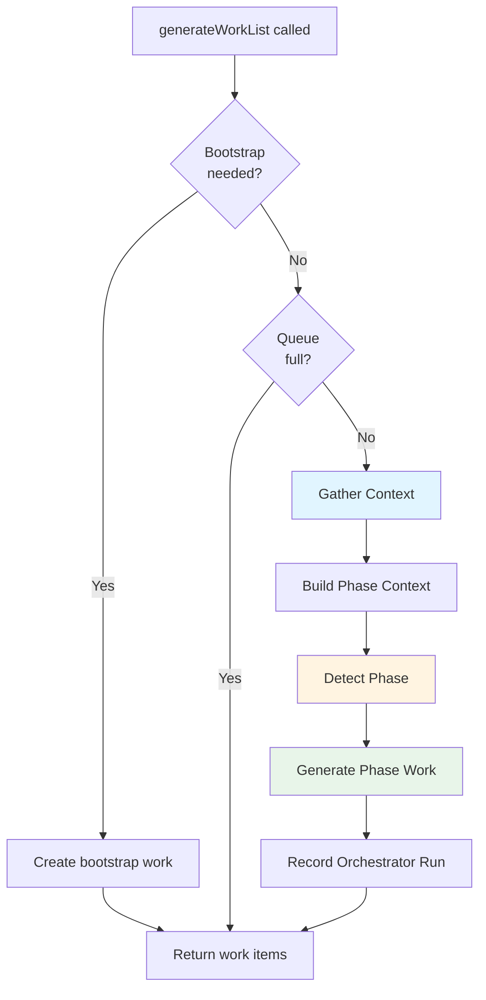

### Context Gathering Process

**File:** `src/agents/orchestrator/context-gatherer.ts`

**Function:** `gather(repoId, wikiId)`

Collects comprehensive snapshot of current state:

**1. Wiki Statistics**
- Total pages, categories, average confidence
- Key page existence (project-overview, getting-started, testing-guide, extension-guide)
- Pages needing rewrite (commit-style content)
- Low confidence pages (<50%)

**2. File Coverage Metrics**
- Total source files in repository
- Touched files (any coverage >0%)
- Touched files ratio (for 90% threshold check)
- Undocumented directories with file-level detail
- Low-coverage files (<40% threshold)

**3. Commit Processing Status**
- Total commits in repository
- Processed/pending counts per agent type
- Recent commits (last 10) with processing status

**4. Quality Indicators**
- Pages without links
- Shallow pages (<100 words OR <2 headings)
- Pages lacking code examples
- Open findings from meta agents

**5. Coverage Tree**
- ASCII tree showing directory structure
- Coverage percentage per directory
- Identifies gaps and priorities

**Example Context Output:**

```
Wiki Statistics:
- Pages: 18
- Categories: 4
- Average confidence: 55.1%
- Low confidence pages: 4 (22.2%)

Coverage:
- Total source files: 200
- Touched files: 157 (78.5%)
- Directories with coverage: 4
- Undocumented directories: 8

Commits:
- Total: 150
- Processed by code-change: 45
- Processed by narrative: 12
- Unprocessed: 105

Coverage Tree:
src/ (45.2%)
├── agents/ (62.3%)
│   ├── orchestrator/ (28.0%)
│   └── executor/ (78.5%)
├── services/ (35.0%)
└── domain/ (12.5%)
```

### Phase Detection Algorithm

**Function:** `detectPhase(ctx: PhaseContext)`

**Decision Tree:**

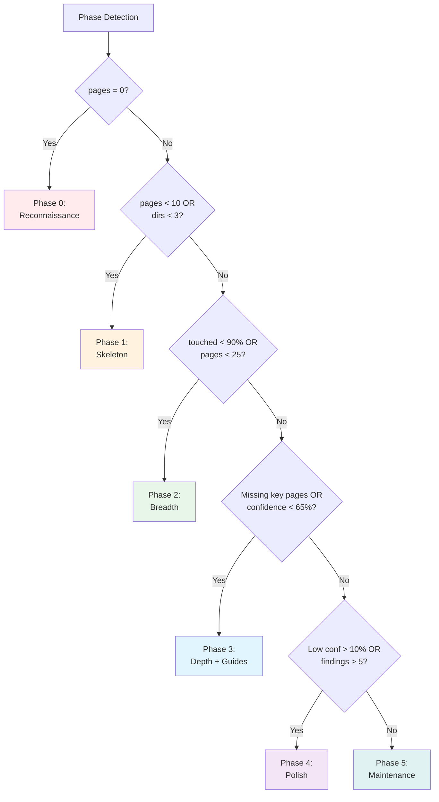

**Implementation:**

```typescript
function detectPhase(ctx: PhaseContext): Phase {
  // Phase 0: Empty wiki
  if (ctx.pages === 0) return Phase.Reconnaissance;

  // Phase 1: Few pages or few directories covered
  if (ctx.pages < 10 || ctx.directoriesWithAnyCoverage < 3) {
    return Phase.Skeleton;
  }

  // Phase 2: Not enough files touched OR not enough pages
  const TOUCHED_FILES_THRESHOLD = 0.90; // 90%
  if (ctx.touchedFilesRatio < TOUCHED_FILES_THRESHOLD || ctx.pages < 25) {
    return Phase.Breadth;
  }

  // Phase 3: Key pages missing or confidence < 65%
  const keyPagesMissing = !ctx.hasProjectOverview || !ctx.hasGettingStarted ||
                          !ctx.hasTestingGuide || !ctx.hasExtensionGuide;
  if (keyPagesMissing || ctx.avgConfidence < 0.65) {
    return Phase.DepthAndGuides;
  }

  // Phase 4: Low confidence ratio > 10% or too many findings
  if (ctx.lowConfidenceRatio > 0.10 || ctx.openFindings > 5) {
    return Phase.Polish;
  }

  // Phase 5: Maintenance
  return Phase.Maintenance;
}
```

### Work Item Generation

Each phase has a dedicated work generation function that creates prioritized work items.

**Deduplication Strategy:**

Every work item has a **deterministic ID** based on:
- Repository ID
- Agent type
- Target (commit SHA, path, or wiki)

```typescript
function generateWorkItemId(repoId: string, agentType: AgentType, target: WorkTarget): string {
  const targetKey = getWorkTargetKey(target);
  // e.g., "commit:abc123" or "path:src/agents" or "wiki"

  const input = `${repoId}:${agentType}:${targetKey}`;
  const hash = createHash('sha256').update(input).digest('hex').slice(0, 32);
  return `work-${hash}`;
}
```

**Result:** Same inputs → Same ID → No duplicates in queue

### Orchestrator Run Recording

Every orchestrator run is recorded with full provenance:

```typescript
interface OrchestratorRun {
  id: string;
  repoId: string;
  timestamp: Date;

  // Input
  context: OrchestratorContext;     // Full snapshot

  // Output
  rawResponse: string;              // Reasoning explanation
  decision: OrchestratorDecision;   // Parsed work items
  workItemsCreated: string[];       // Work item IDs

  // Metrics
  model: string;                    // "phased-orchestrator:Breadth"
  durationMs: number;

  // Progress
  progressUpdate?: string;          // Human-readable summary
}
```

**Reasoning Format Example:**

```
Phase 2 (Breadth): 18 pages, 4 dirs covered, 55% avg confidence.
Scheduling: 3 codebase-explorer, 1 code-change

Decision Inputs:
- Pages: 18
- Directories with coverage: 4
- Touched files: 78.5% (threshold: 90%)
- Avg confidence: 55.1%

Phase Transition Logic:
- Current: Phase 2 (Breadth)
- Blocked by: touched files 78.5% < 90%, pages (18) < 25

Directory Selection (BFS):
- src/services: 35.0% coverage
- src/domain: 12.5% coverage
- src/agents/orchestrator: 28.0% coverage
```

---

## 4. Phase-Specific Strategies

### Phase 0: Reconnaissance

**Goal:** Understand the codebase before exploration

**Entry:** Empty wiki (0 pages)
**Exit:** 1+ pages created

**Work Allocation:**
- Analyze up to 5 recent commits with `code-change` agent
- Analyze up to 3 recent commits with `narrative` agent

**Strategy Rationale:** Understanding recent development provides context for directory exploration. What files are actively changing? What decisions are being made?

**Work Generation:**

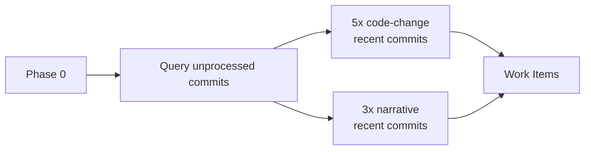

**Example Work Items:**
- `code-change` → commit:abc123 (most recent)
- `code-change` → commit:def456
- `narrative` → commit:abc123

---

### Phase 1: Skeleton

**Goal:** Build navigable structure with focused exploration

**Entry:** 1+ pages
**Exit:** 10+ pages AND 3+ directories covered

**Coverage Target:** 30% (files with undocumentedRatio ≤ 0.70)

**Work Allocation:**
- **70%**: Explore 2-3 directories (in-progress prioritization)
- **20%**: Process recent commits (code-change)
- **10%**: Create wiki-index if pages ≥ 5

**Strategy Rationale:** Focus on completing a few directories to 30% coverage rather than spreading effort thin. This creates a solid foundation.

**Directory Prioritization:**

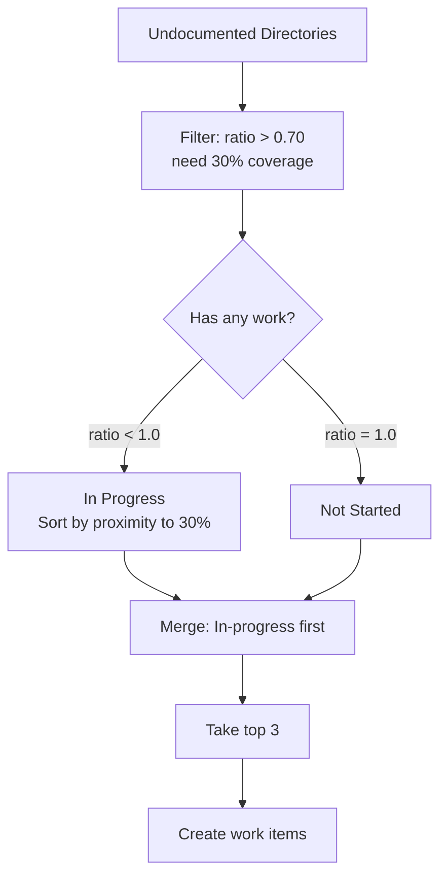

**Example:**

```
Directories needing 30% coverage:
1. src/agents/orchestrator (ratio: 0.72, 28% current) ← In progress, close!
2. src/services (ratio: 0.65, 35% current) ← In progress
3. src/executor (ratio: 1.0, 0% current) ← Not started
4. src/domain (ratio: 1.0, 0% current) ← Not started

Selected (top 3, in-progress first):
1. src/agents/orchestrator (finish what we started)
2. src/services (also close)
3. src/executor (start new directory)
```

**Work Generation:**

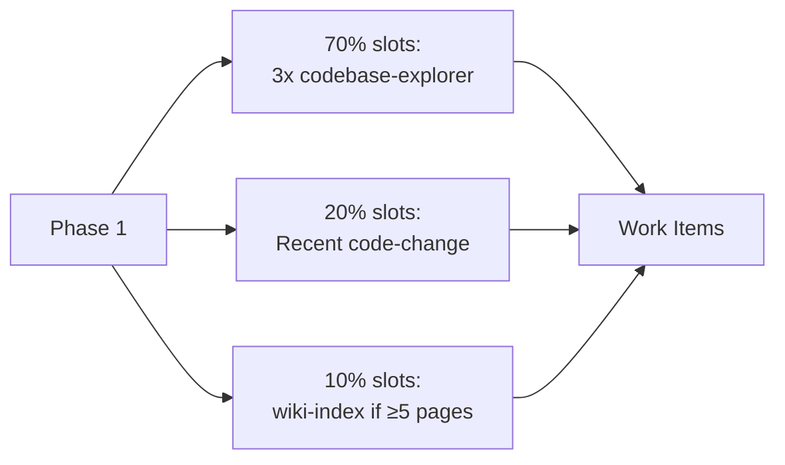

---

### Phase 2: Breadth

**Goal:** Touch 90% of source files using breadth-first traversal

**Entry:** 10+ pages AND 3+ directories covered
**Exit:** 90% of files touched AND 25+ pages

**Coverage Check:** Binary "touched" (coverage >0%) instead of graduated depth

**Work Allocation:**
- **70%**: BFS directory selection (max 3)
- **20%**: Recent commits (code-change)
- **10%**: Structure (overview for categories, link agent)

**Strategy Rationale:** Systematic level-by-level coverage ensures no directories are left behind. Once a directory is "touched," descend to find untouched children.

**BFS Directory Selection Algorithm:**

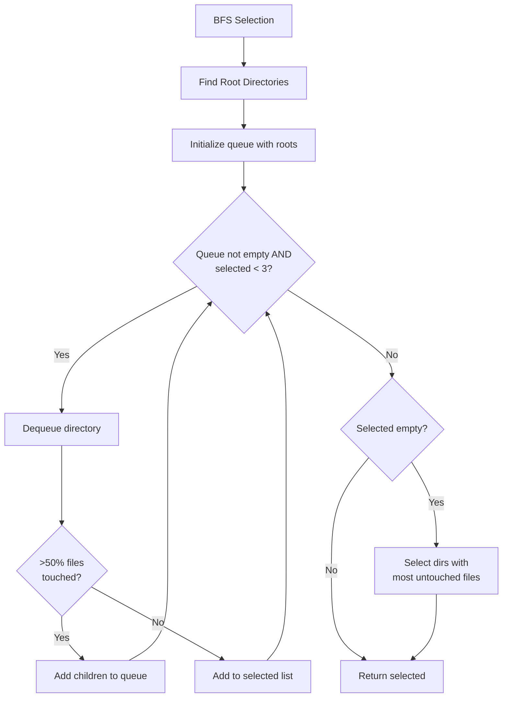

**Example BFS Traversal:**

```
Directory Tree:
src/ (80% touched)
├── agents/ (75% touched)
│   ├── orchestrator/ (20% touched)
│   └── executor/ (90% touched)
├── services/ (30% touched)
└── domain/ (0% touched)

BFS Execution:
1. Queue: [src]
2. src is 80% touched → add children [agents, services, domain]
3. agents is 75% touched → add children [orchestrator, executor]
4. services is 30% touched (< 50%) → SELECT services
5. domain is 0% touched → SELECT domain
6. orchestrator is 20% touched → SELECT orchestrator
7. Limit reached (3 selected)

Result: [services, domain, orchestrator]
```

**Benefits:**
- Natural level-by-level processing
- Descends into covered areas to find gaps
- No artificial round-robin (directories actually complete)

**Work Generation:**

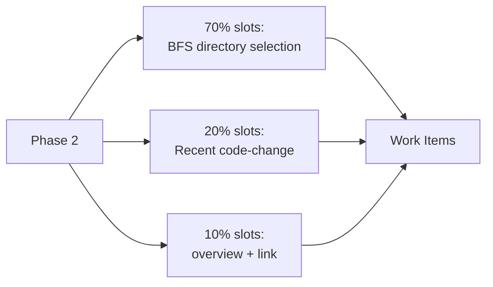

---

### Phase 3: Depth and Guides

**Goal:** Deepen coverage to 60% and create synthesis documentation

**Entry:** 90% files touched AND 25+ pages
**Exit:** All key pages exist AND average confidence ≥ 65%

**Coverage Target:** 60% (undocumentedRatio ≤ 0.40)

**Work Allocation:**
- **55%**: Explore 2-3 directories (in-progress prioritization to 60%)
- **25%**: Create missing synthesis pages
- **20%**: Expand commit analysis (multiple agents)

**Strategy Rationale:** With broad coverage established, deepen documentation and create high-level guides for users.

**Synthesis Priority Order:**
1. `project-overview` (most foundational)
2. `getting-started` (user onboarding)
3. `testing-guide` (developer practices)
4. `extension-guide` (extensibility patterns)

**Work Generation:**

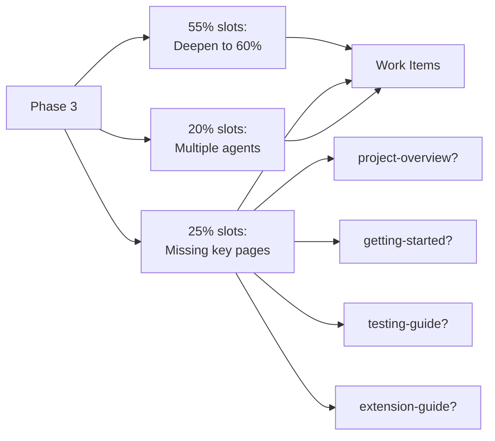

**Commit Analysis Expansion:**

Instead of just `code-change`, now includes:
- `code-change`: General technical analysis
- `security`: Security implications
- `dependency`: Dependency changes and impacts

**Example Work Items:**
- `codebase-explorer` → path:src/services (60% target)
- `project-overview` → synthesis:project
- `code-change` → commit:abc123
- `security` → commit:abc123

---

### Phase 4: Polish

**Goal:** Quality improvements and coverage to 80%

**Entry:** All key pages exist AND confidence ≥ 65%
**Exit:** Low confidence ≤ 10% AND findings ≤ 5

**Coverage Target:** 80% (undocumentedRatio ≤ 0.20)

**Work Allocation:**
- **50%**: Meta/quality agents (quality, consistency, writer, consolidation)
- **30%**: Coverage gaps (to 80% threshold)
- **20%**: Remaining commits (all analysis agents, 1 per type)

**Strategy Rationale:** With broad and deep coverage, focus shifts to quality, consistency, and filling remaining gaps.

**Meta Agent Scheduling:**

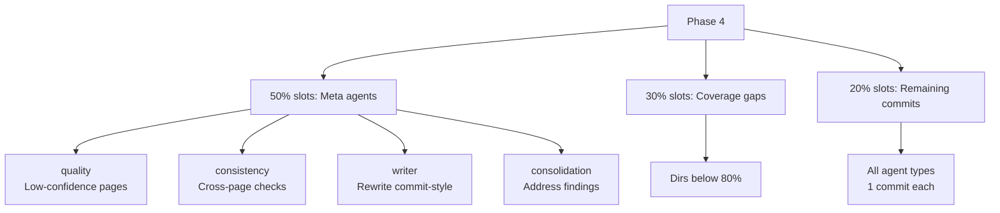

**Work Generation Priority:**

1. **Quality improvements** for low-confidence pages
2. **Consistency** checks across all pages
3. **Rewrite** pages that read like commit summaries
4. **Consolidation** to merge duplicates and fix links
5. **Coverage gaps** to reach 80%
6. **Commit stragglers** across all agent types

---

### Phase 5: Maintenance

**Goal:** Reactive processing of new commits and quality maintenance

**Entry:** Low confidence ≤ 10% AND findings ≤ 5
**Exit:** Never (stable state)

**Work Allocation:**
- Prioritize new commits (up to 2 recent unprocessed)
- Quality improvements (low-confidence pages)
- Fill coverage gaps (highest undocumented ratios)
- Consistency checks (if pages need rewrite)

**Max Items:** 5 (vs 10 in other phases) - lighter workload

**Strategy Rationale:** Wiki is mature. Focus on staying current with new code and maintaining quality.

**Work Generation:**

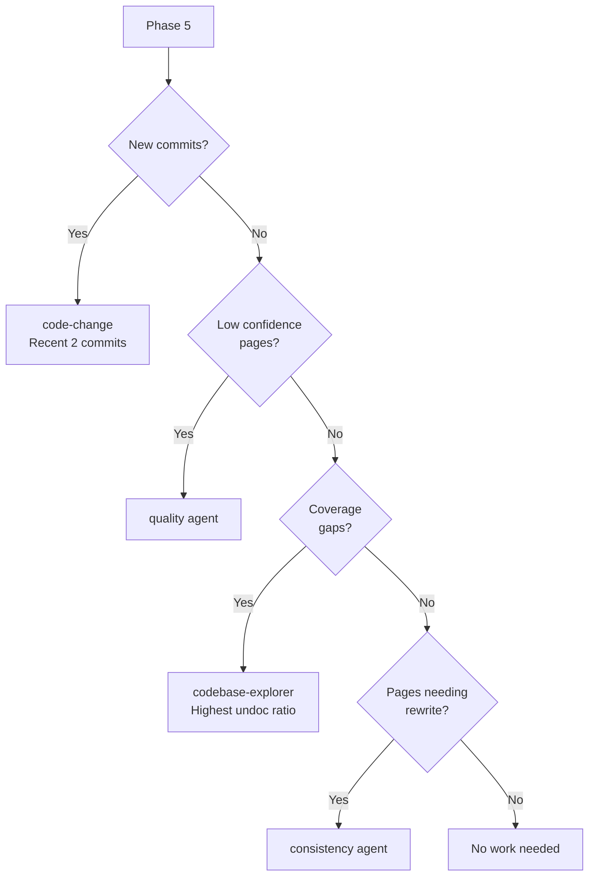

**Reactive Behavior:**

Unlike earlier phases that proactively generate work, Phase 5 is **reactive**:
- New commit arrives → process it
- Low confidence detected → improve it
- Coverage gap found → fill it
- Otherwise → no work generated

---

## 5. Coverage Tracking System

### Graduated Documentation Depth Scoring

**File:** `src/agents/orchestrator/file-coverage-tree.ts`

Rather than binary "documented vs undocumented," CodeWiki uses **graduated scoring** based on documentation depth.

**Algorithm:**

**Step 1: Build Documentation Scores**

For each wiki page, distribute content length across referenced files:

```typescript
for each page:
  filesReferenced = page.filesReferenced + page.filesAccessed
  scorePerFile = page.content.length / filesReferenced.length

  for each file in filesReferenced:
    scores[file] += scorePerFile
```

**Example:**

```
Page A (1000 chars): references [file1.ts]
  → file1.ts score += 1000

Page B (1500 chars): references [file2.ts, file3.ts, file4.ts]
  → file2.ts score += 500
  → file3.ts score += 500
  → file4.ts score += 500

Page C (2000 chars): references [file1.ts, file5.ts]
  → file1.ts score += 1000 (now total: 2000)
  → file5.ts score += 1000
```

**Step 2: Calculate Coverage Percentage**

Normalize scores to 0-100% coverage:

```typescript
function calculateFileCoverage(filePath, scores, maxScore):
  score = scores.get(filePath) ?? 0

  // Try ancestor directory inheritance if no direct score
  if (score === 0):
    for each ancestor of filePath (closest first):
      if (scores.has(ancestor)):
        score = scores[ancestor] * 0.7  // 70% dampening
        break

  coverage = (score / max(maxScore, 100)) * 100
  return min(100, round(coverage))
```

**Inheritance Example:**

```
Directory: src/services/ (score: 500)
File: src/services/api-client.ts (no direct score)

Coverage = (500 * 0.7) / 100 * 100 = 350%? No, min(100) = 35%
```

**Step 3: Aggregate to Directories**

Calculate directory coverage as LOC-weighted average:

```typescript
function calculateDirectoryCoverage(directory):
  totalLoc = 0
  weightedCoverage = 0

  for each file in directory:
    totalLoc += file.loc
    weightedCoverage += file.coverage * file.loc

  for each subdirectory in directory:
    totalLoc += subdirectory.totalLoc
    weightedCoverage += subdirectory.coverage * subdirectory.totalLoc

  return weightedCoverage / totalLoc
```

**Result:**

```
src/ (45.2%)
├── agents/ (62.3%)
│   ├── orchestrator/ (28.0%)
│   │   ├── phased-orchestrator.ts (15%)
│   │   └── context-gatherer.ts (42%)
│   └── executor/ (78.5%)
├── services/ (35.0%)
└── domain/ (12.5%)
```

### Binary vs Graduated Coverage

**Phase 2 uses binary "touched" check:**

```typescript
function isTouched(filePath, scores):
  return scores.get(filePath) > 0
```

A file is "touched" if it has ANY documentation score, regardless of depth.

**Phase 3+ use graduated "undocumented" check:**

```typescript
const LOW_COVERAGE_THRESHOLD = 40; // 40%

function isUndocumented(filePath, scores, maxScore):
  coverage = calculateFileCoverage(filePath, scores, maxScore)
  return coverage < LOW_COVERAGE_THRESHOLD
```

A file is "undocumented" if coverage < 40%.

**Rationale:**
- **Phase 2**: Just touch every file once (breadth)
- **Phase 3+**: Ensure adequate depth (quality)

### Undocumented Directories Structure

```typescript
interface UndocumentedDirectory {
  path: string;              // e.g., "src/services"
  totalFiles: number;        // Total source files in directory

  // Binary check (for Phase 2)
  untouchedCount: number;    // Files with coverage = 0
  untouchedRatio: number;    // 0-1 (1.0 = 100% untouched)

  // Graduated check (for Phase 3+)
  undocumentedCount: number; // Files with coverage < 40%
  undocumentedRatio: number; // 0-1 (1.0 = 100% undocumented)
}
```

**Example:**

```
Directory: src/services/ (10 files)
- 2 files: 0% coverage (untouched)
- 3 files: 25% coverage (touched but undocumented)
- 5 files: 60% coverage (documented)

untouchedCount: 2
untouchedRatio: 0.20 (20%)

undocumentedCount: 5 (untouched + low coverage)
undocumentedRatio: 0.50 (50%)
```

### Coverage Thresholds by Phase

| Phase | Threshold | Meaning | Check Type |
|-------|-----------|---------|------------|
| **Phase 1** | 30% | undocRatio ≤ 0.70 | Graduated |
| **Phase 2** | Touch | untouchedRatio < 1.0 | Binary |
| **Phase 3** | 60% | undocRatio ≤ 0.40 | Graduated |
| **Phase 4** | 80% | undocRatio ≤ 0.20 | Graduated |
| **Phase 5** | Maintain | undocRatio ≤ 0.20 | Graduated |

### Priority Files in Work Items

When creating exploration work, the orchestrator includes **priority files** (low-coverage files to read first):

```typescript
function createExplorationWorkItem(dirPath, repoId, lowCoverageFiles):
  // Get files in this directory with coverage < 40%
  priorityFiles = lowCoverageFiles
    .filter(f => f.directory === dirPath)
    .map(f => f.path)
    .slice(0, 20)  // MAX_PRIORITY_FILES

  return createWorkItem({
    agentType: 'codebase-explorer',
    target: {
      type: 'path',
      path: dirPath,
      priorityFiles: priorityFiles
    }
  })
```

**Agent Usage:**

The `codebase-explorer` agent receives priority files and uses them to:
1. Read undocumented files first
2. Provide more context to LLM
3. Generate deeper documentation

---

## 6. Work Item Lifecycle

### Creation

**Deterministic ID Generation:**

```typescript
function generateWorkItemId(repoId: string, agentType: AgentType, target: WorkTarget): string {
  const targetKey = getWorkTargetKey(target);
  // Examples:
  //   "commit:abc123"
  //   "path:src/agents/orchestrator"
  //   "wiki"

  const input = `${repoId}:${agentType}:${targetKey}`;
  const hash = createHash('sha256').update(input).digest('hex').slice(0, 32);
  return `work-${hash}`;
}
```

**Result:** Same repo + agent + target = same ID every time

**Benefits:**
- Orchestrator can run multiple times without creating duplicates
- Database upsert prevents duplicate storage
- Work queue stays clean

### Status Transitions

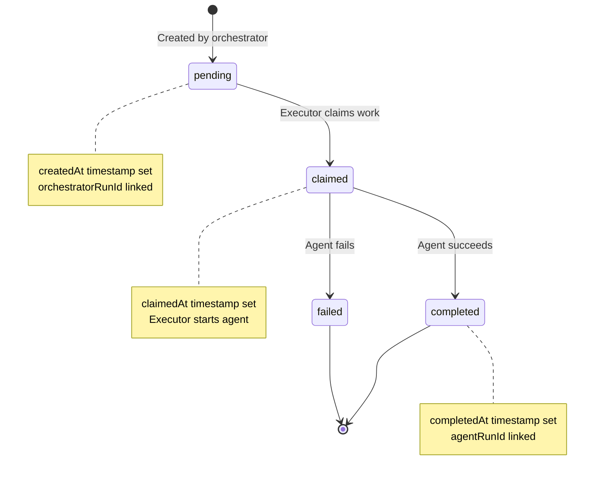

### Executor Claims Work

**FIFO Processing:**

```typescript
// Query for oldest pending work item
const workItem = await workQueueRepo.findOldestPending(repoId);

if (workItem) {
  // Claim it
  workItem.status = 'claimed';
  workItem.claimedAt = new Date();
  await workQueueRepo.save(workItem);

  // Execute agent
  const result = await agent.run(target, context);

  // Mark complete
  workItem.status = 'completed';
  workItem.completedAt = new Date();
  workItem.agentRunId = result.agentRunId;
  await workQueueRepo.save(workItem);
}
```

**Parallel Execution:**

The executor runs a **continuous worker pool** (default: 4 workers) that processes work items in parallel:

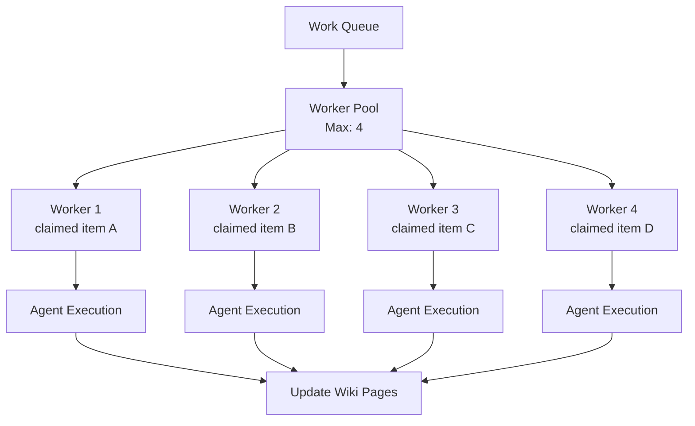

### Agent Execution

**Agent Interface:**

```typescript
interface Agent {
  type: AgentType;
  canHandle(target: WorkTarget): boolean;
  run(target: WorkTarget, context: AgentContext): Promise<AgentRunResult>;
}
```

**Execution Flow:**

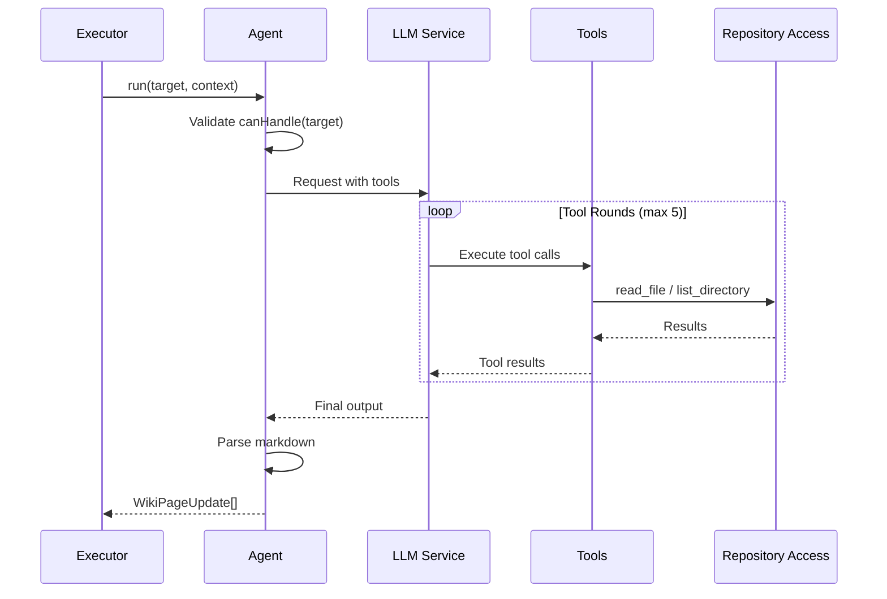

**Agent Output:**

```typescript
interface AgentRunResult {
  updates: WikiPageUpdate[];  // Pages to create/update
  findings: Finding[];        // Issues detected
  filesAccessed: string[];    // Files read via tools
  confidence: number;         // 0-1
}
```

### Result Application

**Update Types:**

```typescript
interface WikiPageUpdate {
  path: string;               // Wiki page path
  title: string;
  content: string;
  category?: string;
  filesReferenced: string[];  // Files mentioned
  targetPaths: string[];      // Code paths documented
  links: string[];            // Links to other pages
}
```

**Update Command:**

```typescript
await handleUpdateWikiPage({
  wikiId,
  path: update.path,
  title: update.title,
  content: update.content,
  category: update.category,
  sourceCommits: [commitId],          // Provenance
  sourceAgentRunIds: [agentRunId],    // Provenance
  filesReferenced: update.filesReferenced,
  filesAccessed: agentResult.filesAccessed,
  targetPaths: update.targetPaths
}, repos);
```

**Page Merge Logic:**

If page already exists:
1. Merge content (append or integrate)
2. Combine file references
3. Update source commits
4. Recalculate confidence
5. Extract new links

---

## 7. Complete Wiki Building Journey

Let's walk through a complete wiki generation for a repository with 150 commits and 200 source files.

### Iteration 1-5: Phase 0 (Reconnaissance)

**Goal:** Understand recent development

**Orchestrator Decision:**
- Analyze 5 recent commits with `code-change`
- Analyze 3 recent commits with `narrative`

**Work Generated:**
```
1. code-change → commit:abc123 (most recent)
2. code-change → commit:def456
3. code-change → commit:ghi789
4. code-change → commit:jkl012
5. code-change → commit:mno345
6. narrative → commit:abc123
7. narrative → commit:def456
8. narrative → commit:ghi789
```

**Results:**
- 3 pages created (one per commit that changed significant files)
- Files referenced: 15
- Average confidence: 45%

**Phase Transition:** 3 pages → Phase 1

---

### Iteration 6-20: Phase 1 (Skeleton)

**Goal:** Build navigable structure

**Orchestrator Decision:**
- Explore `src/agents/`, `src/services/`, `src/domain/` (top 3 undocumented)
- Process 2 recent commits
- Create wiki-index

**Work Generated:**
```
Iteration 6-8: Exploration
  - codebase-explorer → path:src/agents (priority: 8 files)
  - codebase-explorer → path:src/services (priority: 12 files)
  - codebase-explorer → path:src/domain (priority: 6 files)

Iteration 9-10: Commits
  - code-change → commit:pqr678

Iteration 11: Structure
  - wiki-index → synthesis:index
```

**Results After Iteration 20:**
- 12 pages total
- 4 directories with coverage > 30%
- Average confidence: 52%
- Coverage: src/agents (35%), src/services (40%), src/domain (32%), src/executor (0%)

**Phase Transition:** 12 pages AND 4 dirs → Phase 2

---

### Iteration 21-50: Phase 2 (Breadth)

**Goal:** Touch 90% of files

**Orchestrator Decision (Iteration 21):**
- BFS selects: `src/executor/`, `src/web/`, `src/repositories/`
- Process 2 recent commits
- Create overview for "agents" category

**BFS Traversal:**

```
Initial: 4 directories with coverage
Covered directories: src/agents (35%), src/services (40%), src/domain (32%)
Untouched: src/executor, src/web, src/repositories, src/utils, src/mcp

BFS Level 1:
- src (root): 25% touched → descend
  Children: src/agents, src/services, src/domain, src/executor, src/web, ...

BFS Level 2:
- src/agents: 35% touched → skip (already covered enough)
- src/services: 40% touched → skip
- src/domain: 32% touched → skip
- src/executor: 0% touched → SELECT
- src/web: 0% touched → SELECT
- src/repositories: 0% touched → SELECT
- (limit 3 reached)
```

**Work Generated (Iteration 21-30):**
```
Exploration (70%):
  - codebase-explorer → path:src/executor
  - codebase-explorer → path:src/web
  - codebase-explorer → path:src/repositories

Commits (20%):
  - code-change → commit:stu901

Structure (10%):
  - overview → category:agents
```

**Progress Tracking:**

```
Iteration 21: 157/200 files touched (78.5%)
Iteration 30: 165/200 files touched (82.5%)
Iteration 40: 175/200 files touched (87.5%)
Iteration 50: 183/200 files touched (91.5%)
```

**Results After Iteration 50:**
- 28 pages total
- 91.5% files touched (threshold: 90% ✓)
- 7 directories with coverage
- Average confidence: 58%

**Phase Transition:** 91.5% touched AND 28 pages → Phase 3

---

### Iteration 51-80: Phase 3 (Depth + Guides)

**Goal:** Deepen to 60% and create synthesis content

**Orchestrator Decision (Iteration 51):**
- Deepen `src/executor/` (current: 15%), `src/web/` (current: 18%), `src/repositories/` (current: 12%)
- Create `project-overview`
- Expand commit analysis (security, dependency)

**Work Generated:**
```
Exploration (55%):
  - codebase-explorer → path:src/executor (priority: 18 low-coverage files)
  - codebase-explorer → path:src/web (priority: 22 low-coverage files)
  - codebase-explorer → path:src/repositories (priority: 15 low-coverage files)

Synthesis (25%):
  - project-overview → synthesis:project

Commits (20%):
  - code-change → commit:vwx234
  - security → commit:vwx234
  - dependency → commit:vwx234
```

**Coverage Progression:**

```
Iteration 51:
- src/executor: 15% → target 60%
- src/web: 18% → target 60%
- src/repositories: 12% → target 60%

Iteration 60:
- src/executor: 42%
- src/web: 38%
- src/repositories: 35%

Iteration 70:
- src/executor: 65% ✓
- src/web: 58%
- src/repositories: 52%

Iteration 80:
- All directories > 60% ✓
```

**Synthesis Pages Created:**
- Iteration 52: project-overview
- Iteration 62: getting-started
- Iteration 71: testing-guide
- Iteration 78: extension-guide

**Results After Iteration 80:**
- 42 pages total
- All key pages exist ✓
- Average confidence: 68% ✓
- All directories > 60% coverage

**Phase Transition:** Key pages AND 68% confidence → Phase 4

---

### Iteration 81-120: Phase 4 (Polish)

**Goal:** Quality improvements and 80% coverage

**Orchestrator Decision (Iteration 81):**
- Quality agent for low-confidence pages
- Consistency agent for cross-page checks
- Deepen `src/utils/` (current: 45%)
- Complete remaining commits

**Work Generated:**
```
Meta/Quality (50%):
  - quality → wiki (improve low-confidence pages)
  - consistency → wiki (cross-page consistency)
  - writer → wiki (rewrite commit-style pages)
  - consolidation → wiki (merge duplicates, fix links)

Coverage (30%):
  - codebase-explorer → path:src/utils (to 80%)
  - codebase-explorer → path:src/mcp (to 80%)

Commits (20%):
  - code-change → commit:yz0567
  - security → commit:yz0567
  - dependency → commit:yz0567
  - narrative → commit:yz0567
  - pattern → commit:yz0567
  - technical-debt → commit:yz0567
```

**Quality Improvements:**

```
Iteration 81-85: quality agent
  - Improved 6 low-confidence pages
  - Average confidence: 68% → 72%

Iteration 86-90: consistency agent
  - Fixed 3 contradictions
  - Updated 5 pages for consistency

Iteration 91-95: consolidation agent
  - Merged 2 duplicate pages
  - Repaired 8 broken links
  - Created 12 backlinks
```

**Results After Iteration 120:**
- 38 pages (merged 4 duplicates)
- All directories > 80% coverage ✓
- Average confidence: 78%
- Low confidence ratio: 5% ✓
- Open findings: 2 ✓

**Phase Transition:** Low conf 5% AND findings 2 → Phase 5

---

### Iteration 121+: Phase 5 (Maintenance)

**Goal:** Stay current with new development

**Orchestrator Behavior:**

**When new commit arrives:**
```
New commit detected: abc999
Work Generated:
  - code-change → commit:abc999
```

**When low-confidence page detected:**
```
Page "src/utils/index.md" confidence: 42%
Work Generated:
  - quality → wiki
```

**When coverage gap appears:**
```
New directory: src/experimental/ (0% coverage)
Work Generated:
  - codebase-explorer → path:src/experimental
```

**Typical Maintenance Pattern:**

```
Week 1: 2 new commits → 2 work items
Week 2: 1 new commit, 1 low-conf page → 2 work items
Week 3: No changes → 0 work items
Week 4: 3 new commits, coverage gap → 4 work items
```

**Steady State:**
- 40-45 pages
- 85-90% average coverage
- 75-80% average confidence
- <5% low-confidence ratio
- <3 open findings

---

## 8. Adaptive Behaviors

### Responding to Low Confidence

**Trigger:** Pages with confidence <50% detected

**Response (Phase 3+):**

```typescript
if (context.lowConfidencePages > 0) {
  workItems.push({
    agentType: 'quality',
    target: { type: 'wiki' }
  });
}
```

**Quality Agent Actions:**
1. Query pages with confidence <0.7
2. Identify improvement opportunities:
   - Add code examples
   - Expand explanations
   - Include diagrams
   - Add cross-references
3. Generate update requests

**Result:** Confidence scores increase incrementally

---

### Handling Findings

**Finding Types:**
- **Duplicate pages**: Similar content, should merge
- **Broken links**: References to non-existent pages
- **Contradictions**: Conflicting information
- **Orphaned pages**: No incoming links
- **Low confidence**: Needs improvement

**Consolidation Agent Scheduling:**

```typescript
if (context.openFindings > 3) {
  // Bypass cooldown if many findings
  workItems.push({
    agentType: 'consolidation',
    target: { type: 'wiki' }
  });
} else if (context.openFindings > 0 && !hasRunRecently('consolidation')) {
  // Schedule with cooldown
  workItems.push({
    agentType: 'consolidation',
    target: { type: 'wiki' }
  });
}
```

**Finding Resolution:**

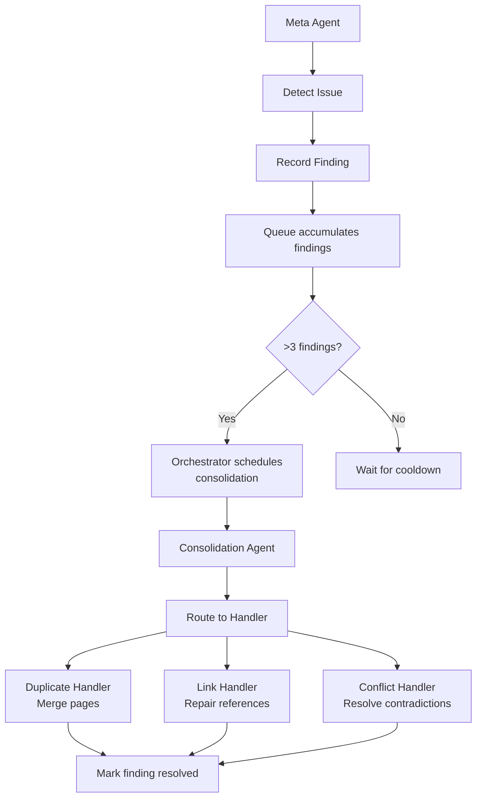

---

### Prioritizing Recent Commits

**Recency Bias:**

All commit queries sort by date descending:

```typescript
const commits = await getUnprocessedCommits(repoId, agentType, limit);
// Already sorted: most recent first

commits.forEach(commit => {
  workItems.push({
    agentType: 'code-change',
    target: { type: 'commit', commitId: commit.id }
  });
});
```

**Rationale:**
- Recent commits represent current development
- More likely to need documentation
- Developers have fresh context
- Higher value to current team members

---

### Balancing Breadth and Depth

**Focus Strategy (Phases 1, 3, 4):**

Limit simultaneous exploration to **MAX_FOCUS_DIRECTORIES = 3**:

```
Instead of:
  10 directories at 10% each (spread thin)

Focus on:
  3 directories to completion, then next 3

Progress:
  [30%, 30%, 30%, 0%, 0%, ...]
  [60%, 60%, 60%, 30%, 30%, ...]
  [80%, 80%, 80%, 60%, 60%, ...]
```

**In-Progress Prioritization:**

Always complete started work before starting new:

```typescript
function prioritizeDirectoriesForPhase(dirs, threshold):
  inProgress = dirs.filter(d => 0 < d.ratio < threshold)
  notStarted = dirs.filter(d => d.ratio >= threshold)

  // Sort in-progress by proximity to threshold
  inProgress.sort((a, b) => a.ratio - b.ratio)

  return [...inProgress, ...notStarted]
```

**Example:**

```
Threshold: 40% (need 60% coverage)

Directories:
1. src/agents/executor (ratio: 0.38, 62% current) ← 2% from threshold!
2. src/services (ratio: 0.45, 55% current) ← 5% from threshold
3. src/web (ratio: 0.55, 45% current) ← 15% from threshold
4. src/domain (ratio: 1.0, 0% current) ← Not started

Priority: [executor, services, web]
(Finish what's close before starting domain)
```

---

## Summary

CodeWiki builds wikis through a **six-phase adaptive orchestration system**:

### Phase Progression

1. **Phase 0 (Reconnaissance)**: Analyze recent commits to understand codebase
2. **Phase 1 (Skeleton)**: Build foundation with focused 3-directory exploration
3. **Phase 2 (Breadth)**: BFS traversal to touch 90% of files
4. **Phase 3 (Depth + Guides)**: Deepen to 60%, create synthesis documentation
5. **Phase 4 (Polish)**: Quality improvements, reach 80% coverage
6. **Phase 5 (Maintenance)**: Reactive mode for new commits and quality maintenance

### Key Innovations

**Graduated Documentation Depth Scoring:**
- Files accumulate score from multiple wiki pages
- Coverage = normalized score (0-100%)
- Inheritance from parent directories (70% dampening)

**Binary vs Graduated Coverage:**
- Phase 2: Binary "touched" check (breadth)
- Phase 3+: Graduated depth check (quality)

**BFS Directory Selection (Phase 2):**
- Natural level-by-level coverage
- Descends into covered areas to find gaps
- No artificial round-robin

**Focus Strategy (Phases 1, 3, 4):**
- Complete 3 directories at a time
- In-progress prioritization (finish close work first)
- Prevents spreading effort thin

**Deterministic Work IDs:**
- Same inputs → same ID
- Prevents duplicates from concurrent runs
- Clean work queue

**Priority Files:**
- Agents receive list of low-coverage files
- Read undocumented files first
- Generate deeper documentation

**Provenance Tracking:**
- Every work item links to orchestrator run
- Full decision context recorded
- Complete audit trail for debugging

### The Result

**Timeline:** 80% useful wiki in 20 minutes, 95% complete wiki in 2-4 hours

**Quality:** Graduated confidence scoring, self-healing, multi-perspective analysis

**Adaptability:** Responds to wiki state, not rigid sequencing

**Efficiency:** Parallel execution, intelligent prioritization, no duplicate work

The system is **deterministic** (no LLM orchestrator required), **adaptive** (phases respond to metrics), and **transparent** (full decision logging for inspection).

---

## Appendix: Debug Mode

Enable detailed orchestrator logging:

```bash
ORCHESTRATOR_DEBUG=1 npm run dev
```

**Output Example:**

```
[DEBUG ORCHESTRATOR] ═══ Phase Context ═══
[DEBUG ORCHESTRATOR] pages: 18
[DEBUG ORCHESTRATOR] directoriesWithAnyCoverage: 4
[DEBUG ORCHESTRATOR] touchedFilesRatio: 78.5% (157/200 files)
[DEBUG ORCHESTRATOR] avgConfidence: 55.1%
[DEBUG ORCHESTRATOR] lowConfidenceRatio: 22.2%
[DEBUG ORCHESTRATOR] hasProjectOverview: false
[DEBUG ORCHESTRATOR] hasGettingStarted: false

[DEBUG ORCHESTRATOR] ═══ Phase Detection ═══
[DEBUG ORCHESTRATOR] Phase 2 (Breadth) detected
[DEBUG ORCHESTRATOR] Reason: touchedFilesRatio (78.5%) < 90% threshold

[DEBUG ORCHESTRATOR] ═══ BFS Directory Selection ═══
[DEBUG ORCHESTRATOR] Selected via BFS (max 3):
[DEBUG ORCHESTRATOR]   1. src/services → 35.0% coverage
[DEBUG ORCHESTRATOR]        └─ 18% api-client.ts
[DEBUG ORCHESTRATOR]        └─ 22% config.ts
[DEBUG ORCHESTRATOR]   2. src/domain → 12.5% coverage
[DEBUG ORCHESTRATOR]   3. src/agents/orchestrator → 28.0% coverage

[DEBUG ORCHESTRATOR] ═══ Generated Work Items ═══
[DEBUG ORCHESTRATOR]   1. codebase-explorer → path:src/services (10 priority files)
[DEBUG ORCHESTRATOR]   2. codebase-explorer → path:src/domain (15 priority files)
[DEBUG ORCHESTRATOR]   3. codebase-explorer → path:src/agents/orchestrator (8 priority files)
[DEBUG ORCHESTRATOR]   4. code-change → commit:abc123
```

---

## Document Maintenance

Update this document when:
- Phase detection logic changes
- New strategies are added
- Coverage calculation algorithms evolve
- Work generation patterns change

**Review Schedule:** After major orchestrator changes
**Owner:** Engineering team
**Last Updated:** December 17, 2025
